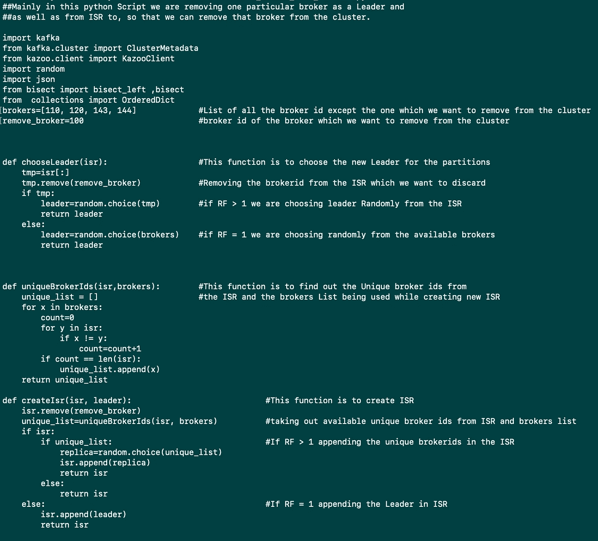
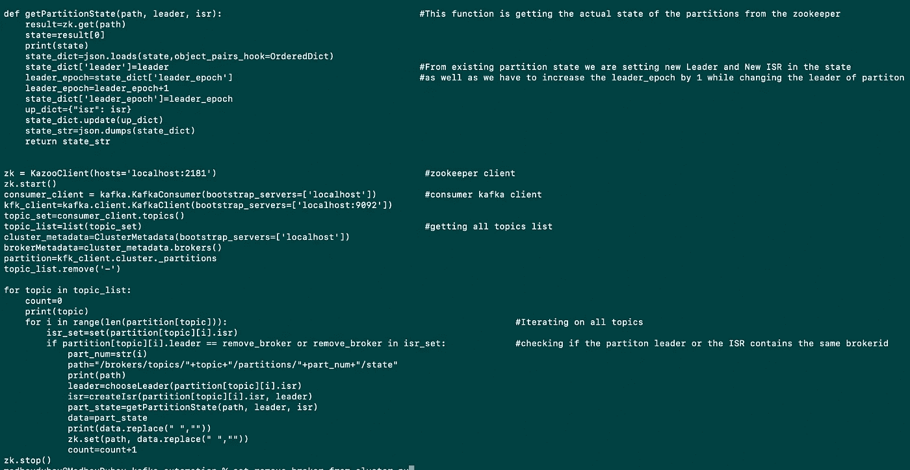
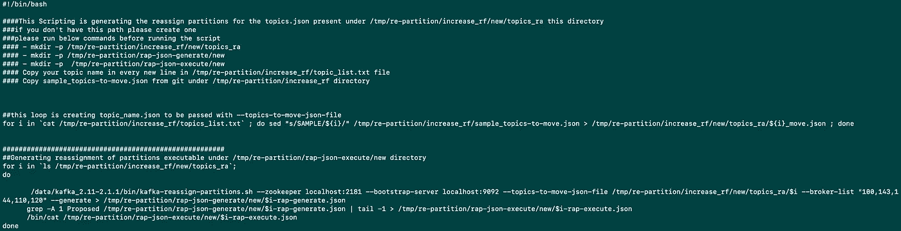
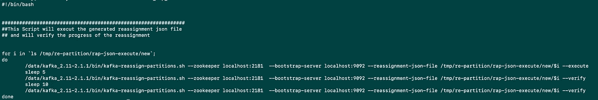

# Kafka Automation 从集群中删除一个代理

> 原文：<https://medium.com/codex/kafka-automation-to-remove-one-broker-from-the-cluster-81dd594f8759?source=collection_archive---------10----------------------->

# **问题陈述**

我们有一个由 3 个代理组成的 Kafka 集群，由于某些 java 版本的原因，3 个节点中的一个被损坏，每次我们需要在该特定代理上重新启动 Kafka 服务时，通常需要大约 30–40 分钟才能恢复。
所以我们决定从集群中丢弃这个代理。不过，在此之前，我们还必须添加 2 个代理来维护负载，以便在删除节点之前，我们可以将其各个主题的分区分发到其他 4 个节点。

# **决议**

## **待办事项:-**

1.  在集群中添加 2 个新的 Kafka 代理。
2.  执行 python 脚本，从同步副本(ISR)中移除该代理 id，并更改相应分区的领导者。
3.  用 bash 脚本执行分区的重新分配。

## **先决条件**

1.  对于所有 Kafka 主题，复制因子(RF)应大于 1。
2.  运行自动化脚本需要 Python。
3.  您需要两个具有相同 Kafka 和 zookeeper 版本的新节点。

使用下面的 Public Git Hub Repository 来访问自动化中使用的所有脚本。

 [## GitHub-madhavdubey 97/corrupted-Kafka-broker

### 此时您不能执行该操作。您已使用另一个标签页或窗口登录。您已在另一个选项卡中注销，或者…

github.com](https://github.com/madhavdubey97/corrupted-kafka-broker.git) 

# 将 Kafka 代理添加到您现有的集群中

确保您的两个新 kafka 节点在 Kafka _ directory/config/server . properties 和 zookeeper.properties
文件中具有所需的更改，并具有唯一的代理 id 和 zookeeper id。

**在所有 Kafka 节点上配置以下变化**

在 server.properties 中添加 **zookeeper.connect** 键和两个新的 Kafka ips

**zookeeper . connect = node 1:2181，node2:2181，node3:2181，newnode1:2181，newnode2:2181**

在 zookeeper.properties 中添加新节点

**server . 4 = new node 1:2888:3888
server . 5 = new node 1:2888:3888**

重启所有节点上的 zookeeper 和 Kafka 服务。
**服务动物园管理员重启
服务卡夫卡重启**

现在，您可以通过 zookeeper-cli 检查您的节点可用性。运行**Kafka _ dir/bin/zookeeper-shell . sh localhost:2181**命令进入 zookeeper shell **。然后运行 **ls /brokers/ids，在 zookeeper 中检查您的可用经纪人。你应该还会看到新的经纪人 id。现在，您的新 kafka 节点已成功添加到集群中。****

但是，在两个新节点上重新分配分区仍处于待定状态。为此，我们将坚持我们的主要问题，即从集群中删除损坏的 kafka 节点，因此我们将从损坏的节点中删除所有分区，并将它们重新分发到其他 4 个节点。为了达到这个目的，你可以使用下面的 python 脚本。

**从集群中删除损坏的 Kafka 节点**

执行**remove _ broker _ from _ cluster . py**python 脚本，将损坏节点的分区重新分配给现有的 4 个代理。举个例子，我们的节点 1 被破坏了。

在执行了上面的脚本之后，现在所有分区的 zookeeper 状态都已经改变了。

## Bash 脚本分区的重新分配

1.  在 kafka-cli 命令下运行以获取所有主题的列表。
    **bin/Kafka-topics . sh-list-zookeeper localhost:2181。**
2.  执行 **kafka_rap_generate.sh** 生成新的重新分配分区。

3.现在运行 **kafka_rap_execute.sh** 让实际的更改生效。

现在，您可以检查成功执行上述步骤后，您可以看到损坏的代理不再是任何分区的领导者和 ISR 成员，现在您可以安全地从 Kafka 集群中删除此损坏的节点。

## **注:**

这是一个用例，我们看到类似于1 的错误。分区的重新分配无限期停留在“仍在进行中”状态
2。卡夫卡对分区的重新分配仍在进行中。

对于我们来说，每个分区都出现这些错误，其中被破坏的代理是 ISR 的领导者或成员，因此在这种情况下，我们必须在 zookeeper 中更改分区状态，这是由**remove _ broker _ from _ cluster . py**完成的