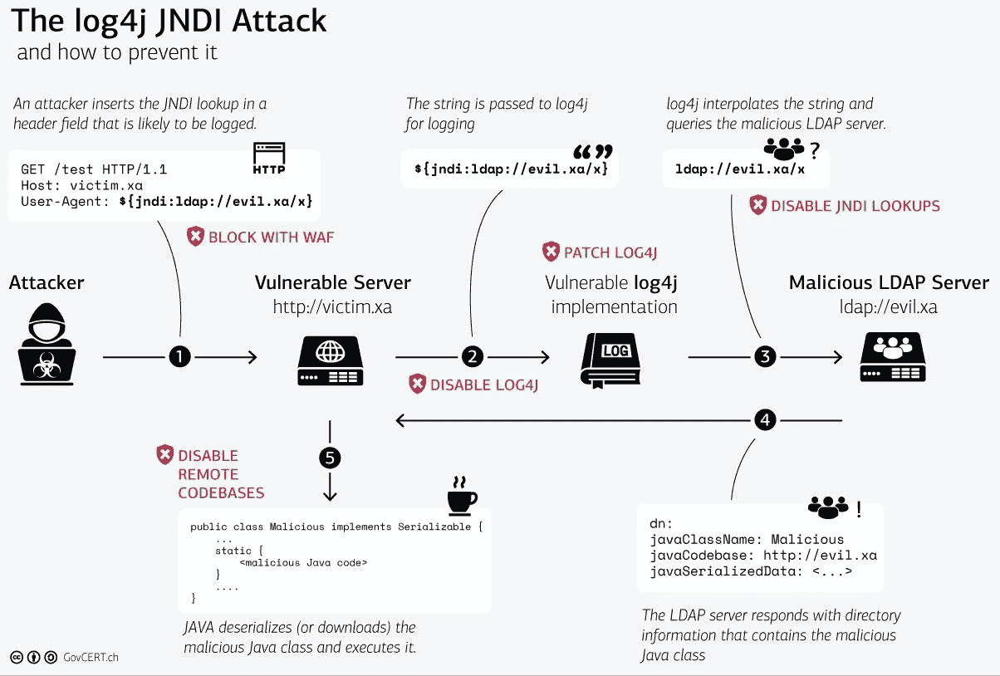

# 保持冷静，戴上眼罩！！Log4Shell 并不是另一个零日

> 原文：<https://medium.com/codex/keep-calm-and-patch-on-log4shell-is-just-not-another-zero-day-8099eb09b5d7?source=collection_archive---------12----------------------->

*原载于 2021 年 12 月 19 日*https://cyberbakery.net/*的*

【2021 年 12 月 10 日 Apache 的 Log4j 库中公布了一个零日漏洞，这使得 Log4shell 成为自 Heartbleed 以来最严重的漏洞之一。利用这一漏洞是微不足道的，因此，我们已经看到了新的利用，因为每天宣布。我们中的一些人将度过这个假期来减轻这种脆弱性。

自从上周末发布以来，已经有很多关于 Log4Shell 的文章。研究人员正在野外发现新的漏洞，并调整应对措施。我不是用这篇文章的标题来贬低这个漏洞的程度和影响。尽管如此，我还是建议退一步，冷静下来，制定缓解计划。我们正处于应对的早期阶段，如果过去的一周有任何迹象的话，我们将在这里进行长期努力。

在这篇文章中，我将集中讨论零日的两个方面。当然，技术方面是最重要的，需要立即关注。然而，长期治理同样重要，它将确保我们不会对一个被忽略或被视为低风险的无关紧要的应用程序失去警惕。

# 那么，什么是 Log4Shell 漏洞呢？

Apache 的 Log4j API1 是一个开源的基于 Java 的日志审计框架，被许多应用和服务普遍使用。因此，攻击者可以利用精心设计的漏洞闯入目标系统、窃取凭据和登录信息、感染网络并窃取数据。由于本库的使用范围，影响是深远的。此外，log4j 在全世界的软件应用程序和在线服务中广泛使用，利用该漏洞只需要很少的专业知识。这些深远的后果使得 Log4shell 成为近年来最严重的计算机漏洞。

> “log 4 shell”(CVE-2021–44228)是 Log4J 库中漏洞的名称。Apache Log4j2 2.14.1 和更低版本易受远程代码执行漏洞的攻击，远程攻击者可以利用此漏洞完全控制易受攻击的机器。通过将 JNDI2 LDAP3 字符串注入日志，触发 Log4j 联系指定的 LDAP 服务器以获取更多信息，可以利用 Log4Shell 漏洞。

在恶意情况下，攻击者可以使用 LDAP 服务器将恶意代码发送回受害者的机器，然后这些代码将在内存中自动执行。由不可信实体注入的仅用于记录到文件中的数据可以接管记录服务器。这对您来说意味着一个记录活动的指令，但如果被利用，很快就会变成数据泄漏场景或运行一次恶意代码场景。

简单地说，完整性所需的事件日志可能会变成恶意软件植入事件。这是令人讨厌的，需要采取所有必要的步骤来确保您不会成为这种恶意场景的受害者。

# 我受影响了吗？

绝大多数人回答“是”，除非有相反的证据。几乎每个软件或服务都有某种日志功能。出于开发、操作和安全目的，记录软件的行为。Apache 的 Log4j 是用于此目的的一个非常常见的组件。

对于个人来说，Log4jshell 肯定会对您产生影响。您日常在线使用的大多数设备和服务都将受到影响。在接下来的几天和几周内，请密切关注这些设备和服务供应商的更新和说明。一旦供应商发布补丁，请更新您的设备和服务，以降低与此漏洞相关的风险。

对企业来说，这将非常棘手，真正的影响可能不会马上明朗。此外，尽管 Apache 已经建议升级到 2.17 版，但是 Log4J 库可能有多种实现。因此，再次关注供应商尽快发布补丁和安装。

# 如何发现您的服务器是否受到影响？

这个问题的答案并不简单。很难确定给定的服务器是否受到网络漏洞的影响。您可能会假设只有运行用 Java 编写的代码的面向公众的服务器处理由 Java 软件和 Java 运行时库处理的传入请求。当然，如果前端是 Apache 的 HTTPd web 服务器、Microsoft IIS 或 Nginx 等构建产品，你就可以认为自己是安全的，因为所有这些服务器都是用 C 或 C++编写的。

随着关于这个漏洞的广度和深度的信息越来越多，看起来 Log4Shell 并不局限于用 Java 编码的服务器。由于它不是基于 TCP 的套接字处理代码漏洞，所以它可以隐藏在处理用户提供的数据的网络中，即使前端是非 java 平台，也可以保留日志，您可能会在您所知道的和所有那些可能使部分整体应用程序代码易受此漏洞攻击的第三方 java 库之间陷入困境。

理想情况下，您的网络上的每个应用程序都必须经过评估，这些应用程序是为 Log4j 库用 Java 编写的。您可以采取以下两种方法:

1.  **搜索易受攻击的代码**:通过扫描所有服务器和应用程序中易受攻击的 Log4j 库版本，开始搜索易受攻击的代码。因为 Log4j 代码可能隐藏在 Java 类的深处，所以对 Log4j 进行基本搜索是不够的。可以肯定的是，您可能需要使用额外的工具和技术。有两(2)种开源扫描工具可以列出代码版本或易受攻击的代码:
    **Grype**([https://github.com/anchore/grype](https://github.com/anchore/grype))—搜索系统上安装的库并显示存在的漏洞
    **Syft**([https://github.com/anchore/syft](https://github.com/anchore/syft))—搜索已安装的代码和库并显示它们的版本

这些工具必须在每个服务器上运行，以识别 Log4j 库的易受攻击的实例。随着时间的推移，供应商现在会发布关于解决方案或重新发布补丁的通知。要保持更新，可以参考以下列表:
[CISA 厂商 DB](https://github.com/cisagov/log4j-affected-db)
[bleeding computer](https://www.bleepingcomputer.com/news/security/log4j-list-of-vulnerable-products-and-vendor-advisories/)
[Github—荷兰 NCSC 受影响软件列表](https://github.com/NCSC-NL/log4shell/tree/main/software)
[Github—SwitHak](https://gist.github.com/SwitHak/b66db3a06c2955a9cb71a8718970c592)

**2。已部署代码的主动扫描**:带有更新插件的 Nessus 可用于主动漏洞扫描，以识别漏洞是否存在。一些安全供应商还建立了公共网站，对您的环境进行最低限度的测试。以下是一些可用于主动扫描的开源和商业工具:

开源:
NMAP 脚本引擎
cyber reason
女猎手测试者
full hunt
雅虎查看 Log4j

商用:
可安装的 Nessus 插件

# 如何减轻 Log4Shell 并防止攻击？

原则上，预防和预防技术与应对任何零时差没有什么不同。该漏洞既复杂又容易被利用，因此，这并不意味着该漏洞可以被成功利用。满足成功攻击的一些前提和条件。这些先决条件中的一些，例如正在使用的 JVM、服务器/应用程序配置、库的版本等。，将决定剥削的成功。12 月 17 日，Apache Foundation 宣布最初的修复不完整，并在 2.17.0 版本中发布了第二个修复。

在撰写本文时，以下是当前的漏洞和建议修复列表:
[CVE-2021–44228](https://thehackernews.com/2021/12/extremely-critical-log4j-vulnerability.html)(CVSS 评分:10.0)——一个影响 Log4j 从 2.0-beta9 到 2.14.1 版本的远程代码执行漏洞(已在 2.15.0 版本中修复)
[CVE-2021–45046](https://thehackernews.com/2021/12/second-log4j-vulnerability-cve-2021.html)(CVSS 评分:9.0)——一个影响 Log4j 的信息泄漏和远程代码执行漏洞 不包括 2.12.2(已在 2.16.0 版本中修复)
[CVE-2021–45105](https://nvd.nist.gov/vuln/detail/CVE-2021-45105)(CVSS 评分:7.5)——一个影响 Log4j 从 2.0-beta9 到 2.16.0 版本的拒绝服务漏洞(已在 2.17.0 版本中修复)
[CVE-2021–4104](https://nvd.nist.gov/vuln/detail/CVE-2021-4104)(CVSS 评分:8.1)——一个影响 Log4j 的不可信反序列化漏洞 升级到版本 2.17.0)

瑞士政府的 CERT 提供了攻击序列的非常好的可视化，为序列中的每个脆弱点建议缓解措施。

# 从这里去哪里？

**保持冷静，继续** ……。我们在这里是长期的，没有简单的解决办法。你可能会发现，今天你修复了一个 app 或者服务器；第二天早上还会有别的事情冒出来。如果您还没有这样做，那么最好的方法是针对零日漏洞建立一个通用的事件响应行动手册。这将有助于你以系统的方式应对未来的任何此类事件。这里成功的关键是关注工具和技术以及它们应对任何新的零日的有效性。

就 Log4Shell 而言，我们还处于早期阶段，无法确定一旦打了补丁，就再也不会有别的东西了。这一点从以下事实中可以明显看出:自从最初的 CVE 发布后的一周左右的时间里，又有三个库被归功于 Log4J 库。因此，Apache 基金会建议采取以下缓解措施来防止利用易受攻击的代码。

首先，将易受攻击的 Log4j 版本升级到 2.17.0 版或应用供应商提供的补丁程序。虽然，由于某种原因，如果无法升级，可以使用一些变通方法。但是，总有一些其他漏洞(CVE-2021–45046)的风险会使变通办法无效。因此，最好升级到 2.17 版本。除了上述内容，还必须考虑和应用一些常见的缓解措施。
隔离系统必须限制在其安全区域内，即 dmz 或 VLANs。
来自服务器的所有出站网络连接都被阻止，除非其功能角色需要。即使这样，也要将出站网络连接仅限于受信任的主机和网络端口。
根据您的终端保护策略，更新任何特征码或插件以防止 Log4j 漏洞。
持续监控网络和服务器的任何泄露迹象(IOC)。
已经发现，即使实施了补丁，漏洞也可能持续存在。因此，作为缓解计划的一部分，必须确保在实施补丁后进行测试和重新测试。在我们生活的时代，这样的事情已经成为一种常态。不幸的是，易受攻击的代码是不可避免的，总会有人热衷于识别这样的代码来利用既得利益。只有在这种情况下，我们才会被黑客攻击，而这一事件可能会中断您的业务。因此，最重要的是制定和实施业务连续性计划，最大限度地减少此类事件的影响。这些计划必须定期更新和测试，以确保不断变化的威胁场景。安全事故响应计划必须作为一种“生活方式”定期实施，并在发现新的漏洞或威胁场景时进行调整。

在像 Log4j zero-day 这样的情况下，我们需要做大量的工作来保护自己，这可能会让我们不知所措。正如女猎手实验室高级安全研究员约翰·哈蒙德所说，“所有威胁行为者需要触发攻击的只是一行文本，”但响应者需要花费数小时、数天甚至数周来保护自己。在这种势不可挡的情况下，我会建议在做我们需要做的事情时，深呼吸，保持冷静。向人们伸出援手，如果你有压力，不要羞于寻求帮助。我祝你们所有人一切顺利，你们将被要求在假期期间留下来保护你们的企业。