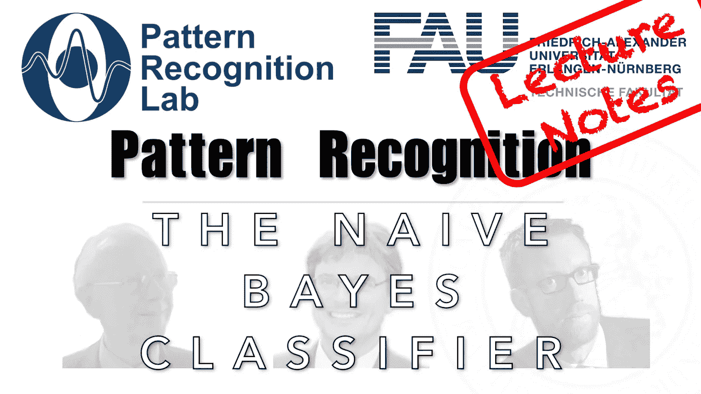

# 保持简单，笨蛋——朴素贝叶斯分类器

> 原文：<https://medium.com/codex/keep-it-simple-stupid-the-naive-bayes-classifier-fa7d8832eb1a?source=collection_archive---------9----------------------->

## 模式识别中的 FAU 讲义，[抄本](http://medium.com/codex)

## 来自独立维度世界的故事

下图 [CC BY 4.0](https://creativecommons.org/licenses/by/4.0/) 来自[模式识别讲座](https://www.youtube.com/playlist?list=PLpOGQvPCDQzsWvT_bqmexrJ359RTQQuMO)

**这些是 FAU 的 YouTube 讲座** [**模式识别**](https://www.youtube.com/playlist?list=PLpOGQvPCDQzsWvT_bqmexrJ359RTQQuMO) **的讲义。这是讲座视频&** [**配套幻灯片**](https://doi.org/10.5281/zenodo.4429576) **的完整抄本。幻灯片的来源可以在** [**这里**](https://github.com/akmaier/pr-slides) **找到。我们……**