# 保持数据一致— Coda 表单

> 原文：<https://medium.com/codex/keeping-data-aligned-coda-forms-9bc4e5ee5a08?source=collection_archive---------13----------------------->


## 在用户提交并更新他们的信息后

在我关于[如何对表单进行编码的博客](https://huizer.medium.com/how-to-coda-a-form-774409c4f374)中，我提到了当你提交预填的 Coda 表单并且用户通过这些 Coda 表单更新他们的信息时，保持数据一致的重要性。

这个博客是关于预填表单的方法，以及在不使用像电话号码或邮件地址这样的键值的情况下将信息返回给用户的方法。

## 介绍

下面 Coda 提出如何解决预填表格的问题。您有一个包含数据的表，并通过一个开放的 URL 将数据返回给用户。打开，因为正如你可能在截图中看到的，你可以在 URL 中读取你推入字段的值。

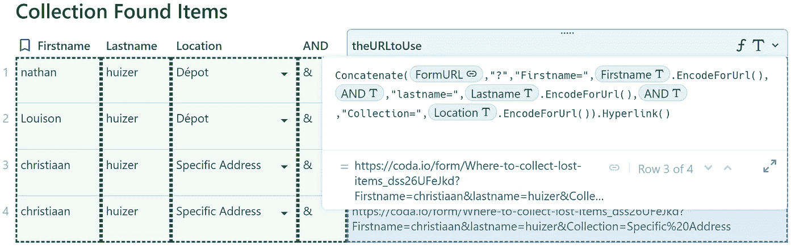

通过[马里乌斯对社区的贡献](https://community.coda.io/t/security-of-personal-data-in-published-forms/24703)，我想到了另一个解决方案。他没有创建一个开放的 URL，而是创建了一个表单，这个表单是基于一个 Id 预先填充的，他使用了一个散列键。这将生成一个表单，其中预填充了您无法覆盖的值，并有第二列，您可以在其中写入新值来更新“旧”值。结果可能如下所示:

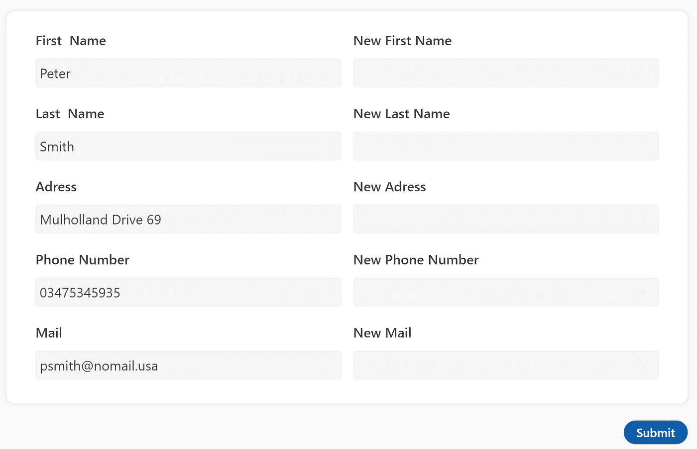

Marius 的安全预填表单解决方案

以及该表单背后的散列 URL:

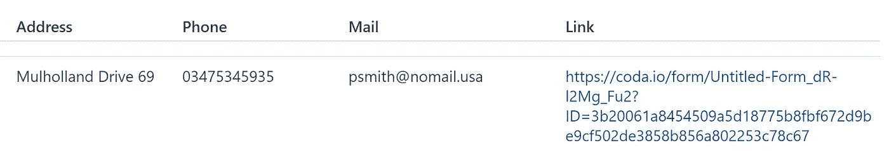

正如您所看到的，在 URL 中，名称是不可见的，它们只出现在表单中。在我们探讨这种安全解决方案相对于传统解决方案的优缺点之前，先简单介绍一下如何获得安全解决方案。

*   你需要两张桌子。在表 1 中，您有地址、城市等文本形式的值。您可以编辑的值。在表二中，这些值是通过[引用一个键](/geekculture/how-to-coda-3913cf5daf9d)得到的。
*   我们在第一个表中生成的键是我们在表二中用来引用第一个表中的值的桥。密钥在表一的显示列中。
*   我们基于表 1 中的值创建一个散列值
*   在表二中，我们不仅有作为公式结果的引用值，还有用于收集新(更新)值的列，如“updated_ name”或“updated_address”。
*   我们创建的表单基于表二
*   我们在表单中输入的值返回到表 2 中

带有更新(和实际值)的新行到达表 2。

几张截图来展示它是如何工作的。哈希是通过 Crypto(免费包)创建的，我将它建立在`RowId`之上，它总是可用的，因为哈希的主要功能是掩饰它背后的表逻辑，所以它工作得很好。`RowId()`也可以工作，但是人们可以很容易地猜测，如果你看到数字 100，你可能会有 101 和 99，这使得系统容易受到攻击，我们将在后面看到。

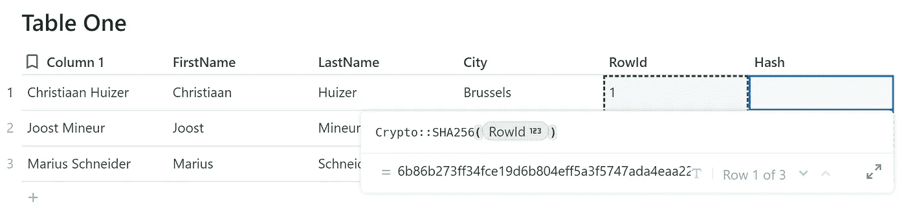

基于常数值创建散列

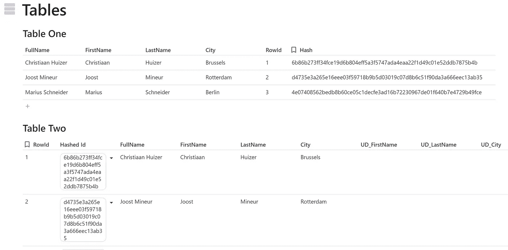

表一和表二

顺便说一下，在上面的 UD 代表更新。下面你会注意到我用了一个不同的短语来询问更新的信息。这是如何工作的，我在[我之前的博客](/nerd-for-tech/how-to-coda-a-form-774409c4f374)中描述过。

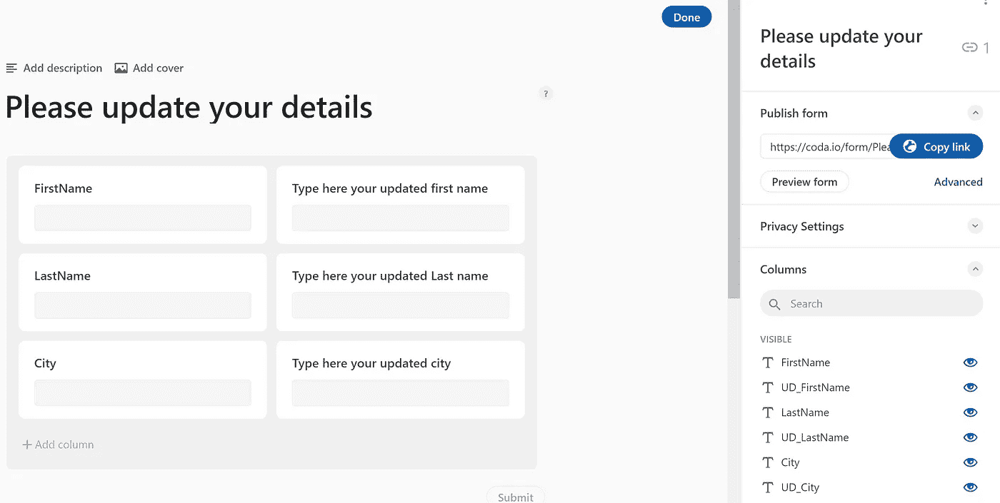

通过**发布表单**我们通过*复制链接*获得 URL，我们添加“？”我们准备使用如下创建的散列 ID 来完成 URL，同时允许表单使用 *LookUp* 值。

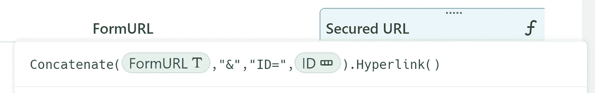

结果如下所示

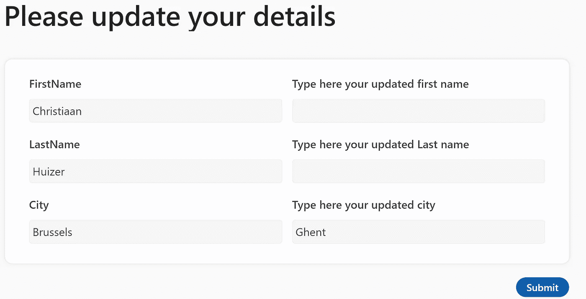

传统方式和安全方式各有优势，但面临着共同的挑战。对于安全版本，您可以看到下面的挑战，显示我们在表 2 中有两行关于同一个人的内容，最初住在布鲁塞尔，现在住在根特。

> 如何保持数据对齐？

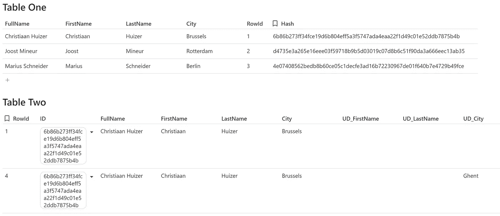

# 要解决的问题

因为我们有两种方法(经典的和安全的)，所以我把解决方案分成两部分。为了保持数据一致，我们需要一个 *MatchValue* 一个唯一的键来帮助我们识别最后的版本。安全的解决方案使用散列的 RowId 作为*匹配值*。

## 在传统解决方案中保持数据对齐

人们填写表格，数据进入表格。在传统的解决方案中，自动处理电子邮件(新行→电子邮件),用户通过电子邮件获得链接回已填写表单的 URL。用户更新类似日期或拼写错误的名字，然后提交。新的一行被添加到数据库中，新的电子邮件发出并再次向用户提供查看先前共享的数据(除了共享的文件和图像)的选项，等等。如前所示，该过程会生成一个包含过时信息行的表。

一旦我们发送包含每个字段信息的 URL 的确认电子邮件，我们就可以添加一个隐藏字段。这个隐藏字段可以包含作为*匹配值*的`RowId()`，虽然在表单中不可见，但在 URL 中可读性很好。

很容易看出这个数字在增加。“黑客”假设以前的号码存在，将所有字段留空，并用一个更小的号码替换 ULR 中的号码，然后提交。一个新的行(empty)以较小的数字到达数据库，并且可以(一旦更新逻辑被激活)逐行清空数据库。有了一点经验，黑客自动化了这个过程，结果是一个空的数据库。为了避免这种情况，我们需要一个更难理解的密钥。一个很好的选择是前面描述的散列键，它将充当**匹配值**。

我们面临的挑战是避免每个新行基于新的`RowId()`生成一个新的散列键。相反，一旦表单返回了现有的键，我们应该使用这个键来调整接下来的更新。为了实现这一点，我们需要自动化。

## 通过自动化获取匹配值

一旦你理解了自动化背后的公式语言，设置就相当容易了。在自动化中，你处理步骤和这些步骤的结果。

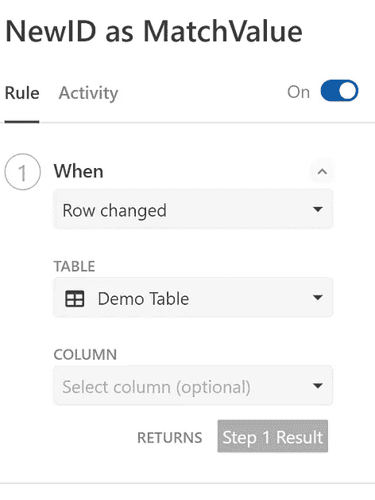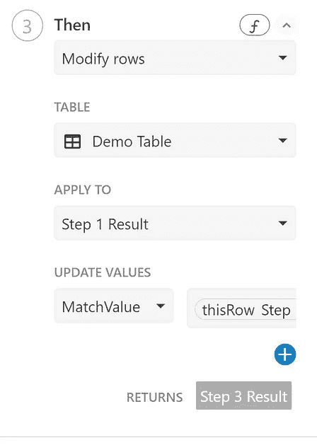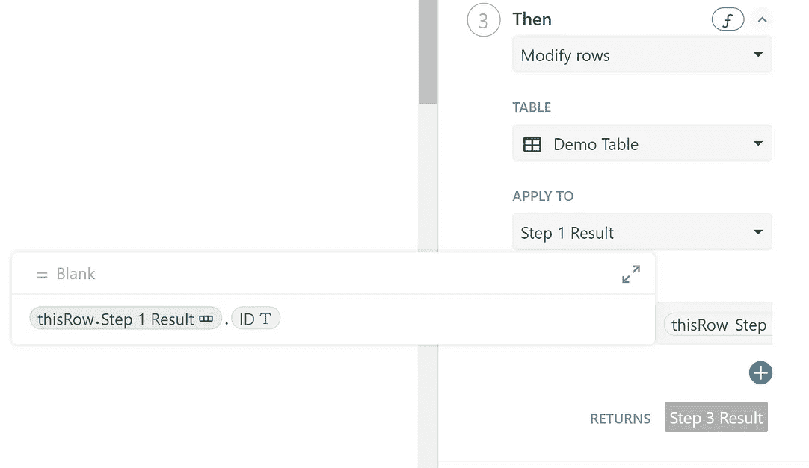

在我们的上下文中，当演示表中的一行发生了变化，而任何一列都没有问题时，就会发生第 1 步。当新的一行出现时，所有列中的值都会发生变化。填写表单的结果是一个新行。

在步骤 3 中(我们稍后返回到步骤 2 ),我们选择要修改的列，它是列 *MatchValue* ,我们使用下面的公式在步骤 1 的上下文中更新它，并从列 ID 中推送值:

`thisRow.[Step 1 Result].ID`

我不得不习惯这种逻辑，但没有立即发现它。如果你对此有同感，也不用担心。这部分 Coda 公式语言没有很好的文档，主要是练习的问题。

在步骤 3 中，我们获取我们正在处理的行(新行)中列 *ID* 的值，并将这个 *ID* 放入列 *MatchValue* 。现在我们有两列具有相同的值。 *ID* 和*匹配值*具有相同的散列关键字。不同之处在于列 ID 中的键是公式的结果，而列 *MatchValue* 中的值是文本，并且文本可以编辑。我们需要一个允许我们写入值的列，由于显而易见的原因，您不能覆盖一个公式值。列 *MatchValue —* 不包含公式，只有文本 *—* 现在可以用来自表单的值填充。只有当一个新的行进来时(第一次用户)，在 URL 中还没有一个*匹配值*(可以说是空白的)我们只需要一个*匹配值*，以防用户想要更新什么。

这就把我们带到了第二步，假设。只有当我们没有返回任何东西时——`IsBlank()`——我们才创建一个散列的*匹配值*。

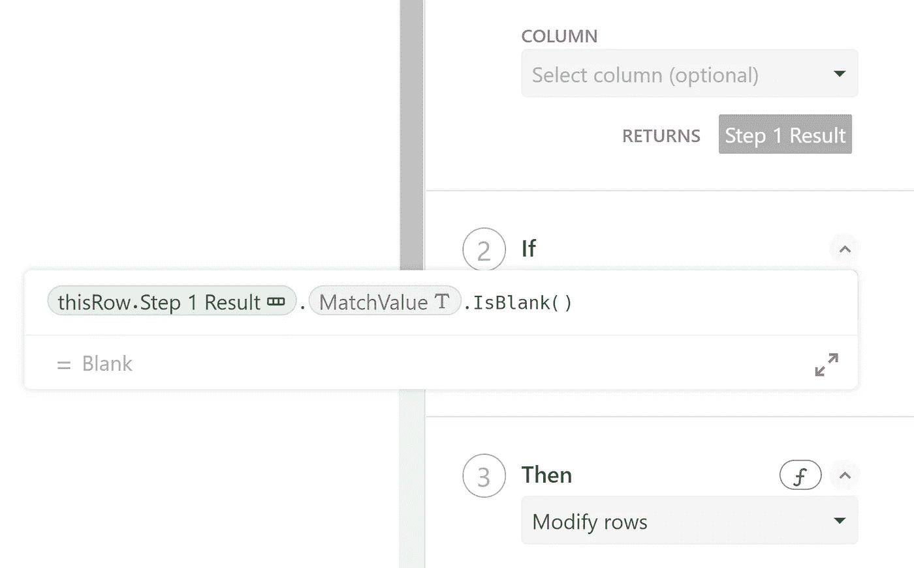

这种逻辑虽然第一次看时不那么明显，但工作得很好，只是有点慢，并且是建立保持数据一致的逻辑的关键。

## 更新值。

由于我们有一个*匹配值，*我们可以为经典解决方案设置第二个表，该表将只接收基于散列 ID 的更新值。实现这一点最简单的方法是在您工作的表格中添加一个按钮。这个按钮包含了如下图所示的`AddOrModifyRows()`:


第一行明确说明了匹配值，并要求匹配值出现在目标表中，如第二行所示。自动运行，对于每一个新的行，我们按下这个按钮，如果有匹配，我们更新。如果没有，我们在*数据库档案库*中添加一个新行。

这个新的目标表有两个优点。首先，我们只有任何用户的最新信息。第二，它没有公式，没有自动化，表格只是纯文本，速度很快。它是源表的更短、更简洁的版本。在源表中，我们仍然拥有所有可用的行，这使我们能够进行回顾。一旦我们收到空字段，这可能很重要。可以设置一个通知来提醒“经理”检查这些行。

一旦你这样做了几次，感觉很优雅，走得很快。

在**安全解决方案**中，我们已经有了两个表(表一和表二)和一个*匹配值*。此外，我们在表 2 中添加了一个按钮，并应用相同的技巧来更新表 1 中的值。下面是我们要仔细研究的两个问题。首先，我将 display 列中的值转换成文本，以便与表 1 中的文本值匹配。第二，如果通过表单应用`IfBlank()`在*空白(空)*中出现一个值，我有一个回退选项

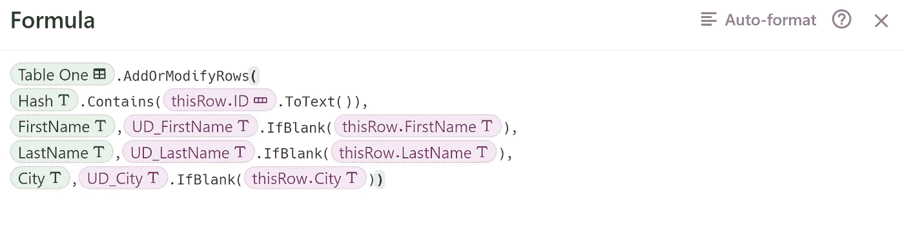

## 最后一件事→电子邮件

到目前为止，我们有两种通过表单更新数据并保持数据一致的解决方案。一种是开放且快速的，另一种是安全的，需要两种形式:一种用于新数据，另一种用于更新的数据。顺便说一下，您可以创建两种形式的更新表单，一种包含实际字段和“新”字段，另一种只包含“新”字段，您只需将其重命名为“您的名字”、“您的姓氏”、“城市”等。在我关于表单的博客中，我用不同的语言问了同样的问题。

回到基本问题，如何用邮件和自动化创建一个功能循环？

我们保持简单，使用 Gmail 包，如本博客[所述。](https://huizer.medium.com/how-to-coda-with-gmail-e3c01471d649)电子邮件根据新的一行发出。Coda 中的一页用变量填充。在我们的用例中，我们可以给出要点的摘要，并邀请接收者根据需要进行修改。如果用户看到一切都是正确的，不需要更新，否则他们单击链接，浏览器打开，表单显示预填充的值(经典或安全)。

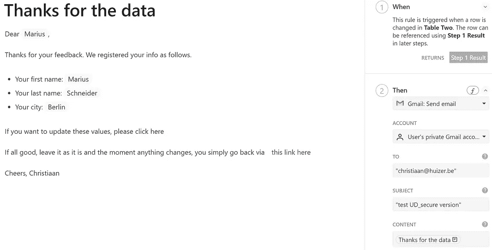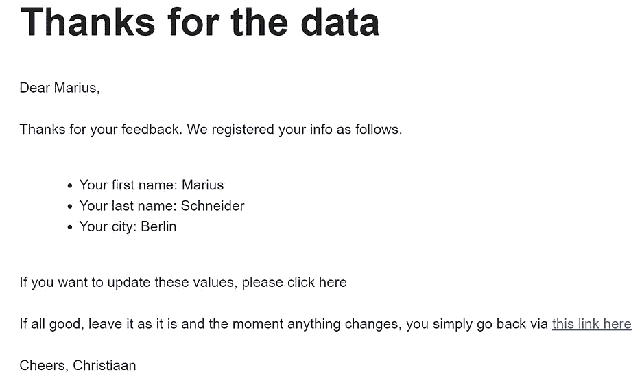

邮件中的链接是这样的:

```
[Table Two].[Secured URL].Last().Hyperlink(" this link here")
```

我们将城市更新为波恩，值到达表 2，在那里我们有一个行更改，它触发一个自动按钮。第一个表得到更新，由于链接的数据，第二个表准备好进行新的更新。

我建议将自动化设置为只按最后一个按钮，以避免由于不幸的事件链导致文档变慢，或者当删除一行时，您可能会由于缺少更正(删除的行)而得到错误的更新。与其后悔，不如挽回。我使用了下面的那个，但是也可以随意使用`Last()`函数或者`Created().Max()`函数或者其他函数。

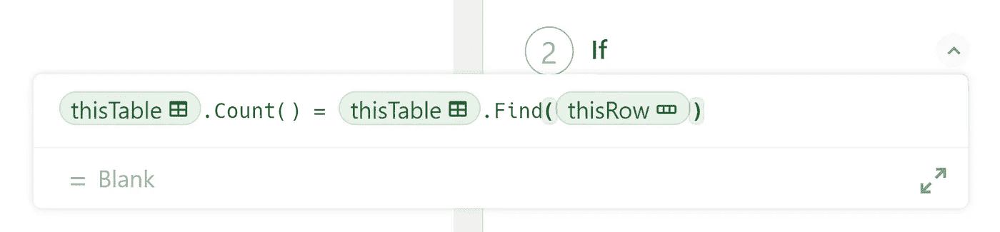

```
thisTable.Count() = thisTable.Find(thisRow)
```

Marius 带给我们的安全解决方案在流程方面相当简单。不要误解我的意思，创建表格、自动化、测试电子邮件(布局、文本)等是很耗时的。但是除了*如何结束*之外，你不会面临其他困难。

我们只剩下最后一个挑战，那就是发出一封包含经典解决方案正确值的电子邮件。您可能还记得，我们注意到在创建新行和通过自动化创建散列 Id 之间有一个延迟。我有点担心这种延迟可能会破坏进程，但它没有！

我填写了一个空表单(新用户),这增加了一个新行。这个新行是创建散列 ID 的触发器，它也触发了给我发送电子邮件的自动化。我收到了电子邮件，使用了电子邮件中的链接并更新了值，它们到达了表中，之前生成的行得到了更新，我收到了一封新的电子邮件，单击链接后，我有了预填的表单，其中包含正确的更新信息。

# 结论

我们可以有把握地得出结论，这两种解决方案都运行良好。我思考了什么时候应用“经典解决方案”和什么时候应用“安全解决方案”的问题。

一旦你已经有了一个数据库，你需要检查更新，这种安全是非常好的。人们看到他们与你分享的内容，理解更新逻辑，并会欣赏它。他们不能清空数据库，因为不填写不会损害数据库。因此，这在两方面都是一个安全的解决方案。为了与 GDPR 保持一致和公平，添加一个短语，如果人们希望部分删除他们的数据，他们只需在主题中回复类似“请删除我的数据”的内容(或者你在电子邮件中创建一个为他们做这件事的链接)。

当您在收集数据时，经典的方法是优雅的，您可以在提交数据以供审查后直接归还。这表明你很小心，因为他们看到的是同样的表格，但现在是预填的；你优雅地授权给订户。缺点是安全部分。他们可以删除所有以前的共享信息，你需要一些地方来检查这一点。例如，通过过滤仅包含擦除了其数据的客户端的源表(使用 *RowId()* 和散列关键字)。第二个问题是 URL 中数据的可见性。在我的工作中，我们从不传输信息，比如信用卡号、社会保险号等等。在我看来，如果你遵循这些基本的安全规则，你就可以走了。

再次感谢 Marius 使用散列 ID 和基于双栏的结构的想法，也感谢 [Joostmineur](https://medium.com/u/8332ecfdb393?source=post_page-----9bc4e5ee5a08--------------------------------) 花时间回顾我写这篇博客时面临的一些问题。

我希望你喜欢这篇文章。如果您有任何问题，请随时联系我们。虽然这篇文章是免费的，但我的工作(包括建议)不会是免费的，但总有聊天的空间，看看可以做些什么。此外，你可以在 [Coda 社区](https://community.coda.io/)和 [Twitter](https://twitter.com/CodaExpert) 上找到我的(免费)贡献

我叫 Christiaan Huizer，是 [Huizer Automation](https://huizer.be/) 的所有者。一家专门为 SME 收集数据并保持数据一致的公司。我是 Coda 专家，我主要依靠 Coda、Mailjet、Zapier、Paperform 来完成工作。


huizer Automation——Coda 专家，研究如何保持通过 Coda 表单输入的数据一致