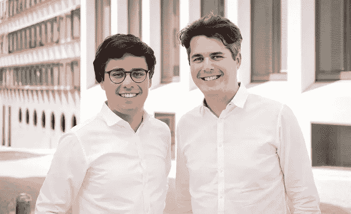

# 跟上 AWS

> 原文：<https://medium.com/codex/keeping-up-with-aws-66529220bd6a?source=collection_archive---------8----------------------->

## 采访

## [*亚马逊网络服务第三版*](https://www.manning.com/books/amazon-web-services-in-action-third-edition?utm_source=medium&utm_medium=referral&utm_campaign=book_wittig2_amazon_3_25_22) 作者访谈

兄弟**迈克尔和安德里亚斯·维蒂希**在 DevOps 出现之前就在练习 DevOps。在这次采访中，Andreas 谈到了如何跟上 AWS 的变化，如何创造自由职业生涯，以及如何编写他们的畅销书第三版[*Amazon Web Services in Action*](https://www.manning.com/books/amazon-web-services-in-action-third-edition?utm_source=medium&utm_medium=referral&utm_campaign=book_wittig2_amazon_3_25_22)*。*

在[manning.com](https://www.manning.com/books/amazon-web-services-in-action-third-edition?utm_source=medium&utm_medium=referral&utm_campaign=book_wittig2_amazon_3_25_22)的结账处，将 **intwittig3** 输入折扣代码框，即可享受 25%的折扣。

## ***第三版有什么新鲜刺激的？***

一大亮点是新的一章，涵盖了 AWS 上的现代和云原生架构以及部署容器。使用容器是一个游戏改变者，因为它们允许你将你的代码、库、运行时环境和运行一个应用程序所需的一切打包到一个容器中。通过使用容器，移动应用程序变得容易多了。例如:在开发人员的本地机器上开始，运送到测试环境，最后部署到生产环境。这就是为什么我们也使用容器来部署我们自己的应用程序。新的一章介绍了在 AWS 上运行容器的两种方法:AppRunner 允许您通过在终端中键入一个命令来运行容器化的 web 应用程序，而 ECS 和 Fargate 是为运行更复杂的系统而设计的。这两种方法都不再需要虚拟机。AWS 为您管理运行容器所需的基础设施。

## 你对哪些新功能最感兴趣，为什么？

自第二版以来，AWS 已经发展了很多。对于每一章，我们都添加了新的功能或删除了对以前缺陷的警告。例如，AWS 推出了具有强大持久性保证的 MemoryDB 和内存数据库，以及基于 ARM 而非 Intel/AMD 处理器的虚拟机。AWS 还改进了弹性文件系统(EFS ),并简化了对象存储 S3 处理流量高峰的方式。我们涵盖所有这些变化和更多。

## ***既然 AWS 是不断变化的，那么你是如何跟上每一次变化、新功能，或者版本发布的？***

我们使用 RSS 阅读器来跟踪 AWS 新闻、AWS 博客和 AWS 社区。此外，我们一直在尝试新的服务和功能，并在 [cloudonaut.io](http://cloudonaut.io/) 上分享我们的成果。除此之外，在为我们的咨询客户实施解决方案时，我们学到了很多东西。最后但同样重要的是，我们在 Twitter 上花了太多时间关注 AWS 社区的动态。

## 到目前为止，你一定对平台开发者有一定的影响力；您希望看到 AWS 实施哪些变革？

AWS 认真听取客户的反馈，我们通过正式和非正式渠道分享我们的反馈。这里有两件事我们最近放在 AWS 的愿望清单上:首先，扩展免费层以包括最新的服务和功能。我们尽可能地利用我们书中的免费层，它允许客户免费尝试大多数服务。似乎 AWS 只是忘记了在免费层下添加新功能的试用版。第二，我们希望看到更多的按请求计费的服务，因为这将改变经济状况，尤其是对于低流量应用。例如，不需要提供机器和按小时付费的 MemoryDB 就很棒。目前，一些 AWS 服务按小时收费，其他服务按请求收费。

## ***AWS 加入容器革命是个大新闻，但是容器总是最好的方法吗？哪些任务最好留在“容器之外”？***

我们使用容器来处理从云原生架构到传统系统的工作负载。在各种基础架构上实现自动化部署的优势保持不变。AWS 提供了不同的方法来运行容器，而不需要操作底层计算基础设施。Fargate 和 AppRunner 是这里最基本的两个服务。除此之外，还可以在一组虚拟机(EC2 实例)上编排容器。但是在 EC2 实例上运行容器会给基础设施增加另一层抽象和复杂性。我们强烈建议避免这种复杂的方法。但是，请记住，Fargate 和 AppRunner 提供的计算能力与 EC2 不同。对于具有特定需求的工作负载，例如计算或内存密集型应用程序，这就成了一个问题。除此之外，在 Fargate 或 AppRunner 上运行一个工作负载会带来比 EC2 更高的资源成本。因此，对于高吞吐量的工作负载，这种数学方法并不适用。

## 让我们来谈谈你的工作生活。你最初是一名软件开发人员，但你会如何描述你现在的工作？是“DevOps”吗？

是的，我们都是从金融行业的软件开发人员起步的。迈克尔在构建高频交易系统，我为投资组合经理编写软件。我们今天仍然编写代码，但是我们也管理运行我们的应用程序所需的云基础设施。我们开始做 DevOps 之前，这是一件事。今天，我们的工作生活包括为 SaaS 和我们在 AWS 市场上销售的软件产品编写代码，为初创公司和企业客户提供咨询以加速他们的云之旅，以及通过写书和文章以及录制播客和视频进行教育。

## 你真的开创了一个多样且令人羡慕的职业。对于那些想为一系列客户做自由职业的工程师，你有什么建议吗？

我强烈建议通过写博客、录制播客或制作视频来分享你的学习成果。对我们来说，内容创作驱动着我们业务的所有部分:咨询、软件和媒体。对 AWS 人才的需求非常高，所以现在是开始自由职业生涯的大好时机。我建议不要与招聘机构合作，而是与直接雇佣自由职业者的咨询公司取得联系。总的来说，我喜欢建立我们的公司。工作量很大，但我也很享受自由。

## 你倾向于说“我们”而不是“我”，当然你指的是你和你的兄弟迈克尔。你们两个一起做生意多久了？

回到 2015 年，我们成立了自己的公司。但甚至在那之前，我们一起为同一家公司写软件。当我们开始自己的公司时，我们主要做咨询，这意味着帮助我们的客户开始使用 AWS。随着时间的推移，我们投资于构建和销售软件。如今，销售软件已经取代咨询成为我们业务中最重要的部分。

## 无论是在工作中还是远离电脑的时候，你和迈克尔都有互补的优势和兴趣吗？

我们在许多方面是相似的。但是，我想说迈克尔更喜欢编程，而我更喜欢营销和销售。迈克尔喜欢看书，我更喜欢看电影和连续剧。我们都喜欢讨论政治和社会问题。但是说实话，除了工作，现在只有时间做一件事:抚养我们年幼的孩子。

感谢阅读。