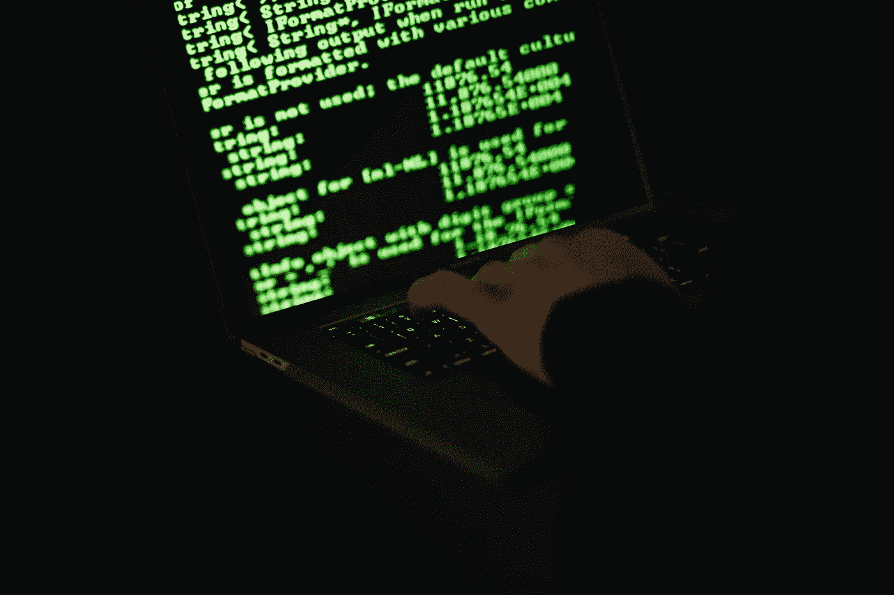

# 防止您的个人数据落入他人之手

> 原文：<https://medium.com/codex/keeping-your-personal-data-out-of-the-wrong-hands-3bb44423bb02?source=collection_archive---------14----------------------->

照片由[黑脸田鸡岛崎](https://www.pexels.com/@sora-shimazaki?utm_content=attributionCopyText&utm_medium=referral&utm_source=pexels)从[派克斯](https://www.pexels.com/photo/crop-hacker-typing-on-laptop-with-information-on-screen-5935787/?utm_content=attributionCopyText&utm_medium=referral&utm_source=pexels)拍摄

如果你上网，无论是通过台式机、笔记本电脑、平板电脑还是手机，你的数据都会被跟踪。多亏了手机信号塔，你的一举一动都会被记录下来，即使你没有试图上网。只要你带着手机(并且开机)，你的信息就会在你每次搬家时被收集。随着智能手表的出现，让你做任何事情的机会…