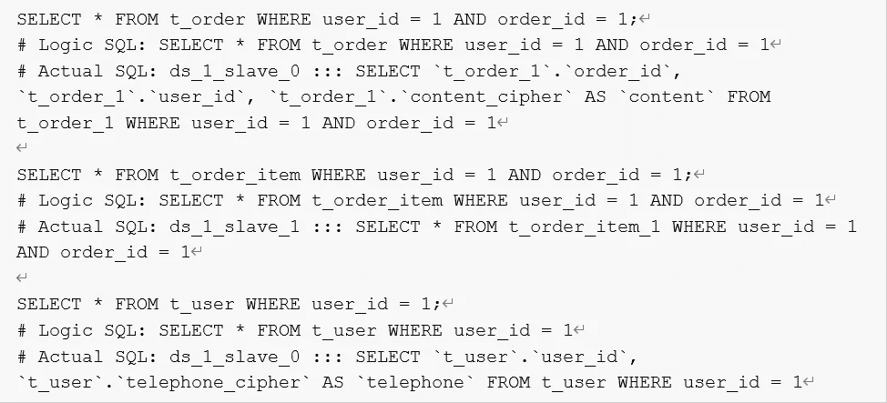

# Apache ShardingSphere 5.0.0 的内核优化和升级指南—理想的数据库管理生态系统

> 原文：<https://medium.com/codex/kernel-optimizations-upgrade-guide-for-apache-shardingsphere-5-0-0-49942fd31898?source=collection_archive---------6----------------------->

经过近两年的开发和优化，Apache ShardingSphere 5.0.0 GA 版本最近发布了。

与 4.1.1 GA 版本相比，新版本的内核有了很大改进:

*   内核优化受制于可插拔架构，允许用户按照自己的意愿组合内核特性。
*   联邦执行引擎旨在提高 SQL 分布式查询能力，以满足用户在复杂业务场景中的需求。
*   我们还在 API 层面做了优化，帮助用户降低成本。

本文将让您更好地理解我们所做的一些与内核相关的更改，以及新版本和以前版本之间的特性差异。您还将了解有关这些优化的更多信息，以及如何在集成了数据分片、读/写拆分以及加密和解密的实际场景中使用 5.0.0 版本。

## **可插拔架构内核**

Apache sharding sphere 5 . 0 . 0 GA 版本的北极星。我们的 Database Plus 概念的使命是在碎片化数据库的基本服务之上建立一个标准层和生态系统，并为用户提供附加功能。统一和标准化的数据库使用规范为上层应用程序提供了支持，企业因底层数据库碎片化而面临的挑战得到了尽可能的最小化。Database Plus 的三个特征是链接、增强和可插拔。

ShardingSphere 可以为用户提供管理服务和增强功能，包括分布式数据库、数据安全、数据库网关和压力测试。面向插件的内核架构允许模块化，用户可以根据需要灵活地扩展特性。

Database Plus 概念的出现标志着 ShardingSphere 已经从一个中间件发展成为一个创新的分布式数据库生态系统。因为我们将 Database Plus 作为我们的新方向，而且在我们的可插拔系统中有许多扩展点，所以拥有一个可插拔的内核是理所当然的。下图说明了新的可插拔内核:

面向 Apache ShardingSphere 插件的内核

Apache ShardingSphere 内核的所有进程(即元数据加载器、SQL 解析器、SQL 路由器、SQL 重写器以及 SQL 执行器和结果合并器)都提供了扩展点，ShardingSphere 在这些扩展点上实现了默认特性，如数据分片、读/写拆分、加密和解密、影子数据库压力测试以及高可用性。

我们可以将扩展点分为两类:基于特性的扩展点和基于技术的扩展点。

在内核进程中，技术扩展点包括 SQL 解析器引擎和 SQL 执行器引擎的扩展点。函数扩展点是元数据加载、SQL 路由器引擎、SQL 重写器引擎以及 SQL 执行器和结果合并引擎的扩展点。

SQL 解析器引擎的扩展点是 SQL AST 分析和 SQL 树遍历。在这两个扩展点上构建的 SQL 解析引擎，默认情况下可以解析和支持 [MySQL](https://www.mysql.com/customers/view/?id=1461) 、 [PostgreSQL](/codex/create-a-distributed-database-solution-based-on-postgresql-opengauss-b30d0e1ced2c) 、Oracle、SQLServer、openGauss、SQL92 等多种数据库方言。用户还可以编写代码来解析 Apache ShardingSphere SQL Parser 目前不支持的更多数据库方言，或者开发 SQL Audit 和其他新功能。

SQL 执行引擎扩展点怎么样？它的扩展依赖于不同的执行方法。目前 Apache ShardingSphere 的 SQL Executor 有单线程执行引擎和多线程执行引擎。单线程执行引擎用于执行事务语句，多线程则适用于不包含事务的场景，以提高 SQL 执行性能。在未来，我们将提供更多的执行引擎，如 MPP 执行引擎，满足分布式场景中 SQL 执行的要求。

Apache ShardingSphere 为数据分片、读/写分离、加密和解密、影子数据库压力测试和高可用性提供了功能扩展点。这些特性实现了全部或部分功能扩展点，以满足他们的需求。同时，在每个模块中，还提供了内部子级功能扩展点，如分片策略、分布式 ID 生成器和负载平衡算法。Apache ShardingSphere 内核函数中实现了以下扩展点:

*   **数据分片:**实现元数据加载器、SQL 路由器、SQL 重写器和结果合并的所有扩展点。对于数据分片函数，提供了分片算法、分布式 ID 等扩展点。
*   **读写拆分:**实现函数扩展点 SQL Router，为函数提供负载均衡算法扩展点。
*   **加密&解密:**实现元数据加载器、SQL 重写器和结果合并。在内部，提供了加密和解密算法扩展点。
*   **影子数据库压力测试:**实现扩展点 SQL 路由器。给出了子级扩展点阴影算法。
*   **高可用性:**还实现了 SQL Rounter 扩展点。

给定扩展点，Apache ShardingSphere 函数是真正可伸缩的。多租户、SQL 审计和其他新特性将通过这些扩展点无缝地添加到生态系统中。

此外，当开发需要快速部署分布式数据库系统时，用户还可以利用这些扩展点来开发定制功能。关于可插拔架构的扩展点的详细描述，请参考开发者手册:[https://sharding sphere . Apache . org/document/current/en/dev-manual/](https://shardingsphere.apache.org/document/current/en/dev-manual/)

我们比较了 5.0.0 GA 版本和 4.1.1 GA 版本的可插拔内核，发现了一些主要差异(如下表所示):

版本比较

首先，两个版本的产品定位不同。版本 5.0.0 GA 是 Apache ShardingSphere 从数据库分片中间件向分布式数据库生态系统发展的里程碑，在分布式数据库生态系统中，功能可以很容易地集成到可插拔架构中。

第二，4.1.1 GA 版本只支持基本功能，而 5.0.0 GA 版本关心的是基础设施和特性最佳实践。用户甚至可以放弃一些特性，在内核基础设施上开发自己的定制功能。在耦合性方面，5.0.0 GA 版本中的内核函数是相互隔离的，因此无法感知另一个特性的存在，最大程度上保证了内核的稳定性。最后，考虑到功能组合，5.0.0 版本将所有功能(例如，数据分片、读/写拆分、影子数据库压力测试、加密和解密以及高可用性)置于同一级别，因此用户可以根据自己的喜好组合功能。4.1.1 GA 版本在其他函数上强加了数据分片。

总之，增强的 5.0.0 GA 版本的可插拔内核允许用户自由组合功能以满足他们的业务需求，就像他们是构建块一样。然而，采用新的可插拔架构也改变了我们使用内核函数的方式。

在本文中，我们将展示一些实际的例子，并展示如何在 5.0.0 GA 版本中组合这些功能。

## **联邦执行引擎**

联邦执行引擎是 5.0.0 GA 版本内核的另一个亮点。我们的目标是支持在 4.1.1 GA 版本中不工作的分布式查询语句，例如跨数据库实例相关的查询和子查询。由于联邦执行引擎，开发人员不再需要担心 SQL 的使用范围，他们可以专注于他们的业务功能开发，减少业务级别的功能限制。

联邦执行引擎流

上图展示了联邦执行引擎的流程。一般来说，流程仍然遵循这样的顺序:SQL 解析器、SQL 路由器、SQL 重写器，然后是 SQL 执行器。唯一不同的步骤是在联邦执行引擎中使用了额外的 SQL 优化器。优化器包含 RBO(基于规则的优化器)和 CBO(基于成本的优化器)，用于优化分布式查询语句，并以最小的成本获得执行计划。在 SQL 路由器中，路由器引擎分析 SQL 语句是否被提供给跨数据库实例，如果是，它确定使用联邦执行引擎来执行 SQL。

联邦执行引擎仍然是一个实验性的特性，所以默认情况下是禁用的。如果要使用引擎，可以通过配置`sql-federation-enabled: true`来启用。

联合执行引擎适用于跨数据库实例的相关查询和子查询，以及一些内核不支持的聚合查询。下面是我们给出的具体场景示例，以帮助您理解联邦执行引擎支持的语句。

*   **跨 DataNode 相关查询:**当一个关系查询的多个表分布在不同的数据库实例上时，使用联邦执行引擎。

比如看下面的数据分片配置:`t_order`和`t_order_item`表是有多个 datanodes 的表分片，没有配置绑定表规则，而`t_user`和`t_user_role`是分布在不同数据库实例上的单个表。

以下 SQL 命令通常用于跨数据库实例，因此建议使用联邦执行引擎来完成这些关系查询:

*   **子查询:**简单下推引擎支持具有一致分片条件的子查询，并且子查询被路由到单个分片。如果没有为子查询和外部查询指定相同的分片键，或者分片键的值不一致，那么就需要联邦执行引擎。

下面的代码块显示了联邦执行引擎支持的一些子查询:

*   **聚合查询:**目前 Apache ShardingSphere 简单下推引擎还不能支持所有的聚合查询。但是，您可以使用联邦执行引擎来执行简单下推引擎不支持的聚合查询。

联邦执行引擎显著增强了 Apache ShardingSphere 的分布式查询能力。未来，我们将继续优化 Apache ShardingSphere，旨在减少联邦执行引擎的内存使用，并改进分布式查询功能。

## **特性 API 调整**

为了帮助用户最小化相关成本，5.0.0 GA 版本在 API 层面做了很多优化。根据一些社区反馈，数据分片 API 过于复杂，难以理解。经过社区层面的讨论，我们决定在新的 GA 版本中提供一个全新的数据分片 API。

随着 Apache ShardingSphere 项目定位从数据库中间件转变为分布式数据库生态系统，我们必须开发一个透明的数据分片功能。准确地说，**在 5.0.0 GA 中，我们为用户提供了自动分片策略，所以他们不需要担心数据库和表的细节，因为他们可以使用自动分片来指定分片的数量。**由于新的可插拔架构和影子数据库压力测试等一些增强功能，内核函数 API 也做了相应的调整。在这一节中，我们将介绍在不同的 API 中所做的调整。

**数据分片 API**

在之前的 4.x 版本发布之后，用户经常在社区中联系我们，抱怨用于数据分片的 API 太复杂和难以使用。下面的代码块向您展示了 4.1.1 GA 版本中的数据分片配置。在旧版本中，有五种分片策略，即标准、复杂、内联、提示和无。用户很难理解和使用不同分片策略的不同参数。

在 5.0.0 GA 版本中，我们简化了数据分片 API 中的分片策略。首先，现在删除了原来的`inline`策略，我们保留了剩下的四种分片策略，即`standard`、`complex`、`hint`和`none`。

同时，从分片策略中提取出分片算法。现在用户可以在属性`shardingAlgorithm`下配置它，并指定`shardingAlgorithmName`作为分片策略中的参考。

上面的代码块是新的配置，不同于 4.1.1 GA 版本中的分片配置。新的分片 API 更加简洁明了。

为了帮助用户减少配置工作量，Apache ShardingSphere 提供了许多内置的分片算法，他们也可以通过分片算法`CLASS_BASED`选择自定义设置。有关内置分片算法的更多信息，请阅读*“内置算法-分片算法”*:

为了实现透明的数据分片，我们在 5.0.0 GA 版本中添加了自动化分片策略。下面的代码块向您展示了自动分片策略配置和手动分片策略配置之间的区别:

自动分片策略必须在`autoTables` 属性下配置。用户只需通过自动分片算法指定数据存储的数据源以及分片的数量。他们不再需要通过`actualDataNodes`手动设置数据分布，或者额外关注设置数据库分片策略和表分片策略，因为 Apache ShardingSphere 会自动帮助用户管理数据分片。

我们也从数据分片 API 中移除了`defaultDataSourceName`。我们反复强调 Apache ShardingSphere 现在是一个分布式数据库生态系统。我们想向用户传达的信息是，您可以直接使用 Apache ShardingSphere 提供的服务，但是当您使用这些服务时，您可能会感觉您只是在使用传统的数据库。您不必感知底层数据库存储。Apache ShardingSphere 内置的`SingleTableRule`可以管理数据分片之外的单表，旨在帮助用户实现单表自动加载&路由。

此外，为了进一步简化配置，结合数据分片 API 中的`defaultDatabaseStrategy`和`defaultTableStrategy`分片策略，还增加了默认分片键 defaultShardingColumn。

当多个表具有相同的分片键时，用户只需要使用默认的 defaultshardingcolumnfiguration，而不是 shardingColumn。t_order 表的分片策略是通过默认的 defaultshardingcolumnfiguration 设置的(参见下面的代码)。

*   **读/写拆分 API**

在 5.0.0 GA 版本中，我们没有对读/写拆分 API 进行大量更改。我们只从`MasterSlave`调整到`ReadWriteSplitting`，其他用法不变。以下代码块向您展示了 4.1.1 GA 版本和 5.0.0 GA 版本的读/写拆分 API 之间的差异。

此外，在可插拔架构中开发的高可用性功能加上读/写拆分可以提供主设备和从设备之间的自动切换，从而产生高可用性版本的读/写拆分。如果你对高可用性功能感兴趣，请关注我们的 GitHub repo 或 socials。我们将很快发布相关文档和技术博客。

*   **加密&解密 API**

我们在加密&解密 API 中加入`table`级别的`queryWithCipherColumn`属性，方便用户在一个表中切换加密/解密字段的明文和密文。5.0.0 版 API 没有其他变化。

*   **影子数据库压力测试 API**

我们在 5.0.0 GA 版本中完全调整了影子数据库压力测试 API。第一个调整是删除影子数据库中的逻辑列，创建影子数据库匹配算法，帮助用户灵活控制路由。

下面的代码块是旧的 4.1.1 GA 版本的影子数据库压力测试 API。老实说，功能相当简单:根据逻辑列值，用户可以判断是否启用影子数据库压力测试。

在 5.0.0 GA 版本中，影子数据库压力测试 API 要强大得多。用户可以通过`enable`属性启用测试。同时实现了对生产表的细粒度控制。

新的 API 还支持多种匹配算法，如列值匹配算法、列正则表达式匹配算法和 SQL 注释匹配算法。

由于文章的字数限制，我们无法详细介绍影子数据库压力测试功能——但我们将很快分享更多相关的技术内容。如果你对影子数据库匹配算法感兴趣，请阅读*“影子算法”*:[https://sharding sphere . Apache . org/document/5 . 0 . 0/en/user-manual/sharding sphere-JDBC/configuration/built-in-Algorithm/Shadow/](https://shardingsphere.apache.org/document/5.0.0/en/user-manual/shardingsphere-jdbc/configuration/built-in-algorithm/shadow/)

## **Apache sharding sphere 5 . 0 . 0 升级指南**

在前面的章节中，我们讨论了一些与 5.0.0 GA 的内核相关的优化，即可插拔内核、联邦执行引擎和内核函数 API 调整。后面还有额外的区别要讨论，**不过我猜你现在最关心的是如何从 4.1.1 GA 升级到 5.0.0 GA 版本。**

在本节中，我们将以集成数据分片、读/写拆分和加密/解密的典型场景为例，详细说明您在升级过程中可能遇到的一些问题的解决方案。

使用 4.1.1 GA 版本，您必须在数据分片上添加读/写拆分和加密/解密。旧版本的配置如下所示:

在上面的配置中，`t_order`和`t_order_item` 配置了分片规则，`t_order` 表的`content` 字段也设置了 AES 加密器算法的加密规则。`t_user` 是非共享表，`telephone`字段也配置了加密规则。此外，请注意，读/写分割规则和加密规则在碎片规则中被配置为属性。这样的配置证明了 4.1.1 GA 中其他功能都严重依赖数据分片。

配置完成后，我们启动 4.1.1 GA 版本的代理适配器并初始化`t_order`、`t_order_item`和`t_user`表。初始化语句的执行结果如下:

`t_order`表分片的路由和重写正常，但加密/解密函数的重写失败。为什么？

因为 4.1.1 GA 版本不支持在加解密场景下重写 DDL 语句。因此，用户必须事先在底层数据库上创建加密和解密表。**目前，DDL 语句的加密和解密重写在 5.0.0 GA 版本中已经完善，用户不再需要重复不必要的操作**。

由于`t_order_item`表不需要加密或解密，其路由&重写结果是正常的。但是，`t_user`表也有加密/解密 DDL 语句重写失败的问题，更糟糕的是，`t_user`表被路由到 ds_0 数据源。为了解决这些问题，我们在分片规则中配置了`defaultDataSourceName: ds_0`。该规则设计用于路由非共享表。

至于`t_order`表和`t_user`表，我们使用下面的 SQL 语句，并在路由结果的底层数据库上手动创建加密/解密表。

重启代理后，我们将数据添加到`t_order`、`t_order_item`和`t_user`表中，在此期间，数据将根据分片键和配置的分片策略被路由到数据节点。根据`defaultDataSourceName`配置将`t_user`表路由至`ds_0`数据源。

然后，我们可以执行一些简单的查询语句来检查读/写拆分功能是否有效。在日志中可以看到,`t_order`和`t_order_item`表已经被加密、解密和重写，并且它们也被路由到正确的从数据库。然而，当配置的读写分离不起作用时，`t_user`表仍然被路由到`ds_0`数据源进行执行。为什么？

因为在 4.1.1 GA 版本中，读/写拆分和加密&解密被集成到数据分片中，自然限制了分片以外的功能。

**5 . 0 . 0 GA 版本采用可插拔架构和升级内核，允许用户不受任何限制地组合这些功能。此外，在新版本中，我们删除了** `**defaultDataSourceName**` **，因此用户不再需要额外的配置。现在 ShardingSphere 默认通过** `**SingleTableRule**` **实现单表元数据加载和路由。**我们来看看 5.0.0 GA 版本中的功能是如何配置和使用的。配置代码如下所示:

**5 . 0 . 0 GA 版本和 4.1.1 GA 版本最大的配置区别在于不同功能之间的关系。在 5.0.0 版本中，它们的位置是平行独立的，不像 4.1.1 GA 中的函数依赖关系。用户可以灵活地加载或卸载这些可插拔功能。当您一起使用一些功能时，部署非常类似于交付管道。**

比如你的读写拆分规则是基于两套主从关系，然后聚合两个逻辑数据源，分别是`ms_ds_0`和`ms_ds_1`；那么由于你的数据分片规则是基于读/写拆分聚合的逻辑数据源，你配置的数据分片规则聚合逻辑表`t_order`；加密/解密功能侧重于重写列和值，并为数据分片功能聚集的逻辑表配置加密和解密规则。读写拆分、数据分片、加解密等功能逐一转移，同时通过修饰的方式不断增加功能。

为了与 4.1.1 GA 版本的功能进行比较，我们执行相同的初始化语句、Insert Into 语句和 Query 语句来测试 5.0.0 GA 版本。

5.0.0 GA 版本支持重写加密和解密 DDL 语句，因此在创建`t_order`时，数据分片、读写拆分和加密/解密中的路由和重写执行得很好。

您可以在日志中看到，`t_user`表被路由到`ds_1`数据源进行执行。在 5.0.0 GA 版本中，虽然`t_user`表是单个表，但是用户不需要配置数据源，因为当表创建语句执行时，ShardingSphere 可以随机选择一个数据源进行路由。为了保证精确的路由结果，我们必须保证它在逻辑数据库中的唯一性。

当您将数据插入到`t_user`表中时，会根据存储在元数据中的信息执行自动路由。例如，由于在前面的步骤中`t_user`被路由到`ds_1`数据源，其他语句将跟随元数据`t_user: ds_1`。

当我们执行查询语句时，我们发现`t_user`表被路由到`ds_1_slave_0`数据源，这样就完成了对单个表的读/写拆分。Apache ShardingSphere 5.0.0 GA 内核可以通过元数据加载在内部维护单个表的数据分布信息；我们还充分考虑了不同函数组合的场景，使得 Apache ShardingSphere 完美支持单个表上的操作。

当然，5.0.0 GA 版本还有更多新特性。在本升级指南中，我们仅比较两个 GA 版本中支持的一些功能。我们希望本文能够帮助您了解新特性，并成功实现版本升级。如果你有兴趣，请访问我们的 repo，或者请阅读我们的文档并自行测试新版本。

## **结论**

经过两年的开发，带有**可插拔内核的全新 Apache ShardingSphere 为所有开发者提供了无限的开发可能性。未来，我们将继续开发更多可插拔内核的新特性，以惊人的功能扩展 Apache ShardingSphere 生态系统。**联邦执行引擎只是分布式查询的开始。我们将更加努力地优化其内存和性能，为您提供更加可靠和高效的分布式查询。

一如既往，欢迎您加入我们开发 Apache ShardingSphere 项目。

## **参考文献**

1.  Apache ShardingSphere 发行说明:https://github . com/Apache/sharding sphere/releases
2.  5.x 版的全新分片配置 API:https://github . com/Apache/sharding sphere/issues/5017
3.  数据库和表的自动分片策略:https://github . com/Apache/Sharding sphere/issues/5937
4.  投稿指南:[https://shardingsphere.apache.org/community/en/contribute/](https://shardingsphere.apache.org/community/en/contribute/)
5.  [https://docs.oracle.com/en/](https://docs.oracle.com/en/)
6.  [https://www.mysql.com/customers/view/?id=1461](https://www.mysql.com/customers/view/?id=1461)
7.  [https://medium . com/codex/create-a-distributed-database-solution-based-on-PostgreSQL-open gauss-b 30d 0 E1 ced 2c](/codex/create-a-distributed-database-solution-based-on-postgresql-opengauss-b30d0e1ced2c)

## 开源项目链接:

***sharding sphere Github:***[https://github.com/apache/shardingsphere](https://github.com/apache/shardingsphere)

**https://twitter.com/ShardingSphere**T21

***ShardingSphere Slack 频道:***[https://join . Slack . com/t/Apache sharding sphere/shared _ invite/ZT-sbd de 7 ie-sjdqo 9 ~ I 4 rycr 18 bq 0 sytg](https://join.slack.com/t/apacheshardingsphere/shared_invite/zt-sbdde7ie-SjDqo9~I4rYcR18bq0SYTg)

***GitHub 问题:***【https://github.com/apache/shardingsphere/issues】T4

***投稿指南:***[https://shardingsphere.apache.org/community/cn/contribute/](https://shardingsphere.apache.org/community/cn/contribute/)

## **作者**

段郑强

> SphereEx 高级中间件开发工程师& Apache ShardingSphere 委员会成员

他于 2018 年开始为 Apache ShardingSphere 中间件做出贡献，此前曾是众多数据分片项目的工程师领导。他喜欢开源，并与他人分享他的技术故事和经验。他现在致力于开发 Apache ShardingSphere 内核模块。