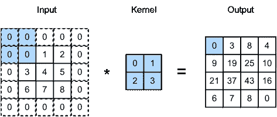
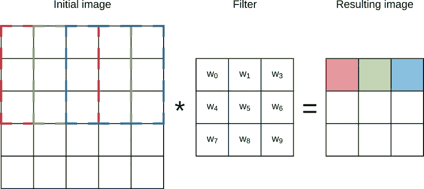

# 卷积神经网络(CNN)中的内核(滤波器)，我们来说说。

> 原文：<https://medium.com/codex/kernels-filters-in-convolutional-neural-network-cnn-lets-talk-about-them-ee4e94f3319?source=collection_archive---------0----------------------->

我们都知道 CNN 中的内核，我们中的大多数人已经使用过它们，但是我们没有正确理解它们。在这篇博客中，我试图解释一些与内核相关的问题，如果你想了解更多，你可以看看我以前的博客。

# 1.我们可以用 2 x 2 或 4 x 4 内核吗，为什么我们总是用 3 x 3 内核？

首先说一下第一部分。是的，我们可以使用 2 x 2 或 4 x 4 内核。

图一。(图片从谷歌下载)

如果我们将上面的猫的图像转换成一个数组，并假设值如图 2 所示。当我们在这个阵列上应用 2 x 2 内核时，我们将得到 4 x 4 的输出矩阵。但是当我们应用 3×3 内核时，我们将得到一个 3×3 的输出矩阵。

我们的算法将处理成千上万的猫的图像，并通过多个神经网络层传递每个图像，因此如果我们使用 2 x 2 内核，我们的计算能力将增加，与 3 x 3 内核相比，该算法将花费更多的时间来计算输出。所以用 3×3 内核比 2×2 内核更有效。

图二。内核的大小是 2 x 2。(图片下载自谷歌。)

图三。内核的大小是 3×3。(图片下载自谷歌。)

现在，我知道你在想什么，如果我们使用一个 4 x 4 的内核，那么我们将有一个 2 x 2 的矩阵，我们的计算时间将减少超过 3 x 3 的内核，但你是把你的 6 x 6 矩阵图像转换成 2 x 2 矩阵；您很有可能无法从图像中捕捉到重要的特征，而且输出矩阵中也会有[噪声](https://www.google.com/search?q=noise+in+deep+learning&oq=noice+in+dee&aqs=chrome.1.69i57j0i13j0i13i30j0i10i22i30j0i5i13i30j0i8i13i30l2.7090j0j7&sourceid=chrome&ie=UTF-8)。

所以总体来说，在深度学习中，使用 3 x 3 内核是一个更有效、更安全的选择。还有，3 x 3 内核是 2 x 2 和 1 x 1 内核的超集，也就是说我们可以把 3 x 3 内核当做 2 x 2 或者 1 x 1 内核来用。

# 2.为什么我们要使用 Symmetrics 内核？

你把上面的图像转换成一个 6 x 6 的矩阵，这是一个 1D 矩阵，为了卷积，我们需要一个 2D 矩阵，所以我们必须翻转内核，然后它将是一个 2D 矩阵。此外，没有翻转的卷积是相关的。

> 如果我们使用一个非对称矩阵和非对称矩阵，我们不能有它的逆，所以我们永远不会得到一个卷积。

如果我们水平翻转正方形或对称矩阵，它们不会改变。此外，一些内核从来没有改变到垂直翻转或近似旋转。

这种核充当正则化器，并以更复杂的训练过程为代价来提高卷积神经网络的泛化能力。

> 研究论文链接:[https://arxiv.org/abs/1805.09421](https://arxiv.org/abs/1805.09421)

# 3.为什么图像的大小不等于内核的大小？

如果我们选择更小的内核大小，那么我们将有很多细节，这可能会导致过度拟合，计算能力也会增加。

现在我们选择核的大小大于或等于一幅图像的大小，然后输入神经元 N×N，核大小 N×N 只给你一个神经元，它会导致你欠拟合。

# 4.在**卷积神经网络(CNN)中，内核的输入值是如何初始化和学习的？**

有许多不同的初始化策略:

*   将所有值设置为 0 或 1 或其他常数。
*   分布中的样本，如正态分布或均匀分布。
*   您可以用预定义的值初始化内核。

训练是一个调整这些元素值的过程。

给定一个输入，所有层元素有效地构成了该输入到预测输出的转换。预测产量和实际产量之间的差异被定义为损失。然后，该损耗值通过这些滤波器反向传递，并用于调整滤波器中的值，以有效地最小化预测输出和实际输出之间的差异。这样，滤波器的值在训练期间被调整，并且当损失最小化时，系统被认为已经收敛。

网络过滤器也可以从另一个网络的权重初始化。这通常被称为迁移学习，并成功地用于更好更快地收敛许多问题。

> 参考:[https://www . quora . com/How-are-convolutionary-filters-kernels-initialized-and-learn-in-a-convolutionary-neural-network-CNN](https://www.quora.com/How-are-convolutional-filters-kernels-initialized-and-learned-in-a-convolutional-neural-network-CNN)

> 如果你知道一些其他的问题，那么你可以发邮件给我。
> 
> 邮件 id:kadamrahulj0909@gmail.com

谢谢…