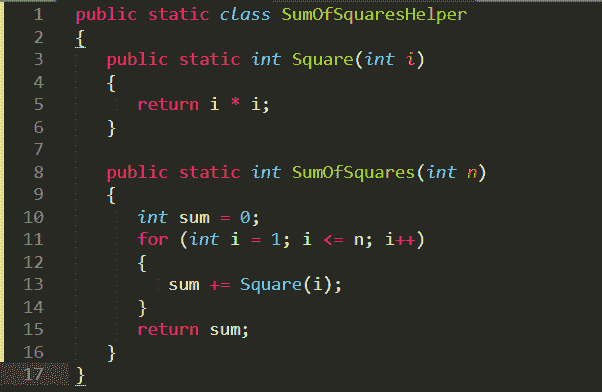
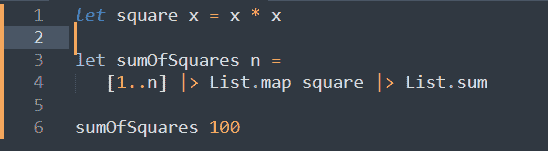

# 升 C 调和降 F 调的主要区别

> 原文：<https://medium.com/codex/key-differences-between-c-sharp-and-f-sharp-73dd465cc296?source=collection_archive---------8----------------------->

C#和 F#都有自己独特的方式。显然，当我们比较不同的编程语言时，这两种语言之间必然存在某些相似之处和不同之处。

那么这些区别是什么呢？C#和 F#中有哪些可以做得更好的地方？在本帖中，我们有你所有问题的答案。请继续阅读。

**目录**

*   C#的得分高于 F#？
*   其中 F#得分超过 C#？
*   两种语言代码的比较
*   结论

# C#的得分高于 F#？

## 任务运行时性能

异步代码在 C#中比在 F#中运行得更快。这主要是因为编译器本身支持这些代码，并且它们生成优化的代码。一旦 F#开始原生支持代码，这种差异就会缩小。尽管存在这种差异，但对于典型的业务线应用程序来说，这并不重要。

w 可以提取到 C#库中，并从 F#中调用它，以获得真正的性能敏感代码。异步工作流通常在代码中使用，因为它比任务更容易使用。还因为它支持开箱即用的取消。

## 与互动。网络图书馆

因为大多数。NET 库是用 C#编写的，与 F#相比，开发人员用 C#工作变得更容易。

## 早期回报

在 C#中，只需使用关键字 *return* 就可以调用一个方法。这在 F#中是不可能的。在深度嵌套的代码块中，这个特性非常有用。尽管 return 使得调用方法变得更容易，但是理解代码可能会变得困难。

## 协变/逆变

C#支持 Co/Contravariance，目前 F#还不支持。这对于处理泛型的库代码尤其有益。

## 一般面向对象编程

在 C#中使用受保护的类更容易，因为它有一个在 F#中没有的关键字叫做*受保护的*。此外，内部类类型、隐式接口和分部类的实现在 C#中是可能的，而在 F#中是不可能的。一般的面向对象编程在 C#中更容易完成。

## 隐式铸造

C#支持隐式转换，而 F#不支持。F#不支持这两种类型，即向上转换或向下转换。因此，在 C#中使用依赖隐式转换的库更容易。

## 源发生器

源生成器不适用于 F#。但是，有 Myriad(一个代码生成器)。

## 文件排序

在 C#中，可以以任何方式对文件和命名空间进行排序。F#中有严格的顺序(从下到上)。因此，在 C#中定义需要循环的模型更容易。

## 工具和集成开发环境支持

与 F#相比，C#提供了更好的工具和 IDE 支持。

在所有 ide 中，C#的调试过程比 F#更容易。在 F#中，异步工作流尤其难以调试。

## 低级编程

不安全代码和 Invoke/P 是属于 C#的东西。C#也支持 Span 和 pinned ref。这些在 F#中都没有。

## Winforms 或 WPF

C#特别开始为 WPF 或 Winform 客户端编码。这不是 F#的重要领域。

## 实体框架

在。NET 世界中，实体框架是一个非常流行的框架。编码人员本能地想到不要在 F#中使用这个框架，因为这个框架的设计是违反 F#的。

## 异步主方法

在 *main* methodm 中 *async* 可用于 C#的情况，而对于 F# *Async。*主*方法中使用同步运行*。

# 其中 F#得分超过 C#？

## 默认不变性

在 F#中一切都是不可变的，除非你使用关键字 *mutable。*不变性有助于使并行化更容易，并防止缺陷。

在 F#中，管道便于从左上到右下编码，而不使用任何局部变量。因此更容易阅读代码。

## 一切都是一种表达

随着表达式的使用，对代码的推理变得更加容易，对代码的调试也变得更加容易。F#中只有表达式，而 C#中有表达式和语句。

## 类型推理

F#中的类型推断使得程序员输入较少的注释。重构也变得更加容易。

## 受歧视的工会

F#中存在有区别的联合，这允许在使用类、记录、枚举和接口时以更好的方式对业务领域建模。更好的建模导致简单的代码和更少的缺陷。

## 计算表达式

计算表达式以一种程序员友好的方式结合了各个方面，如异步、选项、结果、验证等。这在 F#中是众所周知的。许多 ce 都在名为 *FsToolkit 的库中提供。*将 *async* 与任何东西结合起来，最终会变成臃肿的代码，难以阅读。

## 模式匹配

F#中的活动模式使得复杂的模式匹配更容易阅读。虽然 C#最近在模式匹配方面有所改进，但 F#比 C#有一个更高的优势，即有一个活动的模式。

在 F#中度量是已知的，而在 C#中却不是。随着度量方法的使用，代码变得不容易出错并且更具表达性。

## 更容易合并

在 C#中，许多合并冲突都是在方法声明的结尾引起的。在 F#中不会出现这样的问题。

## F#是更简单的语言

简单是使用 F#的主要原因。F#中有 71 个关键字，而 C#中有 110 个。在 F#中只有一种方法来定义记录，而在 C#中有 4 种方法。

C#没有自动语法布局工具。F#有 Fantomas，可以帮助编写没有任何 StyleCop-build-warnings 的可读代码。

## 部分应用和可组合性

F#提供了部分应用程序，这在 C#中是不方便的。这有助于创建更好的可组合设计。

# 两种语言代码的比较

## C#:平方和

## F#:平方和

# 结论

在本文中，我们看到了 C#在某些方面比 F#更好，反之亦然。两种语言各有利弊。因此，根据您正在构建的应用程序来选择语言是很重要的，这样就可以充分利用它们的特性来编写好的代码。最棒的是——这两种语言之间的互操作性非常惊人，允许您在应用程序中混合使用它们。

*原载于*[*https://www . partech . nl*](https://www.partech.nl/nl/publicaties/2021/06/key-differences-between-c-sharp-and-f-sharp)*。*