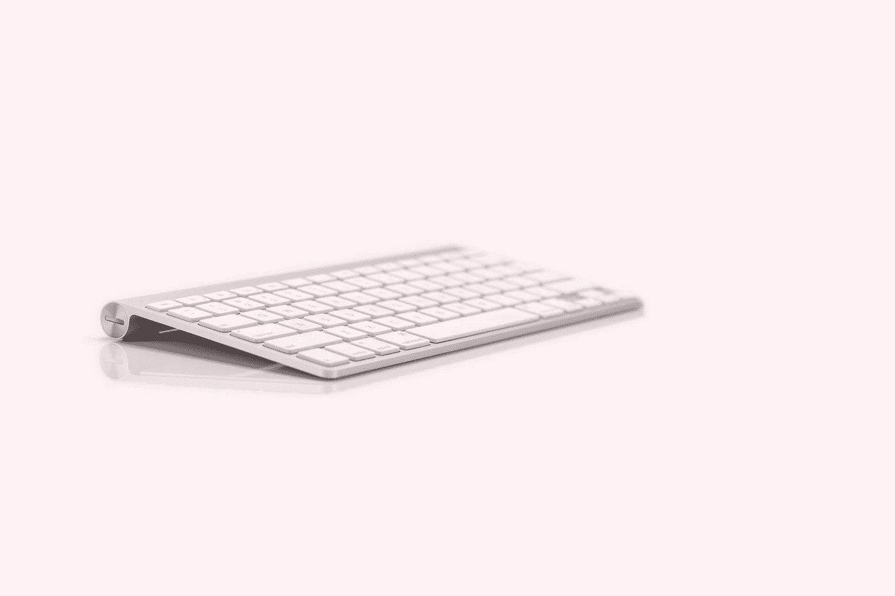

# 键盘快捷键有助于您的工作流程

> 原文：<https://medium.com/codex/keyboard-shortcuts-to-help-your-workflow-8311a4c32b5d?source=collection_archive---------5----------------------->

## 苹果

## 作为 Mac OS 新手使用键盘快捷键

[Barrett Ward](https://unsplash.com/@barrettward?utm_source=medium&utm_medium=referral) 在 [Unsplash](https://unsplash.com?utm_source=medium&utm_medium=referral) 上拍摄的照片

多年来，键盘快捷键对我来说是一个谜。我像躲避瘟疫一样避开他们。直到最近，我才开始使用键盘快捷键。我开始在 Pixelbook Go 上使用它们。拥有一个很棒的键盘和触控板意味着我可以抛弃…