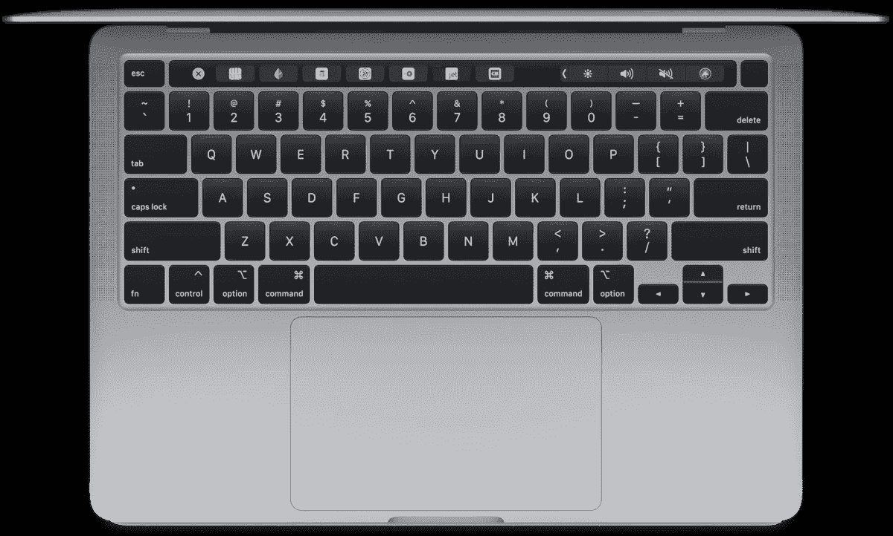
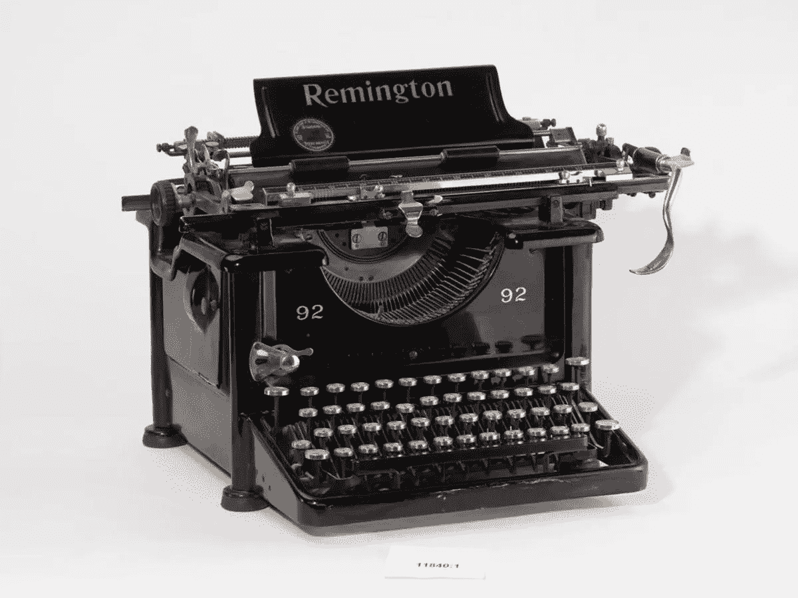
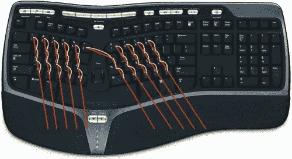
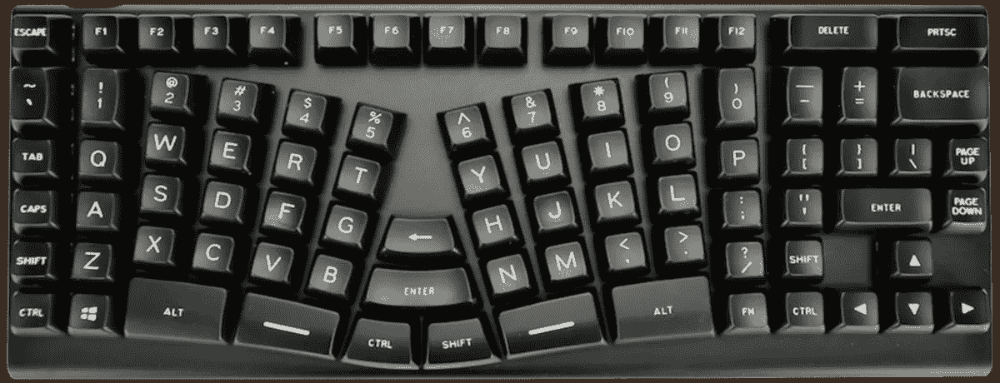
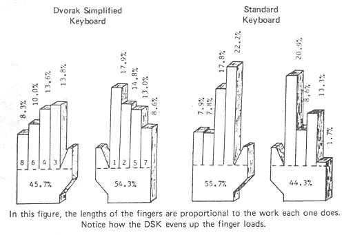

# 键盘及其对进步的显著阻力

> 原文：<https://medium.com/codex/keyboards-and-their-remarkable-resistance-to-progress-4a7dd8b3f7f8?source=collection_archive---------2----------------------->

## [法典](http://medium.com/codex)

**打字机和电话几乎是同时发明的，但是尽管电话已经变得面目全非，今天的键盘看起来和它们第一次出现时基本上没有什么不同。**

苹果图片

为什么键盘看起来仍然像老式打字机上的键盘？让我们回顾一下随着时间的推移发生的一些创新尝试，以及为什么它们没有被广泛采用。这可能会给我们一些线索来了解这里的动态。

我是在计算机变得无处不在的时候长大的，所以让我简单地分享一下我是如何对这个话题感兴趣的。

# 我是如何开始关心打字的

我的祖母在一家糖厂工作，这家糖厂位于我的村庄的尽头。一年中有一段时间总是充斥着拖拉机从地里拖走甜菜的持续噪音，这些甜菜将被转化成精制的方糖，然后用漂亮的瓷杯盛着茶或咖啡。

她的办公室有一台电动打字机和一部带总机的电话。有很多塑料和灯。然而，在家里的一个大衣柜里，在挂着的外套和洒满香水的连衣裙下面，她放着一台旧的机械打字机。那是一台黑色金属机器，对我来说很重，很难提起来放到桌子上。(其实那个年代一切都显得更坚固。)

雷明顿 92 型打字机，1929 年制造。(图片由芬兰国家博物馆提供。)

它的钥匙是漂亮的圆圈，有着干净的字体和银色的边缘，还有相当长的行程；你需要用一些力来推动这些键，当信通过一个色带打印出来时，你会得到一个“噼啪”的声音，色带随着你的打字慢慢移动。我喜欢更换色带，让打字机的铃声在滑架接近纸边时响起。我打字的速度很慢，足以事先知道下一个键会产生亮环，正式宣布我可以完成这个单词，并非常满意地推回马车，使用杠杆也可以将圆柱体旋转到下一行。

打字机上有一个“雷明顿”的标签，对于一个从小说捷克语长大的孩子来说，这个标签看起来很特别。(字母“g”的有趣形状在捷克语中很少出现)。我一点也不知道这家公司除了生产枪支之外，还对向全世界推行一种有问题的键盘标准负有部分责任。当我还是个孩子的时候,“重复性压力损伤”这几个字毫无意义；但那台机器是我拥有过的最有趣的玩具。

# 发明家的遗产

孩子们做得很好的一件事就是提问。*这是什么？* *那是什么？*最有趣的问题是从“为什么”开始的我发现按键排列很奇怪，但直到过了一会儿，我才认真地问了这个问题:“为什么键盘上的字母像*这个*一样排列？”

关于打字机及其键盘布局的历史有许多详细的叙述，至少也有同样多的神话。进入主流使用的打字机是由克里斯托弗·莱瑟姆·肖尔斯在 1867 年发明的。

## 密钥排序

最初，将字母印在纸上后返回键头的机制依赖于重力。肖尔斯最初按字母顺序排列了这些键。这导致了相邻键的干扰，所以肖尔斯实验性地修改了他的字母布局，将常见的字母分开。因此，想出了我们现在接受的标准键盘布局 *QWERTY* 。

这一改变不是为了减慢打字员的速度，正如人们常说的那样。那时没有受过训练的打字员。虽然最初按字母顺序排列的想法有利于让新用户找到按键，但从即将到来的触摸打字时代的角度来看，它在很大程度上是不相关的。

## 物理布局

旧机械时代的另一个持久遗产——很少进入键盘人机工程学的对话——是键排的交错定位。这种从右到左、从低排到高排的渐进偏移，使得机械打字机的金属臂能够无重叠地安装。如今，它唯一真正的“功能”是迫使我们的手指不自然地扭曲。这对左手来说更是如此，因为右手的大部分手指更自然地伸向左侧。

花点时间想象一下，如果在所有触屏手机上拨号都是在转盘上画半圆。甚至在数字时代到来之前，电话就已经从拨号盘变成了按钮。事实上，即使是自称符合人体工程学的键盘也坚持这种交错布局，这很有趣。

## 首次尝试改进

当打字机用弹簧升级以更快地返回按键时，Sholes 实际上想更新所谓的 QWERTY 布局以使其更有效，但制造商反对改变(勉强)建立的标准。因为打字机的部件很难互换，而且主要是因为这将导致制造商之间的布局竞争，所以这些改动没有被采纳。

这种勉强是可以理解的。当然，制造商是竞争对手。但是引入太多不同的布局可能会让他们的业务陷入困境。同样的场景在不同的类别中一再上演。公司通常会同意在一个标准上保持一致(即使他们最初可能会激烈竞争，以确保他们的设计占上风。)

# 挑战者

1932 年，西雅图华盛顿大学的教授奥古斯特·德沃夏克用科学的方法解决了这个问题，并和他的妹夫一起提出了一个“简化”的布局，到那时，这个标准已经真正建立起来了。德沃夏克的简化键盘是基于对英语语言的分析，并考虑了打字员如何学习和触摸打字时运动的人体工程学。

尽管德沃夏克的学生打字速度更快，打字错误更少，但当时反对新布局的最大理由是转换实体打字机和重新培训打字员的成本。事实上，“简化键盘”显然更容易学习和更快是不够的。

## 持久问题:真的更好吗？

从今天的角度来看，德沃夏克过于强调速度和效率。今天最快的打字员使用 QWERTY 键盘的事实并不能证明它的平等性，而仅仅是人口数量对正态分布的影响的证明。在简化键盘上训练有素的打字员创造了打字速度的世界纪录，通过检查差异，简化键盘本质上是一种更有效的布局。但是，正如我稍后将指出的，速度的差异并不是一个足够好的理由来转换。

真正的区别在于手指移动的量，因此增加了舒适度，减少了疲劳。如果你看到有人在 Dvorak 简化键盘上打字，你会注意到没有移动。从人体工程学的角度来看，这是一件大事。

在这种背景下，由于德沃夏克必须说服制造商改变打字机的物理设计，并让雇主投资重新培训数千名训练有素的打字员，提高效率是他们听到的唯一理由。(人体工程学和防止受伤甚至都不在考虑范围之内。)不出所料，尽管德沃夏克方面做了很多努力，但他的发明没有被采纳。

## 遗产

德沃夏克的简化键盘已经成为一个很好的例子，说明一个更好的标准如何输给一个更差但更成熟的标准。有些人认为这在技术上是不正确的，只是因为他们考虑到了德沃夏克设计的一个狭窄的(或被歪曲的)部分好处。

我仍然相信，经常是非常明显的市场之手要对相当多的优越替代品的消亡负责，这些替代品受到企业对利润的渴望和人类不愿改变的强烈支持。

## 该不该学德沃夏克？

如果你已经会打字了，你在 QWERTY 上的速度会非常快。除非你有健康方面的考虑(比如腕管综合症)，否则你应该坚持下去。如果你用英语打字而不能触摸打字，我推荐你用 Dvorak 学习触摸打字。它使我们在学习时不可能再回到狩猎和啄食的风格，这是一个符合人体工程学的优秀设计。(更多关于德沃夏克和 QWERTY 的对比细节在本文末尾的附录中。)

# 物理布局创新

大多数人保持交错的行:无名指在 W、S 和 X 键之间移动，比在 O、L 和句号之间轻松往返的手指进行了一次更杂技的旅程。

不幸的是，即使许多自称“符合人体工程学”的键盘对此也无能为力。虽然绝大多数“分离式”键盘为手臂提供了更舒适的角度，但它们在同一方向上保持了两半的偏移。偏移，如果有的话，应该被镜像，否则左手是紧张的。该行业认为，每个人都宁愿盲目地屈从于一个有着 150 年历史的设计，也不愿花几个小时去适应一个笔直的(正交的)布局或模仿人手的布局。

## 更好的键盘

在不进行过度设计的情况下，一个*主流*、*、*简单键盘早就应该是这个样子了:

*   这些排不是交错的，而是便于双手的手指自然地上下活动。
*   Enter 和 Backspace 可以在显著的位置使用，而不是粘贴在 19 世纪的设计边缘，作为小指的拉伸目标。
*   大写锁定较小，处于边缘，等待灭绝。

真正符合人体工程学的设计进一步修改了不同手指之间按键的相对距离(考虑到手指长度的差异)，铰接第三维以匹配手指的自然移动，并且可以调整按键所需的重量。

笔记本电脑空间有限，所以如果键盘的两半没有成角度是可以理解的。令人震惊的是，截至 2021 年，市场上没有一款笔记本电脑会采用与反人体工程学交错布局相反的直线布局。

# 展望未来

克里斯托弗·肖尔斯于 1890 年去世；打字机越来越多，为女性提供了就业机会。我第一次学会打字的祖母的旧打字机是在奥古斯特·德沃夏克设计简化键盘之前造的。德沃夏克死于 1975 年——在家用电脑允许人们随意切换键盘布局的两年前。他的贡献现在几乎被遗忘了。最近估计全世界大约有 2000 人使用他的键盘。

我们正在寻找一种真正的可能性，即主要的输入方法将从键盘转移到语音，而键盘在近 150 年内从未真正进化过。

我推测，对人们不愿适应键盘等复杂事物变化的担忧，加上缺乏现代真正创新者的持续推动，将手机界面进化的成功与键盘的停滞区分开来。

我们的软件产品是在不断创新中开发的，但相比之下，大部分使用的键盘是史前的。我们至少应该要求制造商开始制造键盘和笔记本电脑，其物理布局至少向创新和人体工程学迈出一小步。

# **附录:德沃夏克 vs QWERTY**

到底为什么德沃夏克简化键盘优于 QWERTY？

图片来自本书 ***打字行为*** *展示了 Dvorak 简化键盘*背后的思考和好处。

*   所有经常出现的字母都在“首页”一行。(70%的打字发生在键盘上，而在 QWERTY 键盘上只有 32%。)
*   打字是按比例分配在手指之间的；右手的工作要求稍微高一点。
*   手与手之间的击键交替更好。
*   最不常用的键在最难敲击的下一行(Dvorak 键盘使用这一行的频率是 QWERTY 的一半)。

德沃夏克博士和迪利博士使用简化键盘的标准是基于研究和调查，当我阅读他们的书*打字行为*时，我感到惊讶。然而，尽管它有这么多优点，令人惊讶的是简化键盘却很少被使用和了解。许多设备甚至根本不支持它:我想到了 iPhone 尽管具有讽刺意味的是，苹果的联合创始人史蒂夫·沃兹尼亚克是一名德沃夏克打字员。