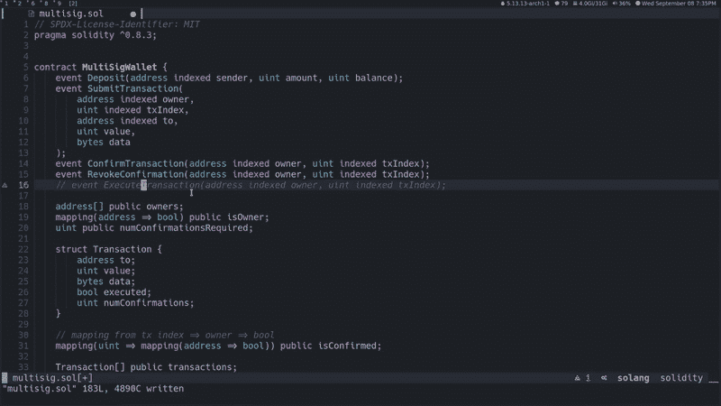
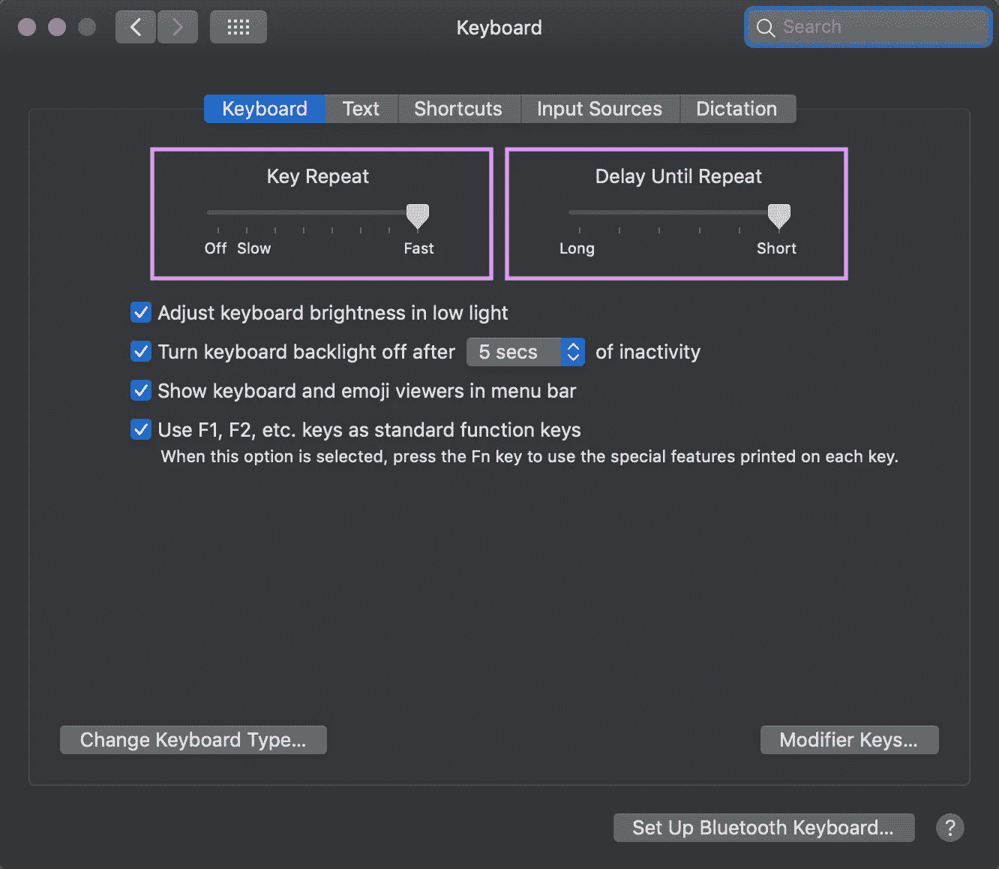
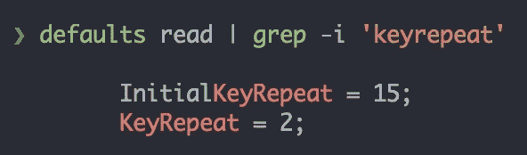
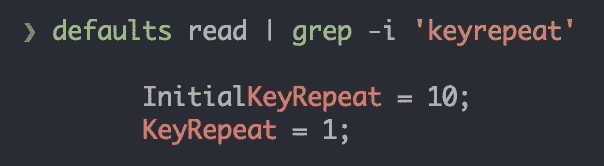

# 类固醇键:简单的设置调整，以提高您的效率

> 原文：<https://medium.com/codex/keys-on-steroids-simple-setting-tweak-to-increase-your-efficiency-ff80e92d87f1?source=collection_archive---------2----------------------->

使用按键重复率提高编辑器/IDE、浏览器或终端的工作效率


弗洛里安·克拉姆在 [Unsplash](https://unsplash.com/s/photos/keyboard?utm_source=unsplash&utm_medium=referral&utm_content=creditCopyText) 上拍摄的照片

# 背景

我已经编程十多年了，但是直到我学习了 Vim，我才知道**键重复率**。我第一次学习 Vim 是在 VS Code/PyCharm 中使用一个插件/仿真层，这是我以前的主要编辑器/ide。最终，由于他的 VS Code + Vim/Neovim 视频和明智的、模块化的配置文件方法，旅程将我引向了 [**ChrisAtMachine**](https://www.youtube.com/c/ChrisAtMachine/playlists) 。之前让我印象深刻的一点是他的快速光标/导航。他大量使用它。这是摘自克里斯最近的一个视频:



我们可以看到光标垂直和水平移动的速度。这甚至还不是最快的动作，因为他也在解释事情，有时会慢下来。他还使用 Vim/Neovim 编辑器。但是快速光标是由于操作系统(Mac、Linux、Windows)的**键重复率**全局设置。

**Brandon Rhodes** 是我最喜欢的 Python 演讲者之一，因为他的主题深度和他讲故事的能力。在这个[剪辑](https://www.youtube.com/watch?v=I56oFTm9UlE&t=328s)关于**停下来磨利你的工具**的演讲中，我很惊讶他还讨论了按键重复率的重要性，并且像往常一样，他讲了一个有趣的轶事。在他的一次短跑中，他帮助一名参与者调整了关键的重复率设置，因为删除一长串要花很长时间。最终，这位参与者感谢他“让他的电脑变得这么快”！这也是一个非常值得推荐的演讲，其中包含了很多关于如何变得更有效率的技巧/见解。Python 主题只是题外话。

# 快捷键和终端

快捷键(即快捷键重复率)在终端中非常有用，因为我们通常导航/编辑/删除命令。例如，我使用我的定制[YouTube-video-trimmer](https://gist.github.com/ranelpadon/cce767de058f75a0730c0558dc761ab7)Python 脚本来下载/修剪本文开头的示例 *ChrisAtMachine* 视频。使用 sample 命令，我可以使用快速箭头键到行中的任何地方，并使用 delete/backspace 键与它们进行交互:


如果没有快捷键，我们可以使用这些组合来导航/更新/清除该行:

*   `Ctrl` + `a`:转到行首
*   `Ctrl` + `e`:走到线的尽头
*   `Alt` + `f`:转到下一个单词
*   `Alt` + `b`:转到上一个单词
*   `Ctrl` + `w`:删除前一个单词
*   `Alt` + `d`:删除下一个单词
*   `Ctrl` + `u`:删除光标左侧的所有单词
*   `Ctrl` + `k`:删除光标右侧的所有单词
*   `Ctrl` + `c`:取消线/命令

这些快捷方式是受我的 Emacs 启发，大多数终端都使用这些。同样，Mac OS 也有全系统的受 Emacs 启发的快捷键。

那为什么要用快捷键呢？

*   使用修饰语的快捷方式(如`Ctrl`、`Alt`、`Cmd`、`Shift`)往往不直观、不方便。这也是为什么 Emacs 系统经常与 Vim 的人体工程学按键结合的原因之一(例如 [Doom Emacs](https://github.com/hlissner/doom-emacs) 发行版中的[邪恶模式](https://github.com/emacs-evil/evil))
*   各种应用程序可能有怪癖和非常规的快捷方式，可能与通常的快捷方式相冲突。
*   快捷键适用于各种应用程序(编辑器、终端、浏览器等)，无需记忆新的快捷键，从而减少认知负荷。因此，上面的终端快捷方式可以简单地替换为快速退格键、删除键和箭头键。

# 关键重复

重复键是一种键盘机制，只要字符被连续按下，它就会无限期地重复输出相同的字符。因此，如果您按下`a`键并保持按下，您可能会得到如下输出:`aaaaaaaaaaaaaaaaaaaaaaaaaaaaaaaaaaaaaaaaaaaaaaa`
重复的速度由**键重复率**设置控制。当然，大部分时间我们不会重复打字母。根据经验，需要重复的最有用的关键是:

*   `Backspace`钥匙
*   `Delete`键
*   箭头键(`Left`、`Right`、`Up`、`Down`)

因为大部分时间我们都在浏览、删除或更新文本。我们可以在很多情况下利用这些快捷键，例如:

*   在编辑器/IDE 中导航/删除/编辑代码
*   在浏览器中导航/删除/编辑 URL
*   在终端中导航/删除/编辑命令
*   导航/删除/编辑代码评审评论或聊天/电子邮件/聊天
*   导航/删除/编辑社交媒体帖子/评论/消息
*   在 Office 套件应用程序中导航/删除/编辑文本

# 系统设置

*苹果操作系统*

您可以访问`System Preferences > Keyboard` 中的**键重复率**设置。然而，默认值很慢/次优，所以我们需要调整它们:

*   **按键重复**:按键按下时重复的速度(越快越好)
*   **延迟到重复**:触发**初始**重复之前等待多长时间(越短越好)



这里有一个关于这两个设置如何工作/交互的很好的演示。根据您的 Mac OS 版本，很可能需要注销/重新启动，更改才会生效。

上述设置是系统/全局**默认值**命令的一部分，将对应于这些值:



有趣的是，我们仍然可以[使用`write`操作将它调整到首选项窗口](https://apple.stackexchange.com/questions/10467/how-to-increase-keyboard-key-repeat-rate-on-os-x)允许的范围之外:

```
$ defaults write -g InitialKeyRepeat -int 10
$ defaults write -g KeyRepeat -int 1
```

因此，这些值现在将是:



不建议设置得比这些更快，因为太短的`InitialKeyRepeat`会使正常输入变得困难，也就是说，即使没有按下键，我们输入的任何东西也会重复。

*其他操作系统*

我不打算包括各种系统上的关键重复率的方法/诀窍，因为这将使文章变得更长，而且我无论如何也不能测试或担保它们。下面的链接似乎是很好的初步指南。

*   [窗户](https://www.youtube.com/watch?v=hX6FCTWdt_o)
*   [Linux](https://www.youtube.com/watch?v=IkzZQ_AiYFo)

# Vim 用户的优势

Vimmers 使用`hjkl`键作为箭头，所以已经很方便了，但是激活快捷键(即具有按键重复率)将进一步提高效率。事实上，一些 Vim 用户，如 *ChrisAtMachine* 更喜欢使用快速的`hjkl`键，而不是使用`w`、`e`、`b`、`f`、`t`、`Ctrl+u`、`Ctrl+d`等进行导航，因为认知负荷较小。

当然，导航只是编辑的一部分，你仍然需要一种机制来操作(例如，猛拉、改变或删除)选择/范围。高效的[单线多线运动](/codex/vim-for-the-win-the-power-of-single-char-motion-82d93b4bf6d6)将有助于这种情况。

# 提升人体工程学

*键盘定制器*

`Backspace`、`Delete`和箭头键通常不方便放在键盘上:与主行中的字母相比，它们需要更多的努力来键入。这就是键盘定制软件可以派上用场的地方。想法是:按下修饰键+主行中的一个字母，它应该产生另一个键。例如，一些 Vim 用户有这样的映射:

*   `Caps Lock + h/j/k/l` : `Left`、`Down`、`Up`、`Right`箭头键

这意味着`Caps Lock + h`将产生`Left`箭头。`Caps Lock`经常被选为修饰键，因为它在主要位置，很少被使用。我使用一个 [Colemak DH](https://colemakmods.github.io/mod-dh/) 键盘布局，我有各种定制。我更喜欢用`Spacebar`作为我的主要修饰键，因为它[非常方便，可以用拇指](https://colemakmods.github.io/ergonomic-mods/modifiers.html)按。同样，我有这些映射:

*   `Spacebar + j/k/i/l` : `Left`、`Down`、`Up`、`Right`箭头键

这意味着`Spacebar + j`将产生`Left`箭头。我用`Spacebar`作为修饰键映射了主行中的大多数字母，包括:

*   `Spacebar + m` : `Backspace`键
*   `Spacebar + n` : `Delete`键
*   `Spacebar + u` : `Enter`键
*   `Spacebar + h` : `Escape`键

*登山扣元件*

我用的是[Karabiner Elements](https://karabiner-elements.pqrs.org/)app(Mac 版)，这里是我对[箭头键](https://github.com/ranelpadon/configs/blob/master/karabiner/karabiner.json#L767-L865)和[退格/删除键](https://github.com/ranelpadon/configs/blob/master/karabiner/karabiner.json#L970-L1005)的配置。

这些键盘映射非常强大，因为您可以在全局范围内使用箭头键/Delete/Backspace/Enter/Escape 或其他键，并使用方便的键来键入它们。因此，映射键甚至可以在终端、浏览器、编辑器/ide、**插入**模式下的 Vim 等中工作。

*替代品*

*   [自动热键](https://www.autohotkey.com/) (Windows)
*   [KMonad](https://github.com/kmonad/kmonad) (Windows、Linux、Mac)

推荐阅读:[扩展层](https://colemakmods.github.io/ergonomic-mods/extend.html)

# 关键要点

*   **按键重复率**和**按键重复延迟**设置易于更新。
*   使用快捷键，尤其是箭头键/退格键/delete 键，尽量减少鼠标的使用。这将影响你的所有应用，并提高你的整体效率。即使你只使用快速退格键/删除键，它也会显著改善你的工作流程。
*   使用快捷键可以最小化认知负荷和打字工作量。告别笨拙的键盘快捷键。对于 Vim 用户来说，快速箭头(`hjkl`键)可以与本地动作竞争，因为您可以轻松地水平或垂直移动。
*   通过使用**键盘定制器**，使箭头/退格键/删除键和其他键更加方便/符合人体工程学。对于 Vim 用户来说，方便映射的箭头/键将使快速导航/编辑成为可能，即使在*插入*模式下。

感谢您的阅读。如果你发现了一些价值，请关注我，或者为文章鼓掌/评论，或者[请我喝杯咖啡](https://ko-fi.com/ranelpadon)。这对我意义重大，鼓励我创作更多高质量的内容。