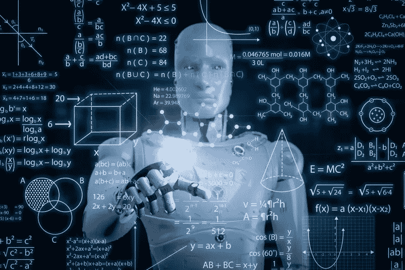

# 通过这 15 个步骤开始您的机器学习之旅

> 原文：<https://medium.com/codex/kick-start-your-machinelearning-journey-with-these-15-steps-f24c9362739f?source=collection_archive---------18----------------------->

如果你想开始机器学习，这 15 个步骤是一个很好的起点。阅读全文，今天就开始你的旅程吧！

机器学习是一个过程，计算机可以在没有显式编程的情况下学习如何做事情。它已经成为数据科学家的必备工具，因为它可以帮助他们分析数据并做出决策