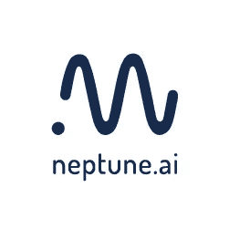
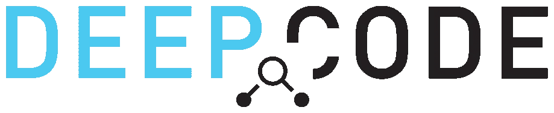
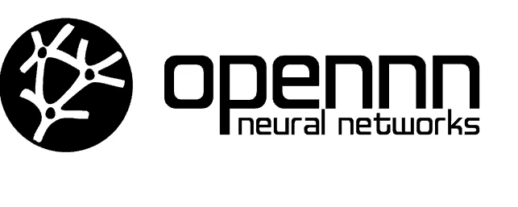
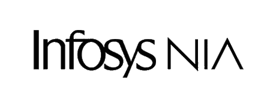
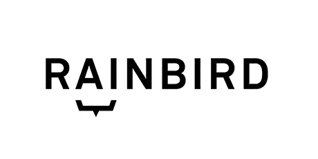

# 了解 8 大人工智能软件产品

> 原文：<https://medium.com/codex/know-the-top-8-ai-software-products-174e58b93033?source=collection_archive---------7----------------------->

照片由 [DeepMind](https://unsplash.com/@deepmind?utm_source=medium&utm_medium=referral) 在 [Unsplash](https://unsplash.com?utm_source=medium&utm_medium=referral) 上拍摄

AI 和 ML 是 IT 极客和技术爱好者已经使用了相当长一段时间的两个术语。他们坚信这些技术将改变商业运作的方式。

市面上有很多 AI 工具。随着人工智能和人工智能技术的快速发展，企业、创业公司和数据专家已经开始使用人工智能应用程序和工具来提高结果。人工智能和人工智能需求增长背后的主要原因是，它有助于企业从收集的数据中获得更多洞察力，使他们能够决定他们运营的下一步。然而，市场上有很多可用的人工智能工具，选择最适合你的工具成为一项乏味的任务。

以下是一些流行的人工智能工具:

# **Neptune.ai**

海王星. ai

这是一个跟踪代码及其其他方面的自动化调试。它比较表中的参数和指标以验证数据质量，删除异常值，并通过自动化数据分析来确保新质量数据的拆分。

## **关键特性**

*   它允许您搜索、调试和比较实验、数据集和模型。
*   它允许您查看所有结果并访问所有模型和实验。

# **测试工艺**

试验飞行器

TestCraft 基于 selenium 的人工智能自动化测试工具，用于连续测试。基于人工智能的智能测试工具的目的是通过自动克服变化来维持时间和成本。最棒的是，它不需要任何编码知识。测试人员可以很容易地拖放界面，并立即在各种浏览器和工作环境中执行它们。

## **主要特点**

*   TestCraft 通过在应用程序准备就绪之前生成测试场景来提供敏捷性。
*   它支持多个数据集和并行实现。
*   元素和流程可以根据需求在各种场景中重用和测试。
*   它可以分析和报告每个测试动作。

# **风筝**

风筝

Kite 是一个基于 python 的助手，使用机器学习为开发者生成建议。它兼容 12+代码语言和代码编辑器。它的人工智能有助于减少按键次数。它有助于通过单击或鼠标悬停查看 Python 文档，并找到有用的示例和操作方法。总的来说，它提高了开发人员的工作效率。

## **主要特性**

*   它消除了使编程成为一项乏味任务的重复部分。
*   它可以完成 Python 程序员输入的整行代码。
*   它使用起来既简单又安全。

# **深度代码**

深度代码

这个人工智能软件从开源程序员那里学习，提出即兴编写代码的建议。DeepCode 的机器人精通各种语言。它包括 JavaScript、Python、C/C++和 TypeScript 等。它可以识别问题，并通过陈述逻辑原因立即提出更改建议。DeepCode 甚至可以在代码耗尽之前识别错误。

## **主要特点**

*   随着时间的推移，深度代码的机器人在获得新知识的同时，也提高了它们的准确度和精确度。
*   给出的建议确保代码保持兼容。
*   它连接到各种来源，收集所有代码的信息。
*   在将代码发送到生产环境之前，它会提醒开发人员代码中的关键漏洞。

# **OpenNN**

OpenNN

OpenNN(开放神经网络)是一个实现神经网络的机器学习开源库。它建立在 C++编程语言之上，以提供高性能。这种基于人工智能的研究工具主要用于客户细分和特定行业的分析。

## **关键特性**

*   它可以轻松处理各种人工智能解决方案。
*   它可以管理和加载大数据集。
*   图书馆不费吹灰之力就建成了。
*   它提供了预测性的见解。

# **印孚瑟斯 Nia**

印孚瑟斯 NIA

这是一个基于人工智能的企业自动化平台。它由先进的 ML 提供动力，使其能够兼容大规模执行繁重的任务。这可以帮助解决客户的各种问题，从订单到现金流程，以实现知识的可操作性。它还帮助企业通过不断发展其生态系统来推动自动化和创新。

## **主要特点**

*   它缩短了生产周期。
*   它可以准确预测成本和制造成本的可变性。
*   它提供定制的解决方案来提高客户满意度。

# **PyCharm**

PyCharm 是一个 AI 支持的代码完成工具，Python 开发人员可以使用它来提高生产率。开发人员可以专注于他们的主要任务，同时允许 PyCharm 管理其他任务，如调试和可视化。

## **主要特性**

*   它能让你更快地编码。
*   PyCharm 对于代码完成或者查找和修复任何快速错误来说是非常可靠的。
*   它完全理解你的项目，所以出错的几率更小。如果发现任何问题，您可以轻松地纠正它们。

# **雨鸟**

雨信鸟

创新者、专家、变革者和 RPA 领导者使用这个自动化平台来做出合理的业务决策。这个智能平台不需要编程。用户可以不受任何限制地利用过程自动化和机器学习。

## **主要特点**

*   它可以自动执行需要大量人工参与的任务，从而将结果速度提高 25 倍。
*   它减少了消费者的等待时间，有助于改善客户体验。
*   它降低了违规的可能性。

# **最后一句话**

如上所述，有几种人工智能工具和软件可用。在这里，我们总结了我们认为最有用的 8 大资源。人工智能有潜力自动化大多数任务，如自然语言处理、图像识别、文本挖掘等。因此，组织应该战略性地部署 [**AI 和 ML**](https://www.infraveo.com/blog/ai-ml-the-universal-language/) 工具，以创造一个最大化结果的环境。