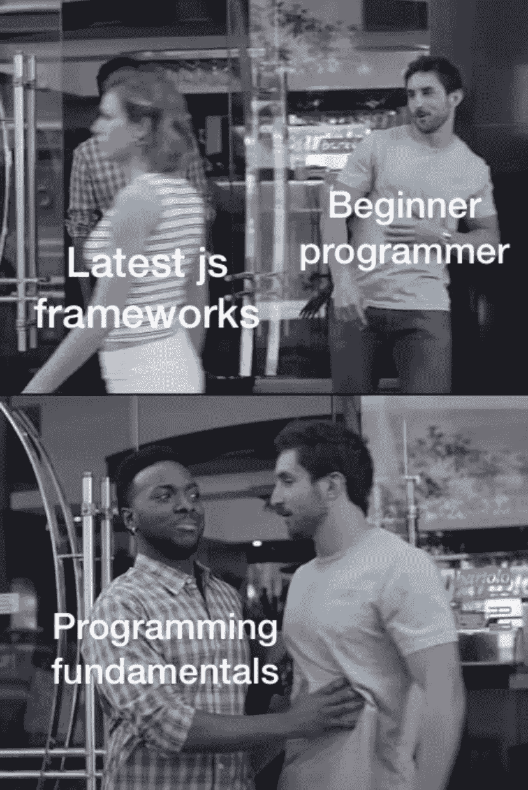

# 编程前了解这些概念！

> 原文：<https://medium.com/codex/know-these-concepts-before-programming-230296f81ab9?source=collection_archive---------18----------------------->

我想我们都经历过这种情况。在那里你想学习一项新技能，然后你兴奋地去亚马逊上开始浏览最新最棒的工具来掌握这项技能。但是大多数时候，我们把大部分精力花在了我们需要的工具上，而不是花在擅长的手艺上。买最新款的乔丹牌运动鞋不会让你成为最好的篮球运动员；你得去实地练习。

这种情况大多发生在刚开始工作的程序员身上；他们总是对学习最好的框架和编程语言而不实际学习如何编码感到兴奋。归根结底，编程语言基本上是用来执行特定任务的工具和设备。也就是给电脑下达指令去做一些事情。另一方面，编程是一门你需要有效使用工具的手艺。现在，如果有意义的话，让我们谈谈作为初学者应该知道的基本编程概念。

在我们进入概念之前，我们需要首先理解什么是编程。基本级别的编程是给计算机一组指令来执行的，很简单，对吧？但是我们和电脑之间有一个断开。我们通过英语交流，而他们通过二进制的 0 和 1 交流。编程语言试图通过在我们和计算机之间提供某种程度的抽象来弥合这一鸿沟，有点像中间人。我们和计算机之间的抽象层次越高，编程语言就像 python 和 java 一样的层次越高。你可以使用基于块的编程语言，比如 Scratch。

如果你想一想，最高级别是直接与你的虚拟助手交流，比如你的谷歌助手、Siri 或 Alexa。所以某种程度上，我们都是程序员，没错，Bixby 不算；抱歉，三星用户，但是加油。

你走得越低，抽象就越少。虽然这可能很难学，但你的代码运行时会比使用更高级别的抽象编译得更快。

所有语言，包括编程语言。总有一套你必须遵循的规则和指导方针，被称为语法。这一点非常重要，尤其是在编程中，因为计算机并不聪明，因此无法读取意图，并且它要求你严格遵循语法，除非遇到错误。不同的编程语言有各自的语法。大多数编程语言都有相似的结构，从一种语言移植到另一种语言很容易。第一门要学的编程语言通常是最难的。

编程的一个重要方面是共享数据，无论是通过计算机网络、API 调用还是其他方式。能够发送数据是必要的。它们是不同类型的数据，数据类型，如整数、浮点、字符串、布尔(它将程序表达为真或假)等等。这些数据类型通常以各种方式存储，例如列表、元组和字典。

大多数时候，当你在编程的时候，你必须对所有事情都持怀疑态度。许多事情可能会出错，这就是条件句的用武之地。在执行特定决策时，它们有助于提供不同的选择。如果不是这个，那就是那个。循环还会重复执行一条指令，直到遇到一条指令或代码中断，以先发生的为准。

编程中有一个概念叫做 DRY 这是为了激励人们通过不重复不必要的代码来尽可能地提高效率。函数在 DRY 中扮演着重要的角色，它们有助于捆绑一堆易于重用和调用的代码。这有助于减少您需要编写的代码量，并且它们也是您可以轻松导入的库，有助于提高您的效率。当为了工作而编码时，你应该尽可能不要重新发明轮子，尽可能多地使用库。

但是在你开始编码之前，将你想要构建的应用可视化是非常重要的。你能做的就是写伪代码和流程图；通过这种方式，你会变得不那么不知所措，并且使你的开发时间变得更快。还有许多其他基本的编码概念，如面向对象编程、数据结构和算法、系统设计、计算机网络和递归。尽管如此，我还是不想让你被这些事情搞得不知所措。如果你觉得这篇文章有用，请鼓掌并分享。:)