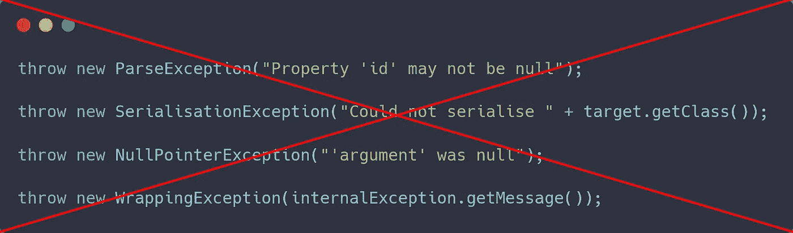

# 投掷前了解你的接球手

> 原文：<https://medium.com/codex/know-your-catcher-before-throwing-43720d98adf0?source=collection_archive---------29----------------------->

## 对谁来说是例外呢？

所有这些都是你不应该抛出的例外的例子——由作者使用[碳](https://carbon.now.sh/)制造的。

我目前正在用 Spring 和其他一些库创建一个 REST API。当然，其中一部分是正确处理所有可能发生的异常，并将它们正确地呈现给 API 用户。

当我试图穷尽所有可能的例外时，我很快意识到:**那些例外不是为我准备的！**

# 例外的两种类型

出于本文的目的，我将把异常分为两种不同的类型，或者说是两种不同的用例，并分别讨论它们:

1.  只有您关心的内部异常
2.  对 API 用户有意义的外部异常。

我所说的内部异常是指那些永远不会离开你所负责的代码的异常。识别它们的一个简单方法是，如果你对它们进行突破性的改变没有问题。

另一方面，外部异常是您(不一定)会捕捉到的异常。用户不一定是你产品的最终用户，也可以是同一公司的其他团队。

# 为自己设计例外

第一种类型的异常是设计难度较低的一种。但我总是质疑你为什么要创造它们。

创建在同一个模块中再次被捕获的异常本质上只用于捷径——所以流控制。您总是可以重构它，使其不使用异常，并且可以向外部提供相同的接口。

我并不是说它们不应该存在，但是如果你决定创建一个内部异常，确保你能证明为什么。

一种无法避免内部异常的情况是当你使用一个抛出内部异常的库时。在这种情况下，您是外部异常的消费者，但是您仍然需要像对待内部异常一样对待它。

原因是您应该总是包装来自内部库的异常。否则，您会暴露内部信息，并(甚至更糟)使自己完全依赖于该库。

# 其他人的设计例外

这是更难的部分——也是我们用于 REST API 的一些库没有做好的部分。

当向用户传递异常时，您是在告诉他们有什么地方出错了。你还应该尽可能详细地告诉他们*哪里出了问题。它本质上只是你的 API 的另一个可能的返回值。*

## 为用户提供元信息

在最顶层，API 的用户需要知道:

*   发生这种异常是我的错吗？我弄乱了输入或一些设置吗？
*   如果我再次做同样的事情，会有同样的效果吗？或者这次会有效吗？
*   当这种情况发生时，我应该通知任何人吗？或者这种情况有时会发生吗？

您可能会注意到，对于 REST 接口，您可以通过查看 HTTP 调用的返回状态代码来解决所有这些问题。在代码 API 中，这通常由异常的类来表示。

这种元信息对于 API 的用户知道如何正确反应是必要的:我们应该将它冒泡给最终用户、记录它、向最终用户呈现通用消息、再次尝试还是它们的任意组合。

## 信息应该在相同的许可级别

我们使用的一个解析库抛出了一个异常，并给出了一个非常好的错误消息，您可以直接将它呈现给用户。想想类似“属性‘id’不能为空”这样的话。但是在对这个库做了更多的研究之后，发现有一个特例，它没有这么好的错误消息，而是封装了另一个异常并继承了它的消息。想想类似“不能将 java.util.ArrayList 强制转换为 java.util.Set”这样的问题。

通常你不应该直接从库中返回异常消息。这仅仅意味着当你更新库的时候，你的信息也可能突然改变，你不可能知道所有可能的短语。但有时这很诱人(尤其是对于经验较少的程序员——我自己也是这样)。

特别是当你的库很可能在用户界面附近使用时(比如 JavaScript 库)，你需要确保所有可能的信息要么总是能被一般的最终用户理解，要么清楚地表明事实并非如此。

在上面的例子中，即使在特殊情况下，它们也可以尝试获得更好的消息，或者抛出不同的异常。或者，更好的是，不要太依赖信息，而是单独提供信息(见下一点)。

公平地说，这不是图书馆的错，而是用户的错。尽管如此，一个好的 API 不会允许它的用户犯错误(或者至少让它尽可能的难)。

## 信息必须是可解构的

这可能是最重要的一点:不要假设您的用户想要的信息正是您提供的格式。

它不仅使包含的信息更加明确，而且用户还可以只选择部分信息并决定如何呈现。这让你以后可以自由添加更多的信息，这些信息可能会更敏感。

另一个明显的用例是翻译成其他语言。解析异常应该为我提供属性名和一个从定义明确的有限的可能错误集中选择的错误。然后我可以自己选择如何表达它，甚至可以把它翻译成不同的语言。

另一个常见的用例是，如果多个库用于用户认为是同一件事的东西。例如，解析两个不同的 JSONs，它们都遵循众所周知的模式，因此有自己专用的解析器。

一个库可能返回“属性‘id’不能为空”，另一个库可能返回“无效 ID:字符串不能为空”。这两个句子说的是同一件事，但是如果用户同时看到这两个句子，肯定会皱起眉头。

# 摘要

正如我们所创造的一切一样，牢记用户是非常重要的。不管那是我们产品的最终用户还是程序员同事。为他们提供适当的工具来完成他们的工作。

创建异常时，很容易只添加一条消息而忘记其他的。毕竟，这是许多语言中绝大多数标准异常的标准。

但是就像正常的“成功”值返回一样，异常也必须小心设计。