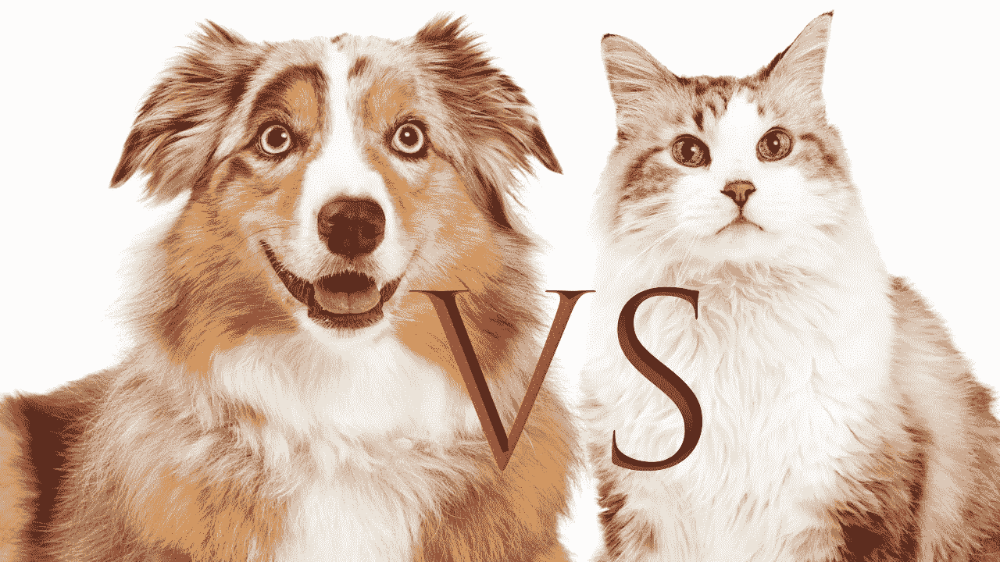
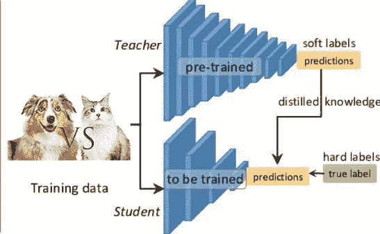

# 用于二元分类的知识蒸馏工具

> 原文：<https://medium.com/codex/knowledge-distillation-tool-for-binary-classification-acf9a6e55456?source=collection_archive---------7----------------------->

# 介绍

知识蒸馏是一种在保持模型性能的同时减小模型规模的方法。该过程包括将知识从大的预训练模型(也称为教师模型)转移到新的较小模型(学生模型)。我们将集中于最小化自定义损失函数来解决二进制分类问题，而不是实现软化的教师逻辑和地面事实标签的匹配。

# 用例

例如，web 浏览器上的实时应用程序需要快速渲染以优化用户的浏览体验，在这种情况下，KD 是有用的，因为它减少了浮点操作(G-FLOPs)的数量。虽然我们可以通过对相同的数据训练许多不同的模型，然后对它们的预测进行平均，来提高几乎任何机器学习算法的性能。不幸的是，使用整个模型集合来进行预测是麻烦的，并且可能在计算上太昂贵而不允许部署到大量用户，但是使用 KD 模型来恢复一个模型中的所有模型，可以在不降低性能的情况下广泛地节省资源密集型。

# 反向传播

这里我们将讨论用于进行反向传播的损失函数，假设我们正在进行二元分类，例如，猫和狗的分类:

猫和狗二元分类的例子

为了计算损失，我们使用教师和学生模型预测输入样本，然后使用这些预测来生成学生和蒸馏损失。

知识提炼过程

学生流失代表学生预测和实际情况之间的二元交叉熵。而蒸馏损失是教师和学生预测之间的二元交叉熵。二元交叉熵的一般公式如下:

> *L = -y.log(ŷ) + (1-y)。日志(1- ŷ)*

因此，通过组合这两个损失，我们将有一个损失函数 *f* 来说明我们的任务(即二进制分类)，下面的等式显示了它是如何计算的:

> f *=* α。student_loss + ( 1-α)。蒸馏损失

参数α可以在区间[0-1]内变化，0.5 并不总是最佳解，另一方面，我们必须尝试包含在所述区间内的一组值，以便找到最小化最佳 our 损失函数的参数。

通过使用这种自定义损失函数，我们可能会在最小化模型大小的同时保持其性能方面获得有希望的结果，建议进一步提高以数据为中心的结果，这包括严格修改(例如，增强、移除模糊图像等)数据集，以提高固定模型的准确性。

# 结论

在上面的谈话中，我们强调了一个重要的工具，那就是知识的升华。我们还提到了在基于自定义损失函数的二元分类任务中使用它的方法，在这个[链接](https://github.com/mkherchouche/Knowledge_Distillation)中你可以找到知识提炼的 Github 知识库。

最后，非常感谢把这个工具带到生活中的研究人员。

# 参考

[1]: Geoffrey Hinton 等人(2015)在神经网络中提取知识。https://arxiv.org/abs/1503.02531

[2]:克拉斯·知识蒸馏。【https://keras.io/examples/vision/knowledge_distillation/ 

[3]:从以模型为中心到以数据为中心的人工智能。[https://towards data science . com/from-model-centric-to-data-centric-artificial-intelligence-77e 423 F3 f 593](https://towardsdatascience.com/from-model-centric-to-data-centric-artificial-intelligence-77e423f3f593)