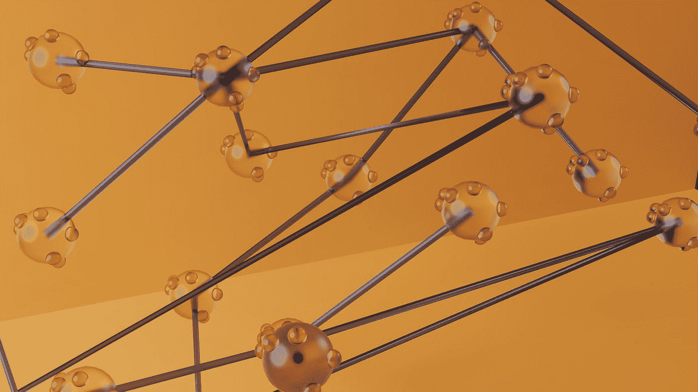
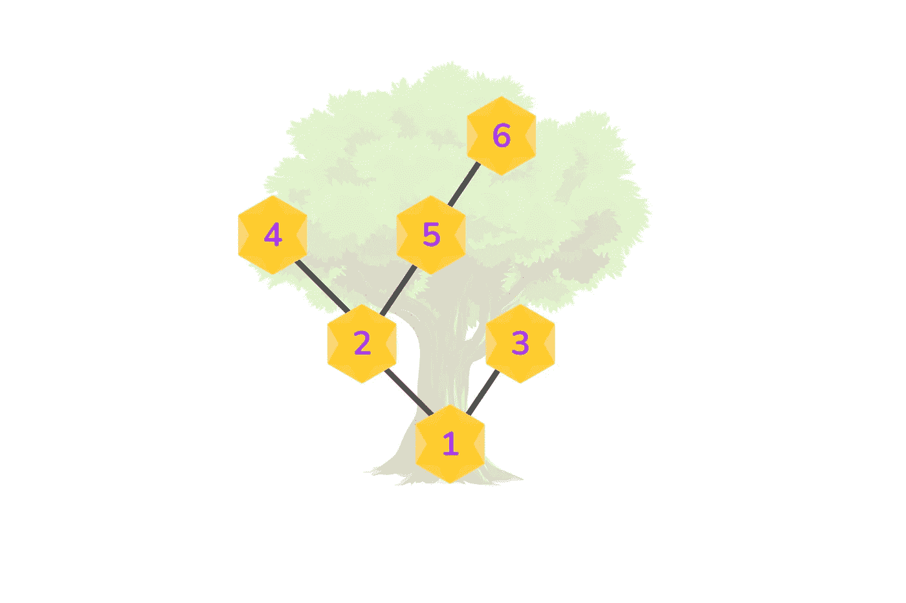
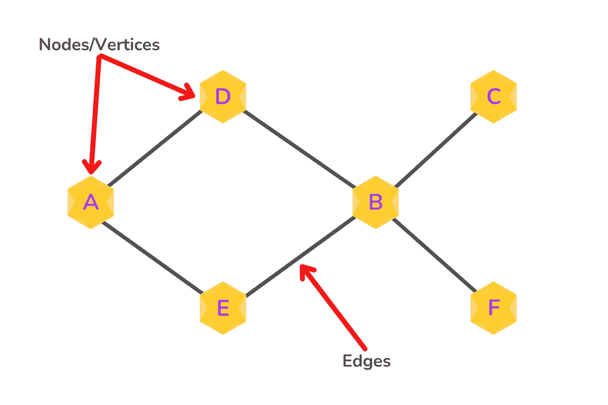
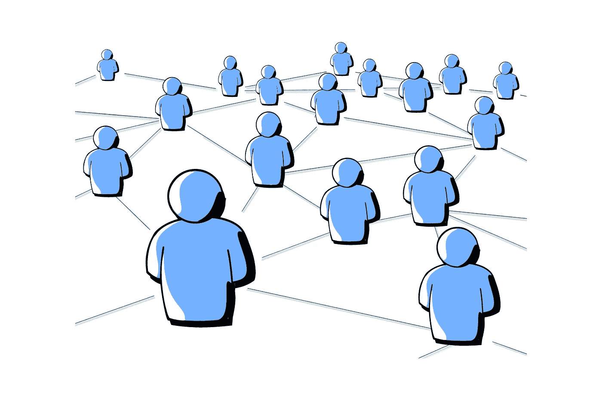
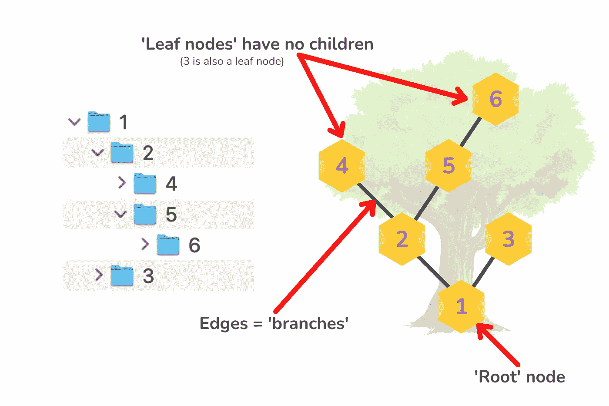
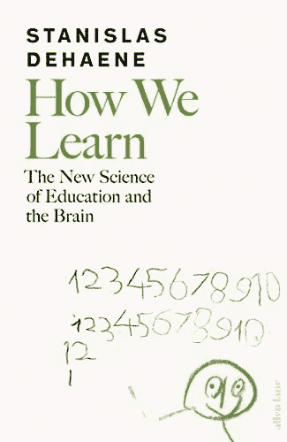
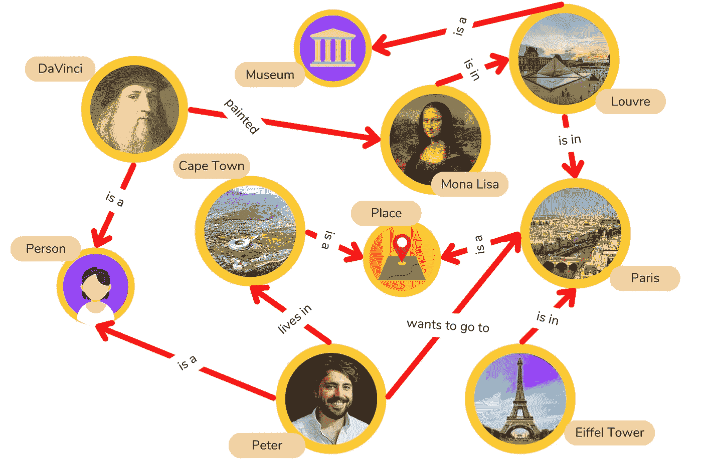
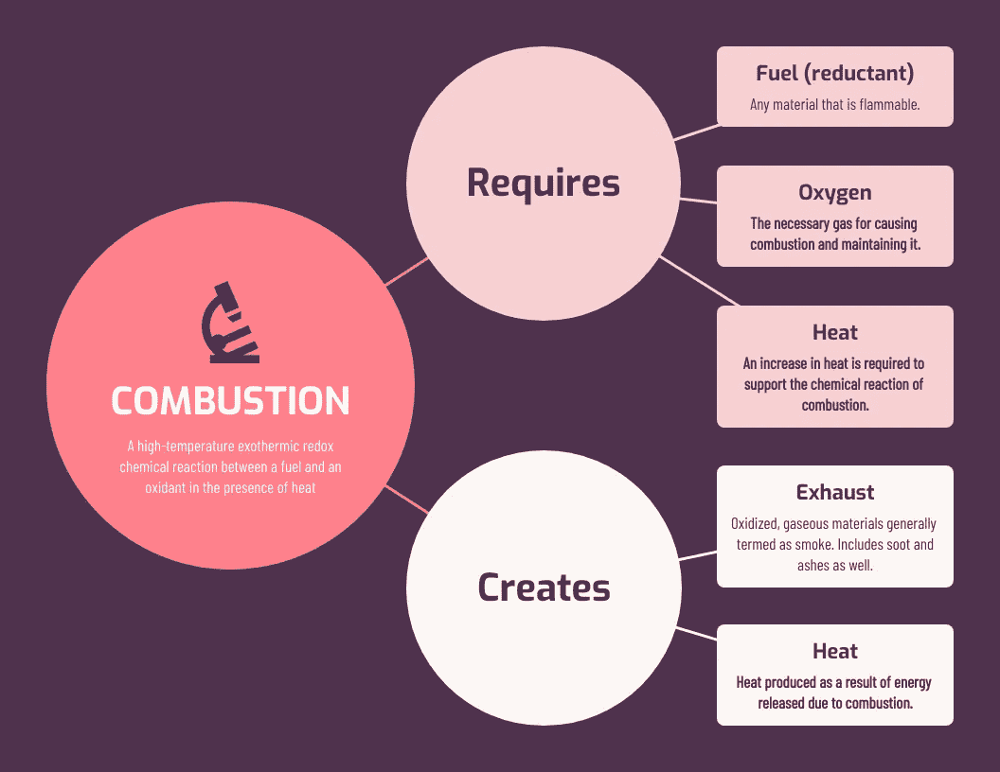
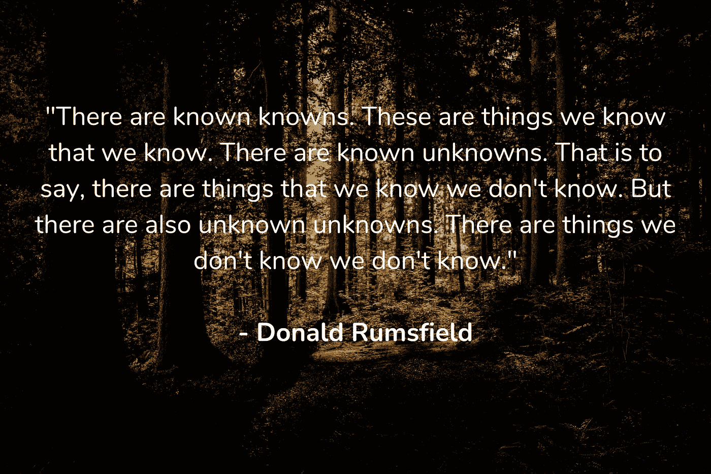

# 知识是一张图表

> 原文：<https://medium.com/codex/knowledge-is-a-graph-4fe81d782873?source=collection_archive---------8----------------------->

[GuerrillaBuzz 区块链公关机构](https://unsplash.com/ja/@guerrillabuzz_blockchain_pr_agency?utm_source=medium&utm_medium=referral)在 [Unsplash](https://unsplash.com?utm_source=medium&utm_medium=referral) 上的照片

## 将其概念化为一个相互联系的森林

在一次 Reddit[Ask**M**e**A**nything](https://www.reddit.com/r/IAmA/comments/2rgsan/i_am_elon_musk_ceocto_of_a_rocket_company_ama/)期间，埃隆·马斯克谈到知识时说:

> “将知识视为一棵语义树是很重要的——在进入树叶/细节之前，确保你理解了基本原则，即主干和大树枝，否则就没有什么可以依靠的了”
> 
> — [伊隆·马斯克在 Reddit 上](https://www.reddit.com/r/IAmA/comments/2rgsan/i_am_elon_musk_ceocto_of_a_rocket_company_ama/)

但是在数据建模中——“树”是一种图形。

在数据建模和图论中，树是一种图形

**什么是图？**

图是一种非线性数据结构，包含节点(或顶点)以及连接它们的边。

图形的图示(作者在 [Canva](https://www.canva.com/) 上绘制的图形)

> 图是一种非线性数据结构，包含节点(或顶点)以及连接它们的边。

当在计算机中对图形结构建模时，节点和边都可以存储数据——节点可以存储关于它们所代表的“对象”的信息，而边可以存储关于这些对象之间的关系的信息(例如，从 A 到 D 的方向，或者 A 是否“喜欢”D)。

## 日常生活中的图表

你每天都要处理知识的图形表示。

图形被用来表示网络，比如铁路系统或电路。

它们也用于表示社交网络，如 LinkedIn 或 Instagram，其中每个人被表示为一个节点，每个节点是一个包含其他信息(姓名、性别、位置等)的结构。

像脸书一样的社交网络；一种图形，其中节点代表人和他们的数据，边代表他们的朋友/关系(作者在 [Canva](https://www.canva.com/) 上绘制的图形)

图也可以表示层次——在图论中，“连通非循环图”更好地被称为“[树](https://www.tutorialspoint.com/graph_theory/graph_theory_trees.htm)”。

文件夹结构是使用这种树数据模型构建的。

传统的文件夹结构是使用树形数据结构(也称为“连接非循环图”)来组织的

## 你的大脑也是一个(不断更新的)图表

连接网络是神经生物学的一个基本结构。

这些节点可能是神经元。

边缘代表这些神经元之间的交流或联系。

你所知道的全部被封装在这个结构中——它支撑着你用来代表一切的**心智模型**！

从真实的，到记忆中的，假设的，甚至是想象的情景！

> 你所知道的全部都被封装在这个结构中——它支撑着你用来代表一切的**心智模型**！

## 学习是更新或生成心智模型

当我们学习时，我们正在做的是更新这些心智模型，我们用它们来理解生活和我们周围的世界。

大脑基于假设创建心智模型，我们通过验证准确的假设来学习——并忘记那些不正确的假设(从而更新我们的模型)。

在这个过程中，错误是不可避免的，但也是学习过程中的关键。

正如斯塔尼斯拉斯·德阿纳所说:

> “人类和机器的学习总是从一组先验假设开始，这些假设被投射到输入数据上，系统从中选择最适合当前环境的假设。正如 Jean-Pierre Changeux 在他的畅销书《神经元人》(1985 年)中所说，“学习就是消除。”—《我们如何学习:为什么大脑比任何机器学习得都好》一书的作者斯塔尼斯拉斯·德阿纳

## 知识图和概念图

[知识图谱](https://towardsdatascience.com/knowledge-graphs-at-a-glance-c9119130a9f0)近年来风靡全球。

顾名思义，它们是知识的图形结构表示——以链接的实体或概念的形式。

知识图为捕获、组织和搜索大量多关系数据提供了一种灵活的方式。

知识图示例

[概念图](https://rkursem.medium.com/concept-maps-the-hidden-gem-of-personal-knowledge-management-84edc658054a)是知识图的一个子集——直观地表示想法和概念之间的关系。

这对于个人知识管理和教授他人都很有用。

来自[venengage](https://venngage.com/templates/mind-maps/science-chemistry-concept-map-5caa75d3-ff07-49c2-9bc7-680d3554068b)的概念图示例(知识共享许可)

## 相连的森林

我很喜欢把我自己的知识概念化为一个由相互联系的树组成的网络——如果你愿意的话，一个相互联系的森林。

有些(大部分)概念我只有零碎的了解，这些是更年轻的树，甚至可能是所有“无所依附”的叶子。

其他概念我更熟悉，也更容易理解。这些是较老的树，树干更结实。

而**创造力**发生在不同树木的异花授粉中。

> 各种树木的 ***杂交-*** 授粉产生了创造力。

其他概念——森林周围的风景——我甚至不知道我不知道的事情。

正如唐纳德·拉姆斯菲尔德所说，这些都是“未知的未知数”。

这也是最有潜力的空间

…用于新知识树的种植和生长。

作者在 [Canva](https://www.canva.com/) 上的图片

非常感谢你走到这一步——我希望你从阅读中有所收获！

> [订阅我的列表](https://hustling-artisan-7562.ck.page/84e25aef54)偶尔会收到电子邮件，内容是我正在挖掘的、我认为对你的创作有价值的东西:)