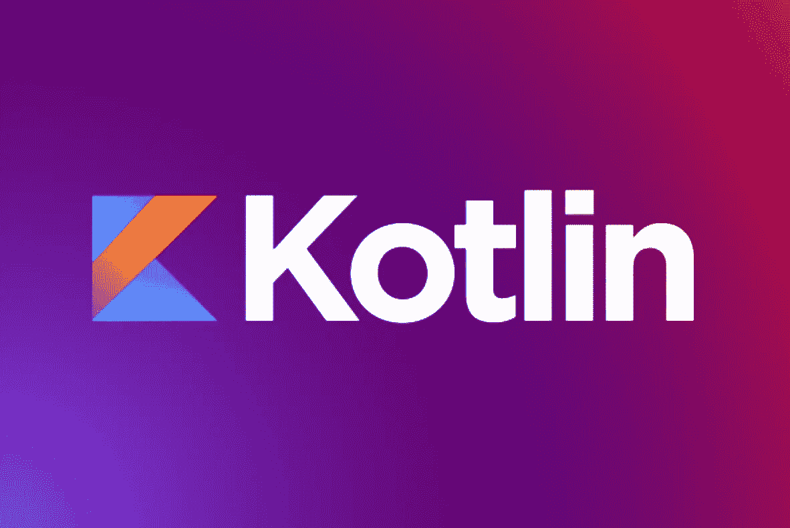

# Kotlin 1.7.0 alpha 版本发布；这是最新消息

> 原文：<https://medium.com/codex/kotlin-1-7-0-alpha-version-released-heres-what-s-new-4bd448980048?source=collection_archive---------36----------------------->

Kotlin 1.7.0 额外增加了一个下划线操作符，当没有提供其他类型时，它可以用来推断类型参数。

最新的[科特林编程语言](http://content.techgig.com/technology-guide/techies-should-shift-from-java-to-kotlin-know-why/articleshow/91997720.cms)版本现已推出。更新包括 K2 编译器的 alpha 版本，对 Gradle 中增量编译的增强，以及其他特性。

除了性能增强，新的 K2 编译器旨在加速新语言功能的开发，标准化[科特林](https://content.techgig.com/technology-guide/5-reasons-why-kotlin-should-be-your-next-coding-language/articleshow/92128782.cms)支持的平台，并为编译器修改提供 API。它目前只对 JVM 可用，并且没有一个编译器插件是可操作的。

现在通过增量编译支持跨模块修改，并且增强了对编译避免的支持。JetBrains 声称，使用构建缓存或频繁更改非 Kotlin Gradle 模块的 Kotlin 开发者将从这些升级中受益最多。

Kotlin 1.7.0 额外添加了一个下划线操作符，当没有提供其他类型时，可以使用它来推断类型参数。

开发人员可以通过委托使用实现来设计轻量级包装器，从这个版本开始，这些包装器通常不分配 RAM。

这个版本还带来了几个现有的特性，比如选择性加入需求注释、不可空类型和构建器推理，使它们达到“稳定”状态。

参观***TechGig***:[https://bit.ly/3ijY5Gt](https://bit.ly/3ijY5Gt)