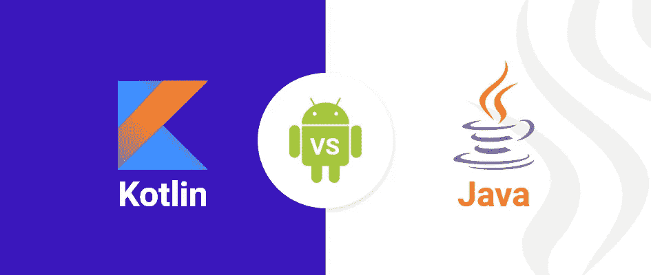

# Kotlin vs Java 用于 Android 开发

> 原文：<https://medium.com/codex/kotlin-vs-java-for-android-development-7cce3e90ed08?source=collection_archive---------7----------------------->

Kotlin vs Java 用于 Android 开发

# Kotlin vs Java？2021 年 Android 开发哪种语言最好？

新的 Android 开发人员想知道他们应该学习哪种语言来构建现代 Android 应用程序。开发团队希望确保 Kotlin 不会对他们的应用程序的性能、他们雇用合格工程师的能力或他们的整体开发效率产生负面影响。

为了帮助您做出决定，我们整理了一份关于 Android 开发中 Kotlin 与 Java 的一些最常见问题的列表。

# 关于 Kotlin 与 Java 用于 Android 开发的常见问题

**Java 和 Kotlin 哪个更适合 Android 开发？**

Kotlin 是 2021 年 Android 开发的[首选语言。Java 和 Kotlin 都可以用来构建高性能、有用的应用程序，但是 Google 的库、工具、文档和学习资源继续采用 Kotlin 优先的方法；使它成为今天 Android 的更好的语言。](https://developer.android.com/kotlin/first#why)

## **谷歌推荐 Kotlin 用于 Android 开发吗？**

是的。谷歌建议开发者开始用 Kotlin 构建 Android 应用，并在现代 Android 开发中采取了越来越 Kotlin 优先的方法。许多 Android Jetpack 库要么完全用 Kotlin 编写，要么支持 Kotlin 语言特性，如协程。

## **Google 是什么时候开始支持 Kotlin for Android 的？**

谷歌在 2017 年的 [Google I/O 上宣布了对 Kotlin 的官方 Android 支持。](https://youtu.be/EtQ8Le8-zyo?t=660)

## **Android 什么时候变成了 Kotlin-first？**

谷歌在 2019 年的谷歌 I/O 上采用了他们目前的 Kotlin-first 方法。

## **Android 开发还用 Java 吗？**

是的。绝对的。Google 仍然百分之百支持 Java 用于 Android 开发。如今，大多数 Android 应用程序都混合了 Java 和 Kotlin 代码。开发人员可以用 Java 构建与 Kotlin 相同的功能。

## **Android 会停止支持 Java 吗？**

Android 不太可能很快停止对 Java 的支持。Android SDK 大部分仍然是用 Java 编写的。大多数 Android 应用程序仍然包含 Java。Android 操作系统是建立在 Java 虚拟机之上的。完全脱离 Java 将代表着 Android 生态系统的巨大转变。

## **kot Lin 正在取代 Java 吗？**

不会。Java 不会被 Kotlin 完全取代。在 Android 生态系统中，Java 可能会继续失去 Kotlin 的一些市场份额，但 Java 仍将是世界上最常用的编程语言之一。

虽然 Java for Android 仍然局限于 Java 版本 8，但在 Android 之外，Java 正在快速发展，并采用了其他现代编程语言的许多特性；包括科特林。

## **kot Lin 对于 Android 开发来说够用吗？**

是的。你可以只使用 Kotlin 构建 Android 应用程序，随着文档、工具和库变得更加以 Kotlin 为中心，专门使用 Kotlin 构建应用程序将变得更加容易。

## **我应该为 Android 学习 Java 还是 Kotlin？**

你应该先学科特林。如果你必须在学习 Java 或 Kotlin 之间做出选择来开始开发 Android 应用程序，如果你了解 Kotlin，你会更容易使用当前的工具和学习资源。

如果你已经了解 Java，并且想专注于学习 Android，那么你可以推迟学习 Kotlin，转而专注于 Android SDK。

## **不懂 Java 可以学 Kotlin 吗？**

是的。虽然了解 Java 或任何编程语言会使它更容易，但 Kotlin 是一种很好的第一语言，这要归功于静态类型、类型推理、丰富的学习资源和强大的 IDE 支持。

## **kot Lin 比 Java 容易吗？**

许多人会发现 Kotlin 比 Java 更容易学习和编写。许多因素影响了这种体验，包括 Kotlin 的简洁语法、类型推理、显式可空性和广泛的标准库。

## **不了解 Kotlin 能找到 Android 开发者的工作吗？**

是的，但是对于寻找合格开发人员的招聘经理来说，Kotlin 正成为一项越来越受欢迎的技能。在 LinkedIn 上搜索“kotlin android developer”职位会出现[~ 7700 条招聘信息](https://www.linkedin.com/jobs/search/?geoId=103644278&keywords=kotlin%20android%20developer&location=United%20States)，而在美国搜索“java android developer”会出现[~ 7800 条结果](https://www.linkedin.com/jobs/search/?geoId=103644278&keywords=java%20android%20developer&location=United%20States)。在印度，帖子的相对数量也类似地平衡,“Java Android developer”和“kotlin android developer”分别有大约 11，100 条[和大约 11，000 条](http://java%20android%20developer/)[。](https://www.linkedin.com/jobs/search/?geoId=102713980&keywords=kotlin%20android%20developer&location=India)

随着代码库、团队、库和谷歌继续向 Kotlin 靠拢，预计 Kotlin 将成为 Android 开发人员工作中更重要的技能。

## **kot Lin 比 Java 快吗？**

没有；虽然真正的答案取决于你对什么性能指标感兴趣。在运行时，这两种语言的性能非常相似。然而，在编译时， [Kotlin 明显比 Java](https://eng.uber.com/measuring-kotlin-build-performance/) 慢。减速的程度取决于许多因素，比如注释处理器的使用，以及混合 Java + Kotlin 源集的存在