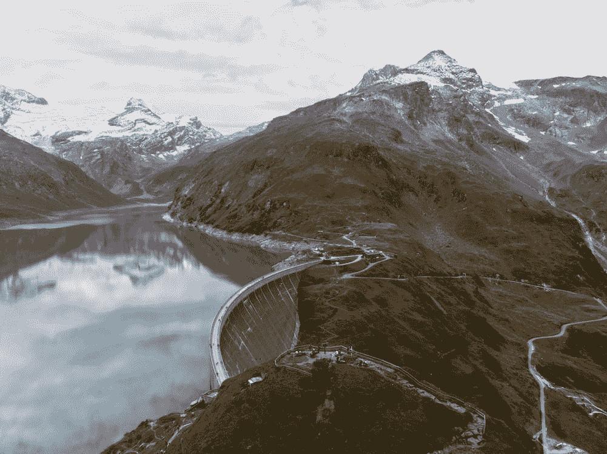

# 为什么没有收藏家？

> 原文：<https://medium.com/codex/kotlin-why-no-collectors-ba314c6f6b1e?source=collection_archive---------9----------------------->

*免责声明:所有观点都是我自己的*



[图片](https://www.pexels.com/photo/mountainous-landscape-with-a-lake-10452118/)来自 Pexels 的 drones 无人机

我写 Java 已经很久很久了。但是最近，我在 Kotlin 做了更多的工作，对我来说比较这两种语言总是很有趣。

今天，我将比较两个简单的地图和采集操作。

在 Java 中

```
ArrayList<String> myList = new ArrayList<String>( Arrays.asList("my"…
```