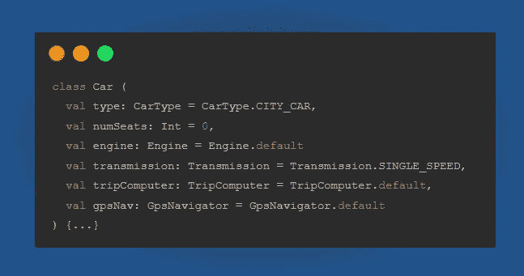
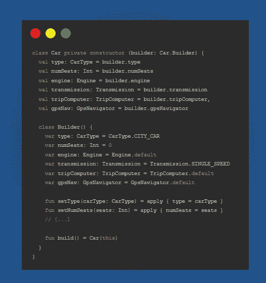
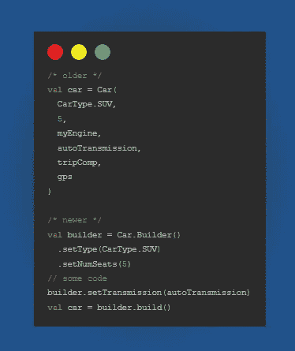
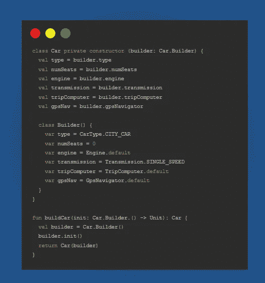
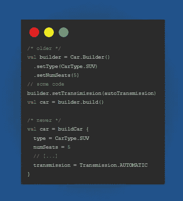

# Kotlin 的构建器 DSL 将改变你编码的方式

> 原文：<https://medium.com/codex/kotlins-builder-dsl-will-change-the-way-you-code-931ecd03012d?source=collection_archive---------6----------------------->

[来源](https://kotlinlang.org)

如果你没有读过 Kotlin 最强大的工具，你可以在这里查看:

 [## 你使用科特林最强大的工具吗？

### 讨厌 Java 的人很多，喜欢 Java 的人也很多，但我几乎没见过不喜欢 Kotlin 的人。来自数据…

medium.com](/codex/kotlins-most-powerful-tool-1265732544ad) 

卡尔·本茨于 1886 年发明了第一辆汽车。从那以后，新技术有了如此多的发展和整合。在 2022 年，汽车是如此复杂的机器，以至于制造一辆汽车需要大量的人力。

我们也在制造汽车，但是用我们的脑力……在电脑上……在你的房间里……与世隔绝……等等，有一个疫情？好吧——我跑题了😜

耶，我们正在制造我们的复杂汽车，但是等等，这有问题。

1.我需要确保在对象构造时我拥有所有必需的字段。嗯。

2.我的构造函数参数可能会改变或增加，这会阻塞参数列表。嗯。

*那么，我们该怎么做才能让情况稍微好一点呢？*

# 创建构建器类

让我们来看看:

万岁，我们已经把复杂的对象构造器简化了很多。我不需要同时拥有所有属性，参数表也不会再阻塞。

站住。尽管这是构造一个复杂类的更好的方法，但是仍然存在一些问题。

1.参数列表没有堵塞，但是整个代码很庞大。嗯。

2.添加大量样板代码。嗯。

3.代码风格不灵活。嗯。

*那么我们该怎么做才能让这种情况稍微好一点呢？*

# 科特林 DSL

> Kotlin 最强大的工具是高阶函数，因此能够编写类型安全的 DSL 代码。

首先，我们可以去掉 Builder 类中的所有函数，并将这个函数添加到顶层:

尤其是`buildCar`函数，它是所有神奇事情发生的地方。该函数有一个高阶函数**，其中`Car.Builder`是**λ接收器类别**。当你编写这个 lambda 函数时，隐式的`this`将属于`Car.Builder`类。**

哇，我们终于到了一个大部分问题都解决了的阶段。

1.代码非常易读和干净。

2.我们可以在**λ参数**中添加任何逻辑，如`if` s 或`for` s

3.如果我们从 API 获取数据，甚至可以灵活地使用协程。

# **结论**

Kotlin 的构建器接口和 DSL 可以提高代码的可读性，并提高团队的生产率。通过一点额外的努力，这种模式可以节省重构和调试代码的时间。