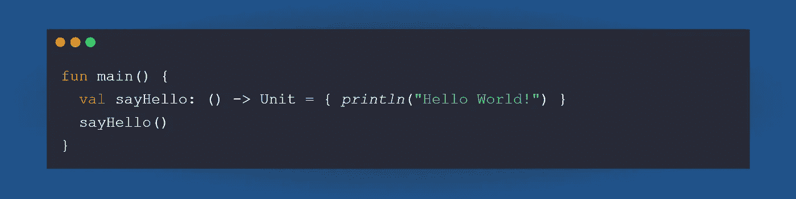
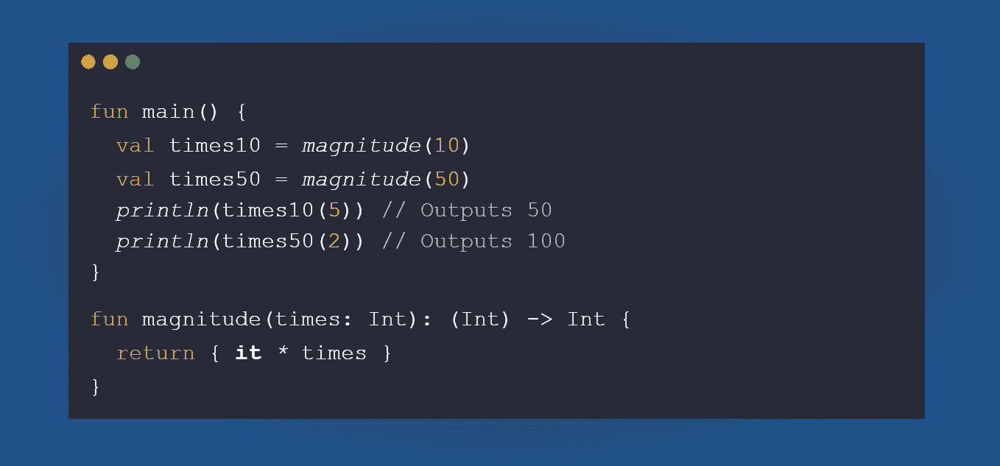
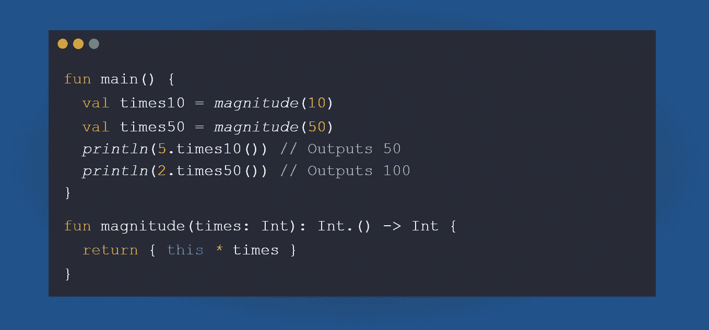
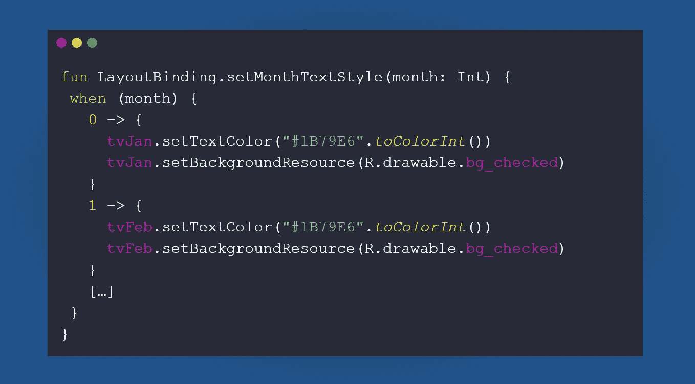
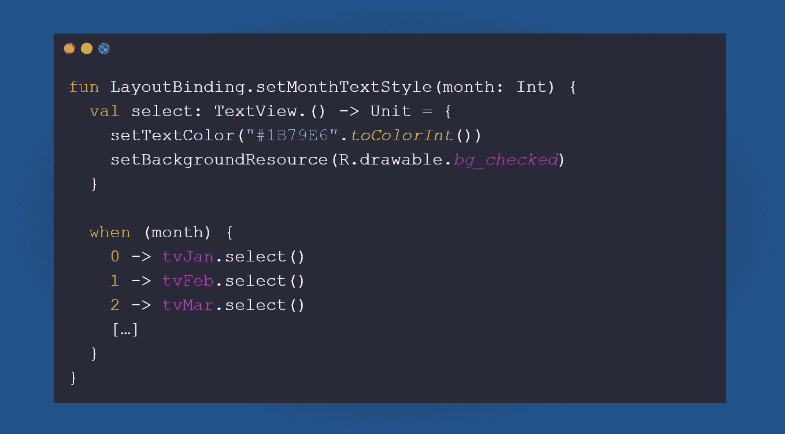
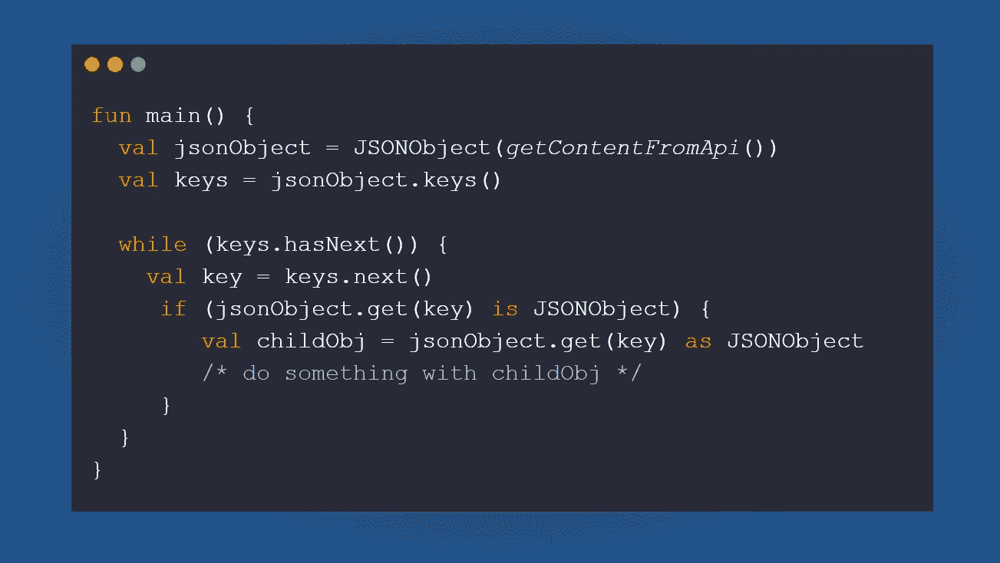
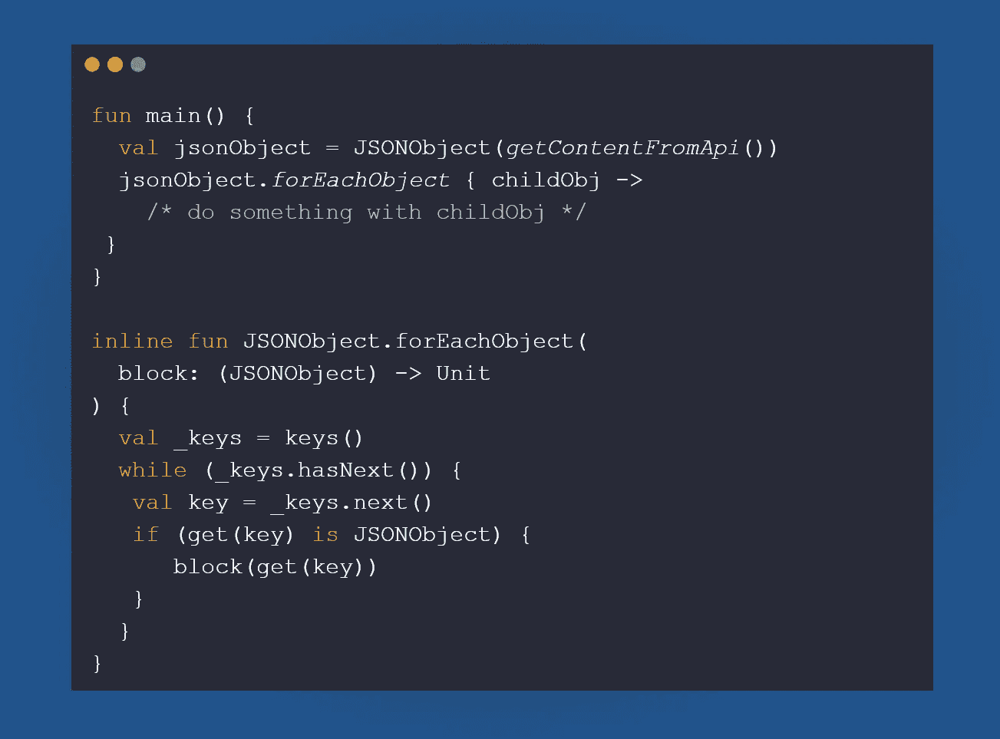
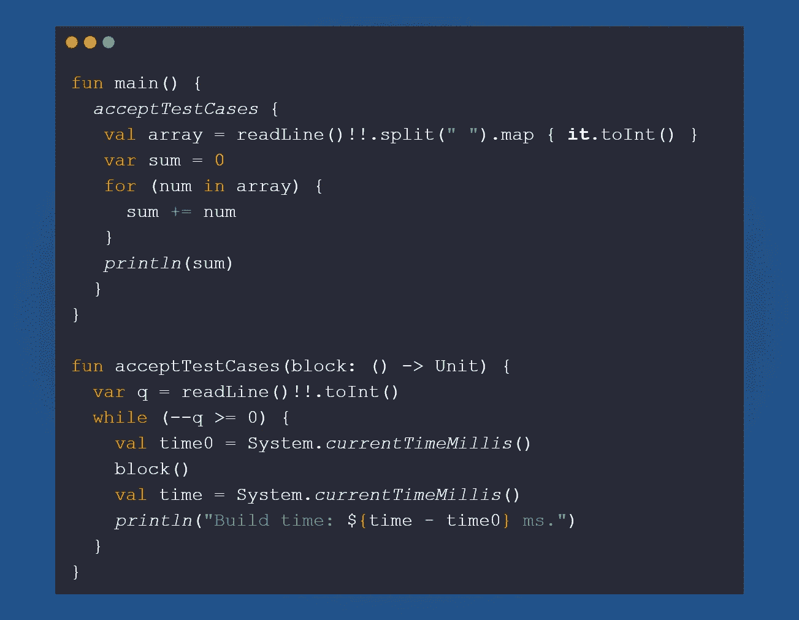
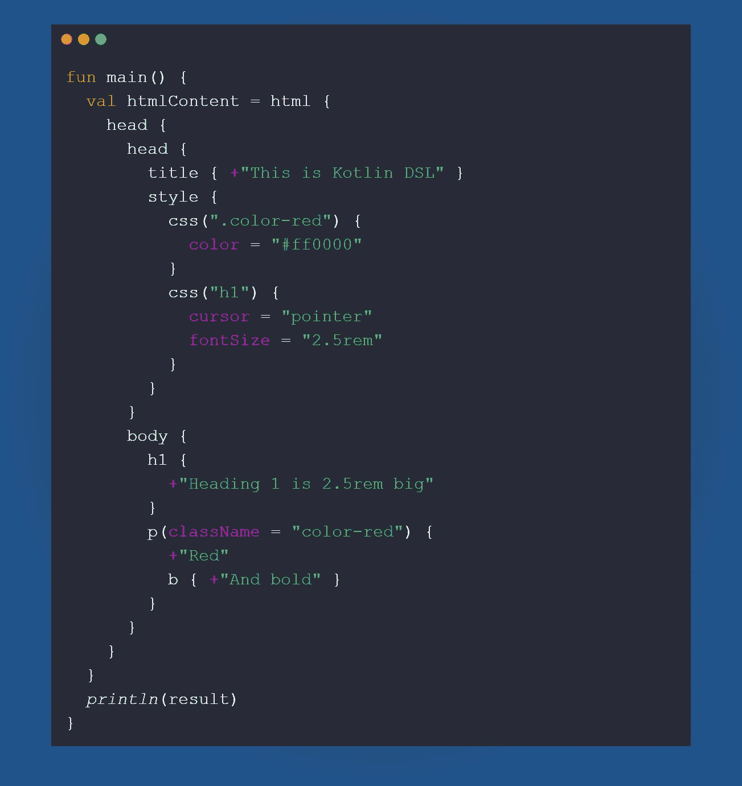

# 你使用科特林最强大的工具吗？

> 原文：<https://medium.com/codex/kotlins-most-powerful-tool-1265732544ad?source=collection_archive---------1----------------------->

在 [Unsplash](https://unsplash.com?utm_source=medium&utm_medium=referral) 上[内伊克·索克利奇](https://unsplash.com/@nejc_soklic?utm_source=medium&utm_medium=referral)的照片

讨厌 Java 的人很多，喜欢 Java 的人也很多，但我几乎没见过不喜欢 Kotlin 的人。从`data class` s 到算子函数，Kotlin 最被低估的特性之一是拥有高阶 Lambda 函数。

科特林中的 Lambda 函数

起初，这似乎不是一件有用的事情，因为我们可以定义一个函数，而不是为变量定义一个函数。但是这里有一些在 Kotlin 中使用 Lambda 函数的惊人用例。

# # 5—制作函数生成器

我们知道我们从我们定义的传统函数中返回变量和对象；然而，随着高阶函数的引入，我们可以从一个函数返回一个函数类型。让我们来看看:

信号发生器

如果我们有一个具有可定制内容的函数，我们可以使用闭包来返回一个具有特定意图的函数。我们还可以为 lambda 函数添加一个接收器参数，如下所示:

接收器类型的函数发生器

# # 4—减少代码重复

正如我们在前面的例子中看到的，借助 Lambda 函数，我们可以删除重复的代码并减少样板代码。

例如，您正在开发一个 android 应用程序，它可以改变屏幕上文本的颜色和背景。

**不要**(不带 lambda 函数)

**做**(带 lambda 功能)

# # 3—易于迭代

为了迭代一个数组，我们可以使用一个`for`循环或者`forEach`函数。然而，有时，它们并不容易获得。我们可以利用 lambda 函数来提高代码的可读性。

通常的“Java”方式

现代的“科特林”方式

# # 2 —在函数之前执行一些代码，在函数之后执行

**如果你来自竞争性编码背景，你一定知道很多问题要求你在同一个执行中做一定量的测试用例。您可以使用这个带有 lambda 参数的函数来专注于解决问题，而不是设置样板文件。**

****

**对给定的解决方案执行代码分析**

# **# 1 —科特林 **DSL****

****他们所有人的赢家！** Kotlin DSL 是 Kotlin 中 lambda 函数的最佳用例之一。这使得 Kotlin 也可以创建网站和运行 React 代码。举个例子，**

****

**来源: [GitHub](https://github.com/Kotlin/kotlin-by-example/blob/master/examples/09_Kotlin_JS/06_HtmlBuilder.md)**

# **结论**

**在我看来，Kotlin 本身就是一种复杂的语言。我在网上辅导编程，我逐渐意识到教 Java 比教 Kotlin 容易得多。创建 Kotlin 的目的是减少 Java 的样板代码，并增加许多 Java 没有的新特性。然而，一旦你掌握了这门语言，它就变得非常漂亮，并且很好地适应了程序员的需求。**