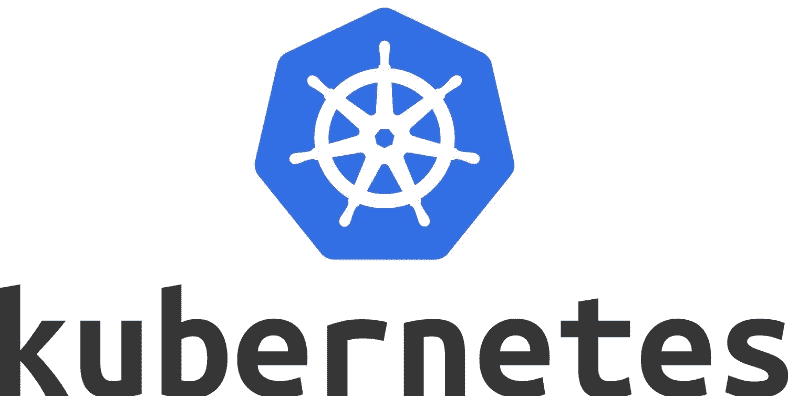

# Kubernetes 101 笔记

> 原文：<https://medium.com/codex/kubernetes-101-notes-853fbf2d6d24?source=collection_archive---------17----------------------->

## 写这篇文章是为了收集不同来源的笔记。



“Kubernetes 是一个可移植、可扩展的开源平台，用于管理容器化的工作负载和服务，有利于声明式配置和自动化。它有一个庞大的、快速增长的生态系统。Kubernetes 的服务、支持和工具随处可见。[0]"

你至少需要知道以下术语。

# **豆荚**

可以部署在库伯内特的最小单位。

实际上，pod 是一个或多个协同工作的容器，为系统的一部分提供服务。

每个 pod 都有一个唯一的 IP 地址。

pod 中的容器可以通过本地主机相互通信。

但大多数情况下，每个舱都包含一个容器。

**"注意:**将多个协同定位和共同管理的容器组合在一个 Pod 中是一种相对高级的用例。您应该只在容器紧密耦合的特定情况下使用这种模式"[3]。

# **副本集**

“副本集的目的是在任何给定时间保持一组稳定的副本盒运行。因此，它通常用于保证指定数量的相同 pod 的可用性。”

介绍状态管理

# **部署**

副本集之上的抽象级别

部署创建和更新副本集

# **配置图**

用于覆盖特定于容器的数据，如

*   配置文件
*   环境变量
*   数据的整个目录

“应用程序有时会将配置作为常量存储在代码中。这违反了要求**将配置与代码**严格分离的十二要素。不同部署的配置差异很大，但代码不会。”[5]这就是为什么使用 ConfigMap 来处理这种情况。

当改变时在容器内自动更新

最佳实践是版本化配置映射并执行滚动更新

"配置映射可以作为数据卷装入。配置映射也可以由系统的其他部分使用，而不直接暴露给 Pod。例如，配置映射可以保存系统的其他部分应该用于配置的数据。[4]

## 将配置图用作 Pod 中的文件

要在 Pod 的卷中使用配置图，请执行以下操作:

1.  创建配置映射或使用现有配置映射。多个窗格可以引用同一个配置图。
2.  修改 Pod 定义，在`.spec.volumes[]`下添加一个卷。将该卷命名为任意名称，并设置一个`.spec.volumes[].configMap.name`字段来引用您的 ConfigMap 对象。
3.  向每个需要配置映射的容器添加一个`.spec.containers[].volumeMounts[]`。将`.spec.containers[].volumeMounts[].readOnly = true`和`.spec.containers[].volumeMounts[].mountPath`指定为您希望配置图出现的未使用的目录名。
4.  修改您的图像或命令行，以便程序在该目录中查找文件。ConfigMap `data`映射中的每个键都成为`mountPath`下的文件名。

这是一个在卷中装载配置图的 Pod 示例:

```
**apiVersion**: v1
**kind**: Pod
**metadata**:
  **name**: mypod
**spec**:
  **containers**:
  - **name**: mypod
    **image**: redis
    **volumeMounts**:
    - **name**: foo
      **mountPath**: "/etc/foo"
      **readOnly**: **true**
  **volumes**:
  - **name**: foo
    **configMap**:
      **name**: myconfigmap
```

当卷中当前消耗的配置映射被更新时，投影的键最终也被更新。kubelet 在每次定期同步时检查安装的配置图是否是新的。然而，kubelet 使用其本地缓存来获取配置图的当前值。缓存的类型可使用 [KubeletConfiguration 结构](https://kubernetes.io/docs/reference/config-api/kubelet-config.v1beta1/)中的`ConfigMapAndSecretChangeDetectionStrategy`字段进行配置。ConfigMap 可以通过观察器(默认)、基于 ttl 或通过将所有请求直接重定向到 API 服务器来传播。因此，从更新配置映射到将新密钥投射到 Pod 的总延迟可能与 kubelet 同步周期+缓存传播延迟一样长，其中缓存传播延迟取决于所选的缓存类型(它等于观察传播延迟、缓存的 ttl 或相应的零)。”[4]

# **服务**

"定义一个可以用来指一组 pod 的 DNS 项目

为 pod 组提供一致的端点

不同类型的集群 IP、节点端口、负载平衡器

*   `ClusterIP`:公开集群内部 IP 上的服务。选择该值将使服务只能从集群内部访问。这是默认的`ServiceType`。
*   `[NodePort](https://kubernetes.io/docs/concepts/services-networking/service/#nodeport)`:在一个静态端口暴露每个节点的 IP 上的服务(`NodePort`)。自动创建一个`ClusterIP`服务，`NodePort`服务将路由到该服务。您将能够通过请求`<NodeIP>:<NodePort>`从集群外部联系`NodePort`服务。
*   `[LoadBalancer](https://kubernetes.io/docs/concepts/services-networking/service/#loadbalancer)`:使用云提供商的负载均衡器对外公开服务。外部负载平衡器路由到的`NodePort`和`ClusterIP`服务是自动创建的。"

# **入口**

"定义群集外的流量如何路由到群集内。

用来向世界展示 Kubernetes 的服务

基于主机和路径等因素将流量路由到内部服务

入口通常由负载均衡器(Nginx、HAProxy 等)实现

就像第 7 层负载平衡器。

开发入口是为了降低云中的负载平衡器成本。如果我们为每个服务使用一个负载均衡器(服务类型->负载均衡器)，成本会非常高。这就是我们使用入口的原因。

我将像这样为不同的主题合并资源。回购:

[](https://github.com/yunuskilicdev/notes) [## GitHub-yunuskilidev/notes:收集不同来源的笔记

### 从不同的来源收集笔记。在 GitHub 上创建一个帐户，为 yunuskilidev/notes 开发做贡献。

github.com](https://github.com/yunuskilicdev/notes) 

0-)[https://kubernetes . io/docs/concepts/overview/what-is-kubernetes/](https://kubernetes.io/docs/concepts/overview/what-is-kubernetes/)

1-)【https://www.youtube.com/watch?v=5h1TCrh_hZ0 

2-)【https://www.cncf.io/blog/2019/12/16/kubernetes-101/】T4

3-)[https://kubernetes.io/docs/concepts/workloads/pods/](https://kubernetes.io/docs/concepts/workloads/pods/)

4-)[https://kubernetes . io/docs/concepts/configuration/config map/](https://kubernetes.io/docs/concepts/configuration/configmap/)

5-)[https://12factor.net/config](https://12factor.net/config)