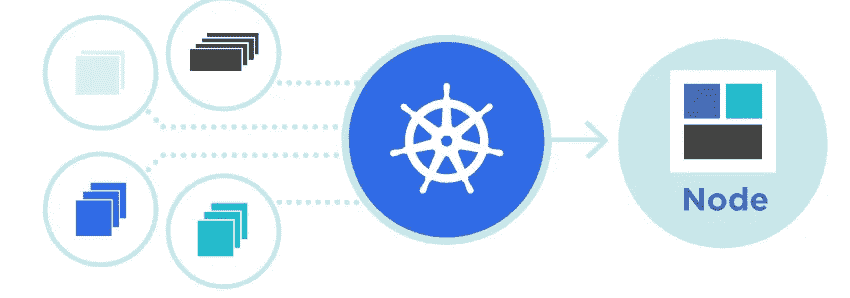

# Kubernetes:对其组件的介绍

> 原文：<https://medium.com/codex/kubernetes-an-introduction-aaa7c6304e97?source=collection_archive---------1----------------------->

[来源](https://kubernetes.io/)

**简介**

微服务数量的增加对开发人员和企业都有很大的帮助和好处，但也增加了运营团队的负担，因为其部署涉及的技术非常复杂。在这种情况下，我们不是指 2000 年代末，当时一家公司只有一个…