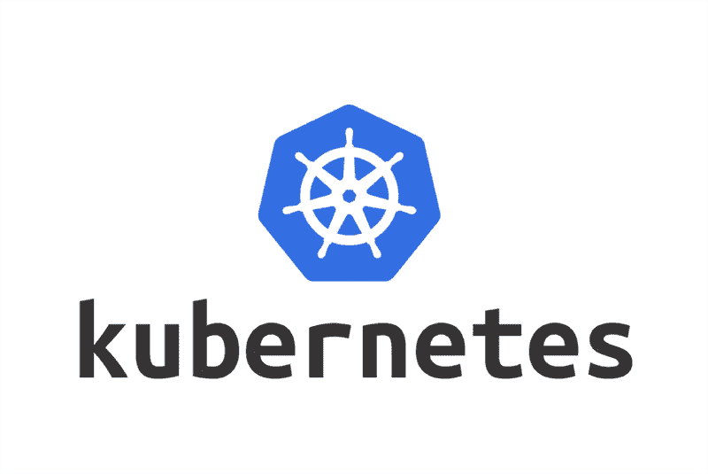

# Kubernetes:引论第二部分

> 原文：<https://medium.com/codex/kubernetes-an-introduction-part-ii-b6ccaadb76db?source=collection_archive---------4----------------------->

[来源](https://www.eweek.com/it-management/how-enterprises-can-future-proof-kubernetes-management-platforms/)

在之前的博客[帖子](https://securitylit.medium.com/kubernetes-an-introduction-aaa7c6304e97)中，我们了解了 Kubernetes 是什么，它的用途是什么，它有什么特点。我们还研究了什么是节点以及 k8s 的基本单元，也就是豆荚。我们学习了他们如何相互交流。在这篇博客文章中，让我们再看几个 Kubernetes 组件。

再一次，看这张图片，我们可以看到我们的 NodeJS 应用程序正在与…