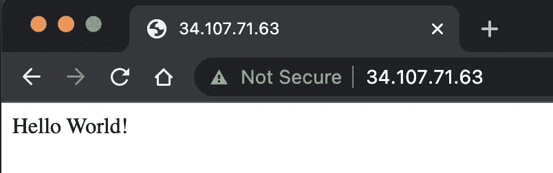

# 谷歌云中的 Kubernetes 引擎和 Terraform

> 原文：<https://medium.com/codex/kubernetes-and-terraform-in-google-cloud-3fc9e1c81e0?source=collection_archive---------6----------------------->

使用 Terraform 在区域性 Google Kubernetes 引擎(GKE)集群中部署应用程序的基础知识。


**TL；博士？**你可以从[我的回购](https://github.com/Escoto/KotlinSpringSample/blob/main/Deployment/main.tf)获得剧本。

这是我的容器系列的第 3 部分。访问第 1-2 部分，看看我是如何构建我们今天将使用的应用程序和容器的。

**第 1 部分** : [将你的第一个应用程序容器化](/codex/containerizing-your-application-b1644385e2ef)

**第二部分** : [谷歌云中的 Kubernetes](/codex/kubernetes-in-google-cloud-f27bb8cc6603)

为了不断重复容器的主题，今天的主题是自动创建应用程序所需的所有资源，然后进行部署。只需几个命令。

对于这个例子，我们将使用 [**地形**](https://www.terraform.io/) 。虽然已经有许多 [*基础设施作为代码*](https://docs.microsoft.com/en-us/devops/deliver/what-is-infrastructure-as-code) 语言，但 Terraform 的 *HCL* 是最新的一个，于 2014 年发布。在短短的 8 年时间里，它已经成熟到被所有主要的超大规模公司(GCP、Azure、AWS)采用，现在许多公司依靠它来维持其基础设施的正常运行。

# 目标

今天的目标是快速了解 Terraform，脚本如何工作，以及如何通过 terraform 脚本将服务联系在一起。我们的任务是:

*   为我们的应用创建虚拟私有云
*   创建一个区域性的 Kubernetes 集群
*   部署我们的应用程序负载平衡，以利用我们所选区域中的每个区域

## 要求

*   一个 [GCP 项目](https://cloud.google.com/resource-manager/docs/creating-managing-projects#creating_a_project)
*   启用所需的 API
*   在你的本地机器上安装谷歌 SDK
*   安装[地形](https://learn.hashicorp.com/tutorials/terraform/install-cli)

> 如果你用谷歌的云壳-> SDK，Terraform 开箱即用！！

## 要启用的 API

*   compute.googleapis.com
*   container.googleapis.com

> 对我来说，这些 API 已经足够了。可能您已经启用了它们，或者您甚至需要启用另一个。

# 获取代码

从 GitHub 获取项目

```
$> git clone [https://github.com/Escoto/KotlinSpringSample.git](https://github.com/Escoto/KotlinSpringSample.git)
$> cd Deployment/
```

不要忘记将 Google SDK 指向正确的项目

```
$> gcloud config set project gke-deployment-example
```

# 分析 Terraform 脚本

首先，我们必须使用 [google_compute_network](https://registry.terraform.io/providers/hashicorp/google/latest/docs/resources/compute_network) 设置我们的 VPC

VPC 是不够的，我们需要一个子网来支持我们的集群。我们使用[谷歌计算子网](https://registry.terraform.io/providers/hashicorp/google/latest/docs/resources/compute_subnetwork)创建一个

有了这个网络，我们就可以继续创建我们的 Kubernetes 引擎集群了。让我们设置一个集群，并允许它使用 [google_container_cluster](https://registry.terraform.io/providers/hashicorp/google/latest/docs/resources/container_cluster) 自动填充一组默认节点。

指定一个区域而不是一个区域会使群集成为区域性的。

我们需要的最后一点基础设施是负载平衡器的公共 IP。我们可以让 Kubernetes 来处理它，但我更喜欢自己申请并获得一个。

最后，所有的基础设施都已就绪，剩下唯一要做的就是创建一个 Kubernetes [服务&部署](https://kubernetes.io/docs/concepts/services-networking/service/)。

一言以蔽之，有了服务，你指定 app 将如何暴露给世界；在部署中，您可以指定如何管理 pod，以及将要执行什么容器映像。

在这里，脚本已经准备好一次性创建和部署我们的应用程序。为了让我们的生活更容易，我将添加一个输出，以便在部署完成后获取应用程序的 URL。否则，您将不得不在公共 IP 地址中搜索它。

现在我们已经完成了对脚本的分析，我们知道它应该做什么——确保将`local variables`更新到您想要的区域和项目。

是时候让 terraform 做自己的事了。在与`main.tf`相同的文件夹中打开控制台并运行:

```
$> terraform init
```

如果一切都按计划进行，您应该得到如下所示的内容，否则，请进入调试模式:


在这里，让我们告诉 terraform 根据我们目前拥有的配置来评估我们想要的配置，它将提出一个如何达到我们想要的状态的计划:

```
$> terraform plan
```


这将允许你看到每个服务将会发生什么；像现有的服务重新创建/修改。

一旦我们对计划感到满意:

```
$> terraform apply
```


资源创建完成后，Terraform 会输出分配给我们的 IP，你可以复制粘贴或者使用`ctrl + left click`如果你用的是 VS 代码。


我已经处理了这个 IP…

你将拥有这个知识产权，直到你处理掉它。即使您对基础设施进行了更改并运行了`apply`。它是您的，直到您运行`destroy`命令或者从您的基础设施中删除它。



成功！！

让我们现在清理我们的环境。

```
$> terraform destroy
```

# 结论

对我来说，作为一名开发人员，主要的优势是能够在几次点击中重新创建服务，因为我经常喜欢破坏并从头开始。

当我想快速测试某个东西时，这种使用 2-3 个命令以预测的方式再现环境的能力可以让我更高效。

# 接下来—多地区 GKE！