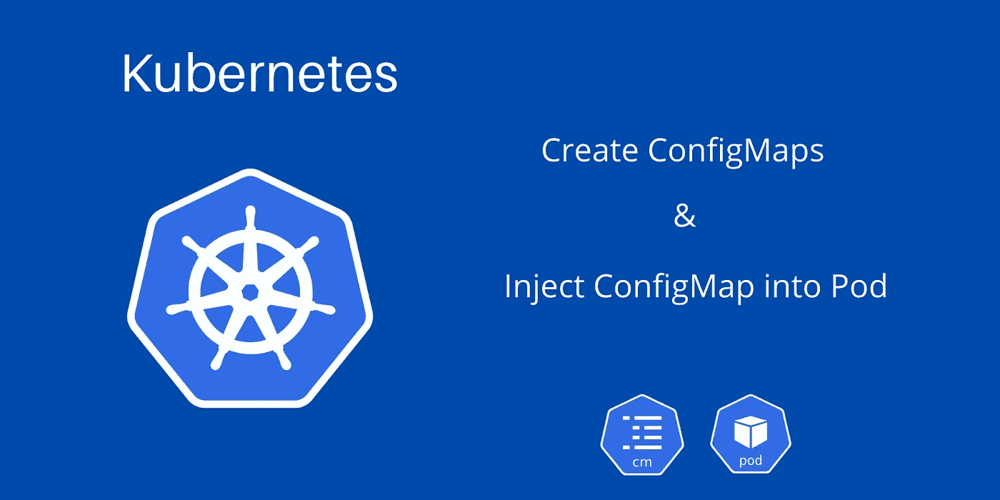

# Kubernetes 配置图解释

> 原文：<https://medium.com/codex/kubernetes-configmaps-explained-961cdd23f232?source=collection_archive---------2----------------------->

了解什么是 Kubernetes 集群中的配置映射，以及如何使用各种方法创建配置映射。并了解如何将配置映射注入 Pod 定义。

k8s-配置映射

在本教程中，我们将了解 Kubernetes 集群中的**配置映射**是什么，以及如何使用命令式和声明式方法创建配置映射。最后，如何将配置映射注入到 Pod 中。 **Kubernetes** 集群中的一个配置图是…