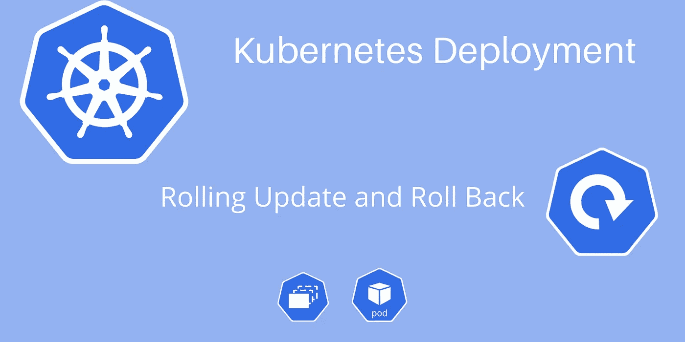

# Kubernetes 部署—滚动更新和回滚说明

> 原文：<https://medium.com/codex/kubernetes-deployment-rolling-updates-and-rollbacks-explained-e3efa6557368?source=collection_archive---------0----------------------->

## 了解一旦在 Kubernetes 集群中创建了部署，如何更新应用程序以及如何回滚。

K8s 部署时滚动更新和回滚

创建第一个部署后，如何更新 Kubernetes 集群上运行的应用程序？。以及如果出现任何问题，如何回滚？。这两个问题就来了…