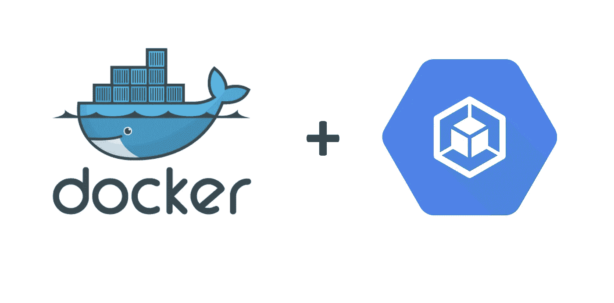

# 谷歌云中的 Kubernetes

> 原文：<https://medium.com/codex/kubernetes-in-google-cloud-f27bb8cc6603?source=collection_archive---------8----------------------->

## 让我们使用 Google 的 Kubernetes 引擎中的 Docker 运行我们的第一个容器集群。



多克和 GKE

> 如果你对如何构建你的第一个容器感兴趣，请访问我正在撰写的云计算系列文章的第一部分:容器化你的第一个应用程序 。

谷歌云提供了许多在云上运行应用程序的方法，但我们讨论的是容器，所以，在这里我将详细阐述 [Kubernetes 引擎(GKE)](https://cloud.google.com/kubernetes-engine) ，尽管还有其他方法来运行容器，如 [App Engine 灵活环境](https://cloud.google.com/appengine)。

# 什么是 Kubernetes？

Kubernetes 是一个专注于帮助我们进行容器编排的工具。它简化了部署，同时管理数百个容器，甚至推出新版本，并在遇到困难时回滚。

如果您已经在使用容器打包您的应用程序，那么您可能希望它们以微服务的方式相互独立。这意味着每一个都有自己的功能和不同的需求，这意味着他们需要独立地扩展/缩小规模——可能跨多个主机——最重要的是，他们之间的通信可能是一个要求，Kubernetes 可以简化所有这些管理。

谷歌的 Kubernetes 引擎是一个完全托管的 Kubernetes 集群，由谷歌的计算引擎提供支持。您可以在自己的环境中建立自己的 Kubernetes 集群，但是之后您必须自己管理/维护它。GKE 简单地拿走了大部分劳动力。

对于开发，Docker 桌面应用程序自带了 Kubernetes。虽然我不打算在这里讨论这个问题，但我认为值得一试。

# **要求**

*   [谷歌云账户](https://cloud.google.com/apigee/docs/hybrid/v1.3/precog-gcpaccount)

> 不用说，在你自己的 GCP 遵循这个教程，可能会招致费用。有一个免费层，所以，你可能会被覆盖，如果你只是跟着走。 [GKE 定价](https://cloud.google.com/kubernetes-engine/pricing#cluster_management_fee_and_free_tier)。

考虑到为容器开发时开箱即用的可移植性，无需太多努力，您就可以准备好在云上运行应用程序，并预先知道它将如何运行。对于这个例子，我将使用在本系列的第 1 部分中创建的容器。

出于安全原因，许多谷歌云服务都被禁用了。确保通过转至**API&服务**启用它们，如果它们被禁用，则通过**启用**它们:

*   Kubernetes 引擎 API
*   容器注册 API

# 让我们兜一圈

现在，使用您的[云外壳](https://cloud.google.com/shell)，Google 允许您使用 [gcloud](https://cloud.google.com/sdk/gcloud) 命令以一种相当简单的方式创建容器集群。


首先，让我们请求 google 创建一个集群 Kubernetes 可以在其中调度工作负载的一组机器——有两个节点:

```
$> gcloud container clusters create mykotlinapicluster --zone europe-west3-a --num-nodes 2
```

这将创建一个 Kubernetes 集群，在德国法兰克福有两个节点。您可以在您的`VM Instances List`中找到您的节点，或者通过运行:

```
$> gcloud compute instances list
```


集群创建命令中指定的 2 个计算实例。

`clusters create`命令自动配置 Kubernetes 控制命令`kubectl`,让您使用新创建的集群。要检查 Kubernetes 是否正常工作:

```
$> kubectl version
```

如果`kubectl`命令按预期运行，那么您可以继续配置 GKE 来运行容器化的应用程序。

我[在](https://docs.docker.com/engine/reference/commandline/push/) [DockerHub](https://hub.docker.com/r/escoto/kotlinresthello) 发布了 [Part 1](/codex/containerizing-your-application-b1644385e2ef) 中的 app让一切变得更简单。让我们告诉 GKE 创建该容器的部署:

```
$> kubectl create deploy kotlinresthello --image=escoto/kotlinresthello
```

这应该很快，你应该能看到一个[吊舱](https://kubernetes.io/docs/concepts/workloads/pods/)在几秒钟内运行:

```
$> kubectl get pods
```


随着我们的 pod 运行，让我们告诉 Kubernetes 向世界公开它，并检索公共 IP:

```
$> kubectl expose deployment kotlinresthello --port 8080 --type LoadBalancer
$> kubectl get services
```


这是一个为点播生成的随机 IP——我将在随后击落它，所以，不要指望我的服务在你读到这篇文章时已经上线。

将公共 IP 复制粘贴到浏览器中，并指定要通过打开的`8080`端口访问:


从这里，我们可以开始手动放大/缩小我们的应用程序:

```
$> kubectl scale deployment kotlinresthello --replicas 3
$> kubectl get pods
```


如果我们列出 pod，您可以看到第一个创建的 pod 和 2 个新创建的 pod。

现在，让我们清洁我们的环境:

```
$> gcloud container clusters delete mykotlinapicluster --zone europe-west3-a
```

# 结论

Kubernetes 提供了更多的特性，这只是对该工具的一个简单介绍。对于本教程，我遵循“命令式”方法，但是当你采用“[声明式](https://kubernetes.io/docs/tasks/manage-kubernetes-objects/declarative-config/)”方法时，它开始发光，告诉 Kubernetes 你想要什么，然后让工具为你完成。