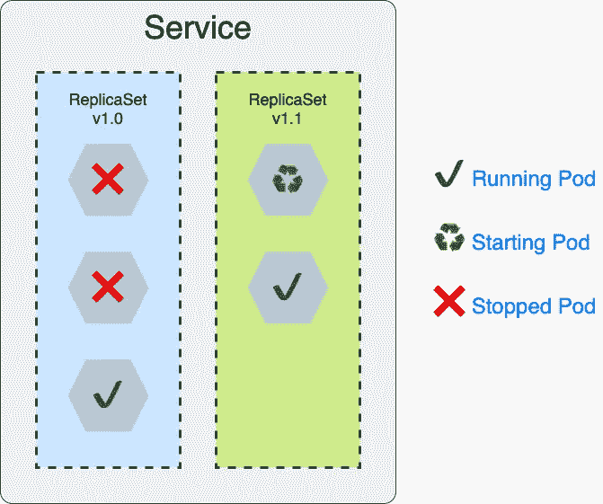
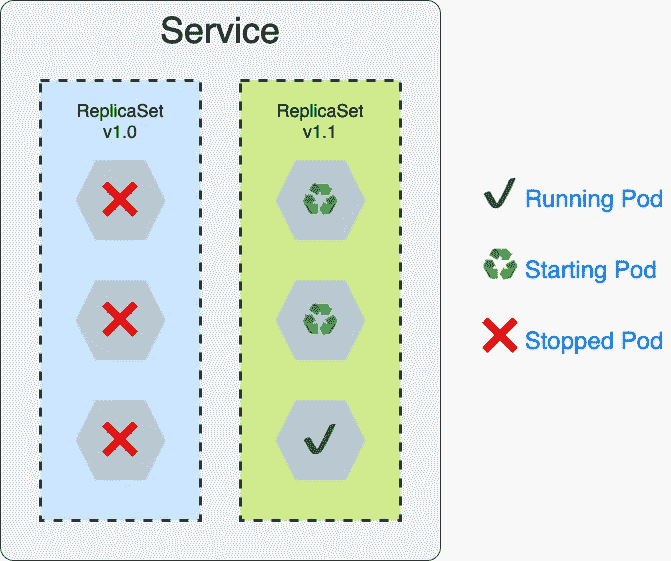
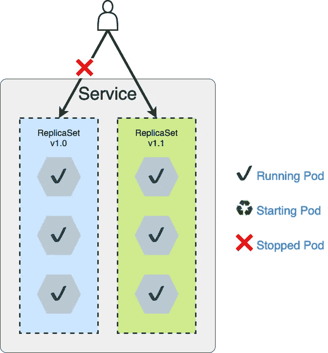
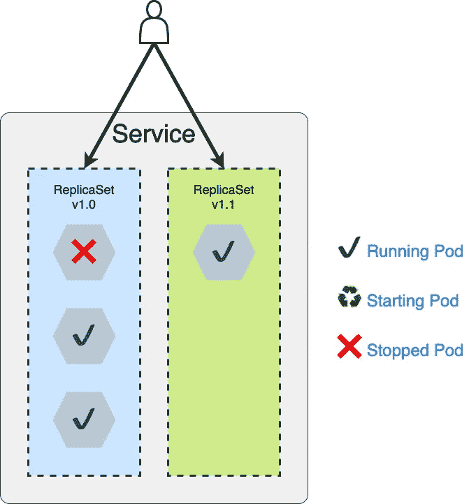
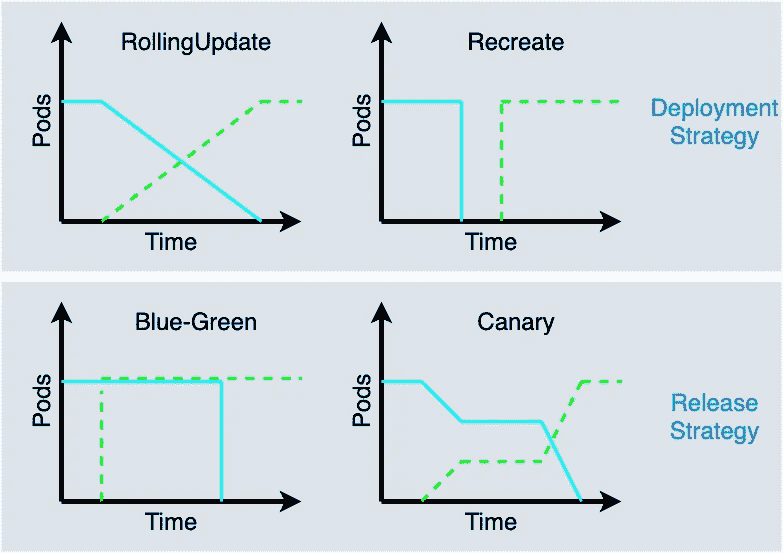

# 库伯内特图案:2。声明性部署

> 原文：<https://medium.com/codex/kubernetes-patterns-2-declarative-deployment-51a5375b4dc7?source=collection_archive---------3----------------------->

照片由[像素](https://www.pexels.com/)上的 [Pixabay](https://www.pexels.com/@pixabay) 拍摄

## [抄本](http://medium.com/codex)

***Kubernetes 模式*** 和设计模式一样，将 Kubernetes 原语抽象成一些可重复的解决问题的方案。

# 前置

*   [Kubernetes 图案:0。简介](https://rocky-chen.medium.com/learning-kubernetes-patterns-0-introduction-288f9f7ee787)
*   [Kubernetes 图案:1。可预测的需求](/codex/kubernetes-patterns-1-predictable-demands-e64cf804d96d)

本文将介绍 ***声明式部署*** 模式，主要关注 Kubernetes 的部署资源。将讨论以下几点:

*   滚动更新
*   固定更新
*   蓝绿色释放
*   金丝雀释放

# 什么是声明式部署模式？

***声明式部署*** 模式封装了一组容器的升级和回滚过程，并使其执行成为可重复的自动化活动。

# 为什么要用？

为了实现高可用性，云原生应用程序或服务通常部署在多个 pod 中。如果部署过程是手动维护的，那么对于云管理员来说会很困难。

将服务升级到较新的版本涉及几个活动，比如用较新的版本启动新的 Pods，停止旧版本的 Pods，验证新的 Pods 是否成功启动，以及如果需要的话回滚到旧版本。

如果自动控制和执行部署过程，则可以提高效率并避免人为误操作。

Kubernetes 原始人的部署就是为了这个目的。它负责告诉 Kubernetes 应该如何更新您的应用程序，使用不同的策略并调整更新过程的许多方面。

换句话说，我们通过部署告诉 Kubernetes 我们想要的部署解决方案，然后 Kubernetes 负责所有剩余的工作并有效地完成任务。

[**祈使句与陈述句**](https://kubernetes.io/docs/concepts/overview/working-with-objects/object-management/)

正如模式名中提到的，声明性对象配置与命令性对象配置相比较。

当使用声明性对象配置时，比如部署，我们定义 Kubernetes 系统的期望状态，而不是操作。因此，部署带来了一些好处:

*   部署是 Kubernetes 内部管理的资源。
*   部署显示状态而不是步骤。
*   部署配置可以用版本控制系统来管理，比如 github。

# 怎么用？

## 部署

*部署*是一种在 Kubernetes 中安装或更新应用程序的声明式方法，因为它创建了一个带有标签选择器的副本集。一个*部署*的核心是能够可预测地启动或停止一组吊舱。

因此，*部署*维护了在 pod 上运行的应用程序容器的生命周期，而容器本身也可以接收和处理生命周期事件(例如:SIGTERM)并提供健康检查状态，这将告诉 Kubernetes 它们是否成功启动。

下面是*部署*的一个例子:

在 Kubernetes 集群中安装应用程序之后，当发布新版本时，它们通常需要更新。然后，应该仔细考虑如何更新部署。

## 部署策略

*   **滚动更新**

[滚动更新](https://kubernetes.io/docs/concepts/workloads/controllers/deployment/#rolling-update-deployment)策略的目标是保证部署过程中的零停机时间。部署会创建一个新的副本集，逐渐停止旧副本集中的单元，并逐渐启动新副本集中的单元。

滚动更新策略确保总有一些 pod 在运行以工作或服务于传入的请求，因此服务没有停机时间。

滚动更新

*   **修复更新(重新创建)**

RollingUpdate 是在不停机的情况下升级开发，但有时停机是不可避免的。

RollingUpdate 的副作用是在更新过程中可以同时存在两个版本的容器。这在大多数情况下应该没问题，但是当容器的新版本包含不兼容的更改，尤其是不兼容的 API 更改时，这可能就不好了。

固定更新或[重建](https://kubernetes.io/docs/concepts/workloads/controllers/deployment/#recreate-deployment)策略通过关闭旧版本的所有容器，然后同时启动新版本的容器来处理这种情况。

使用重新创建策略修复更新

固定更新在更新期间引入了停机时间，但它同时只包含单一版本的容器。要实现重新创建部署，您只需在部署规范中将`.spec.strategy.type`设置为`Recreate`。

开发人员试图避免这样的变化，这不仅会导致应用程序更新期间的停机时间，还会在客户端和服务之间引入不稳定性。

# 什么时候用？

在 Kubernetes 集群中也有一些其他的策略来更新云应用程序，用于各种目的。

## 蓝绿色释放

*蓝绿*发布是一种应用程序发布策略，它可以通过运行两个副本集来减少停机时间和风险，一个副本集用于旧版本(称为**蓝**，而另一个副本集用于新版本(称为**绿**)。

旧版本的 pod(蓝色)继续接受和处理请求，然后当它们启动并准备好处理用户请求时，请求流量被切换到新版本的 pod(绿色)。

蓝绿色释放

然而，蓝绿色发布策略不容易在 Kubernetes 中使用，除非您手动执行或者使用一些扩展，比如 Service Mesh。

蓝绿色版本的另一个好处是只有一个版本的应用程序可以同时处理用户请求。但是它需要在短时间内对应用程序的副本进行双重计数。

## 金丝雀释放

Canary 发布是另一种降低风险的发布策略，它用新版本替换一小部分旧版本。一旦我们对新版本有信心，然后用新版本替换旧版本的所有剩余豆荚。

金丝雀释放

在 Canary release 中，用户请求会到达旧版本和新版本的 Pods，即使一开始可能会有少量的请求。

在 Kubernetes 中，金丝雀发布可以通过 Istio 来完成，这是一个服务网格，可以在 Kubernetes 集群中使用，根据您自己的规则来调整您的流量。

## 部署策略与发布策略

部署策略控制旧版本的单元如何被新版本的单元替换，而发布策略控制新版本的单元如何服务于用户请求。

部署策略与发布策略

上图显示了部署和发布策略的生存时间和 Pod 计数。

*Deployment* 原语是 Kubernetes 中创建或更新应用程序的一种基本方式，并控制应用程序的生命周期。

关于生命周期和健康状态，下一个健康探测模式将说明应用程序如何与 Kubernetes 交流其健康状态。