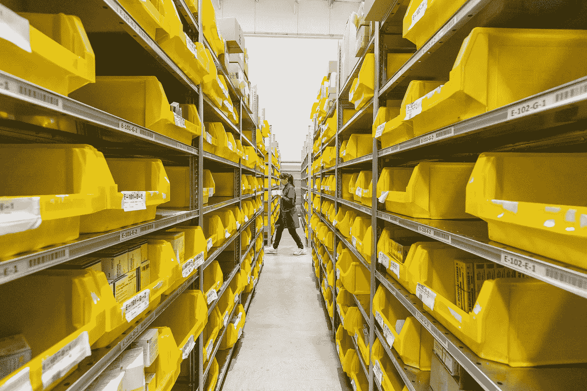

# Kubernetes 持续量解释

> 原文：<https://medium.com/codex/kubernetes-persistent-volume-explained-fb27df29c393?source=collection_archive---------0----------------------->

了解什么是持久卷，以及如何从存储类创建持久卷。然后，学习如何创建永久卷声明以及如何将 PVC 附加到 Pod。

阿德里安·苏约克在 [Unsplash](https://unsplash.com/s/photos/warehouse?utm_source=unsplash&utm_medium=referral&utm_content=creditCopyText) 上拍摄的照片

默认情况下，Pod 不存储创建的数据。比方说，您正在运行一个具有文件上传功能的应用程序。一旦 Pod 被删除或重启，Pod 内上传的文件将被删除…