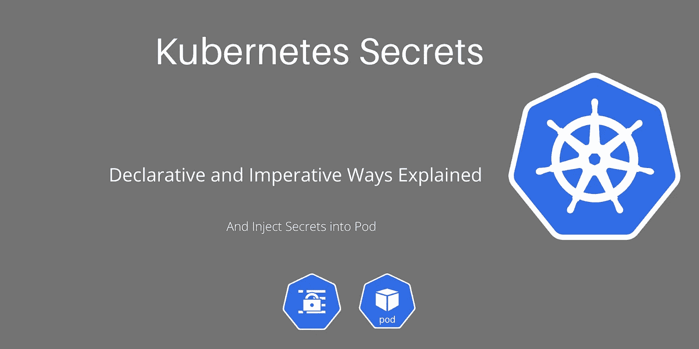

# 库伯内特的秘密解释

> 原文：<https://medium.com/codex/kubernetes-secrets-explained-f45baf8cefa7?source=collection_archive---------2----------------------->

了解 Kubernetes 集群中的秘密是什么，以及如何使用各种方法创建秘密。并学习如何将秘密注入 Pod 定义中。

k8s-秘密

在本教程中，我们将了解什么是 **Kubernetes** 集群中的**秘密**，以及如何使用命令式和声明式方法创建秘密。以及最后如何**利用**把**的秘密变成一个豆荚**。Kubernetes 集群中的秘密是一个对象，它被用于…