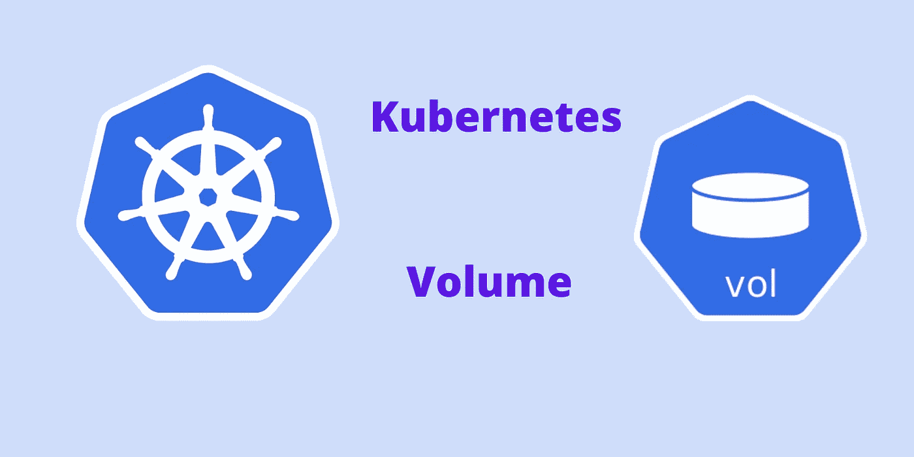

# Kubernetes 卷解释说

> 原文：<https://medium.com/codex/kubernetes-volume-explained-b346400b9754?source=collection_archive---------0----------------------->

## 了解 Kubernetes 集群中的卷是什么，以及为什么需要卷。以及如何将数据从 Pod 传输到 worker 节点，保证数据的安全性。

K8s 音量说明

Kubernetes 集群中的 Pod 无法永久存储数据。当 Pod 重新启动或 Pod 被删除时，在 Pod 内创建的数据将被删除。为了…