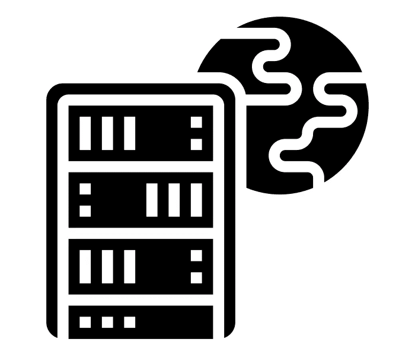

# λ演算:所有计算的根源

> 原文：<https://medium.com/codex/lambda-calculus-the-root-of-all-computing-4084228c3235?source=collection_archive---------8----------------------->

无服务器由 Eucalyp 从名词项目

你有没有想过电脑是如何变魔术的？有没有一种简单的方法来可视化计算或从根本上理解它，即我们通过代数和微积分应用和公理化数学的方法？为什么计算机指令和编程难以学习、阅读和理解？难道没有一种“更简单的方法”来学习计算是如何工作的吗？

从上到下理解计算机确实是一个崇高的目标，也是一个需要大量学习的目标。为了理解计算机是如何工作的，理想情况下需要理解数字电子学、CPU 体系结构、汇编语言、数据结构、数据库设计、编译器设计等等。在当今世界，课程还将包括云架构、分布式计算，甚至可能包括量子计算。但是，有更好的办法。

如果你曾经做过任何编程，特别是用不止一种语言，你就有一个很好的视角来理解“所有计算的根源”,而不需要详细研究上面的任何主题。我们将回答两个简单的问题:计算机实际上做什么，以及如何最有效地表示“工作”？

首先，我们得谈谈电脑。也许你以前从没想过要问这个问题，但是到底是什么*电脑？为什么要创造它们？*

**什么是电脑？**

在这个计算机已经存在的时代长大的人常常会认为计算机是理所当然的。一个世纪前，它们只是一个想法。人们想知道这样的“逻辑机器”是否能被建造，如果能，如何建造？几个世纪以来，人们制造了许多设备，这些设备可以粗略地称为计算机，但不是 T4 通用计算机。

一台简单的计算机，如计算器，是非常具体的——它只解决数学问题。通用电脑是一种可以解决任何问题的电脑。它不仅可以解决任何问题，它甚至可以确定问题是否可以解决，确定解决问题的最佳方式，确定首先解决哪些问题最有用或最有价值，使用这些信息来决定解决问题的方式，等等。解决问题只是冰山一角。

然而，在我们能让计算机解决问题之前，我们首先必须用计算机能解释的方式来表示或描述问题。现在我们可以开始回答第一个问题了——计算机是干什么的。

**什么电脑做什么**

计算机运行程序——什么是程序？是的，它是一组计算机指令——但是任何程序的目的是什么？他们是*符号操纵器*。它们接受某种形式的输入或数据，对其进行处理，并产生结果或输出。也许 Dijkstra 说得最好:

> “我更喜欢用另一种方式来描述(软件开发):程序是一个抽象的符号操纵器，通过给它提供一台计算机，它可以变成一个具体的符号操纵器。” *——e . w .迪杰斯特拉*

我们如何用一种优雅简单的语言来表示符号操作？令人惊讶的是，第二个问题的答案并没有我们想象的那么困难或复杂。

如果您使用过多种语言，也许您会注意到其中一种语言比另一种语言更容易使用，也更容易理解。不，我不打算提升一种语言的地位。我的观点是，随着每一次更新，许多语言都朝着一个明确的方向发展。例如，Java 在版本 8 中增加了 lambda 表达式。语言到底在向什么靠拢？为什么有些语言感觉更自然，似乎比其他语言更流畅？

> “我们的目标是 C++程序员。我们成功地将它们中的许多拖到了 LISP 的半路上。” *——盖伊·斯蒂尔，Java 的联合创始人*

编程语言越来越接近 LISP。越来越多新的类似 LISP 的(函数式)语言变得流行起来。那么 LISP 是什么呢？它是我们代表计算机将解决的问题的候选。

如果计算机程序解决问题，而一个程序真的只是一个符号操纵器，那么描述我们问题的语言应该是一种*符号*语言，也就是 LISP。

LISP 是一个很好的候选语言，但是作为一门语言，它太大了，不能作为一个整体来讨论。它需要在概念上进行分解。在语言中，我们将实际使用什么样的特定结构来编写代码呢？LISP 由 lambda 表达式组成。记得 Java 在版本 8 中添加了 lambda 表达式。但是什么是 lambda 表达式呢？

**λ表达式是函数**

λ表达式是函数应用的符号表示(或抽象)。函数是数学和代数的基础，但它们在计算机科学中同样有用。

例如，函数 f(x) = x + 5 将值 5 加到 x 上。函数应用是使用函数来确定结果的行为。当我们将 f(x)应用于一个特定的值时，比如说 f(6)，我们给它加 5。因此，f(6) = 6 + 5 = 11。我们已经将值 6 应用于该函数。

lambda 表达式基本上是一个函数的简短版本，去掉了许多语法错误。在 Java 等编程语言中，上述函数可能如下所示:

> public int add five(int x){ return x+5；}

其中大部分是语法、名称、类型以及与函数实际做什么*没有什么关系的东西*。作为 lambda 表达式，该函数可以大大缩短:

> (x)-> { return x+5；}

它仍然抓住了重要的部分:函数实际做什么。它接受一个我们称之为 x 的输入，对它做一些事情，然后返回结果。

没有函数，你所拥有的只是一大堆指令(称为意大利面条代码)。有了函数，这些指令可以组合在一起并组织起来。指令执行的任务规定了这些指令应该是哪个功能的一部分——毫不夸张地说。

现在我们知道了这一点，我们可以更清楚地说明 LISP 实际上是什么。它是一种编程语言，将函数视为核心单元或符号，代表正在解决的问题。但即使这样也是在卖空。

**LISP 的发现**

LISP 编程语言是由美国计算机科学家约翰·麦卡锡在 1958 年创建的，它完全基于函数的符号操作(被称为 lambda 演算)。

> “与其说是麦卡锡发明的东西，不如说是他发现的东西。这是你试图将计算公理化时得到的结果。” *——保罗·格拉厄姆*

LISP 的核心是惊人的优雅和简单。它只不过是一个评估函数。它的精彩之处在于它是对计算本身的一种抽象——计算机如何获取表达式并解释它，以便执行它并返回相应的输出或结果(在很高的层次上，这是所有函数都做的)。

只需定义七个函数，就可以用 LISP 编写一个 LISP 编译器。使用一个相当小的程序，LISP 可以归结为一个求值函数，它接受任何 LISP 表达式，对其求值，并返回结果。

LISP 代表列表处理，是用于设计和研究人工智能的最重要的语言之一。LISP 的发明者约翰·麦卡锡被认为是人工智能之父。由于语言本身的符号和列表性质，它也是一种用于自然语言处理的优秀语言。

LISP 是如此纯粹的语言，以至于定义其编译和评估的指令都可以用语言本身来编写。评估循环非常简单，进一步证实了 LISP 是代表计算机如何执行符号操作的基本公理。

LISP 采用 lambda 表达式——比如不加修改地返回输入的 identity 函数——并赋予它们真正的用途。如果仔细研究“引用”lambda 表达式，它不是别的，正是 identity 函数。它通过给代码加上引号来保护代码不被求值。报价增加了另一层，一个只返回包含在其中的内容的函数。这个引用函数是大多数编程语言的主要特性，通常是处理字符串或文本数据的机制。

理论上有可能将 LISP 中的每一个基本函数映射到它们各自的 lambda 表达式，从而说明什么是所有计算的根或理想基础。更好的是，应该给它们起一个更直观的名字，描述它们对输入的影响。Raymond Smullyan 在他的书《模仿一只知更鸟》中，用森林和唱歌的鸟做了一个勇敢的尝试。一个令人兴奋的最新进展是，许多基于 LISP 的语言越来越受欢迎(比如 Clojure 或 Racket)。

教育游戏[鳄鱼蛋](http://worrydream.com/AlligatorEggs/)和它的[网络实现](http://tibordp.github.io/gator-calculus/)，是研究和学习 lambda 微积分的奇妙方式，lambda 微积分是所有计算的根源。他们还用一种有趣且有共鸣的方式来说明它。视觉表示本身有助于直观地理解计算。表示是编程的本质，在 LISP 中，我们将数据和动作都表示为函数。你的结果将是一个函数，所以在你开始之前，理解或决定这个结果实际上意味着什么是很重要的。

例如，如果您将 True 和 False 表示为特定的函数，那么您可以使用它们来执行布尔运算(and、or、not、xor 等。).鳄鱼蛋建议将 True 表示为函数 f(x，y) = x，将 False 表示为函数 f(x，y) = y。如果您通过评估上述 web 应用程序中的不同表达式来研究这些，您将直观地看到计算是如何执行的。

不幸的是，Lambda 微积分仍然相当晦涩，但是它太美了，不值得仔细看看。