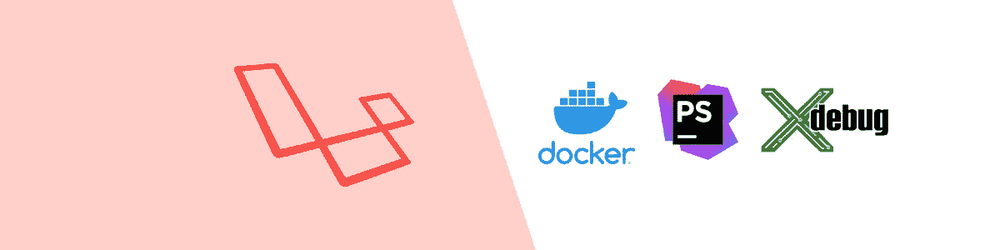

# 用 XDebug & PHPStorm 调试 Sail Laravel 8.0

> 原文：<https://medium.com/codex/laravel-8-0-sail-xdebug-phpstorm-5cc900e96da4?source=collection_archive---------0----------------------->

Laravel Sail 在帮助最关键的开发设置决策方面表现出色。它不止于此，如果你需要进一步定制它，你也可以！

# 帆

安装 sail 真是一件乐事，开箱后，您可以免费获得`docker-compose.yml`文件中最重要的部分。查看[官方指南](https://laravel.com/docs/8.x/sail)并向前跳过或…