# 在 5 分钟内在多边形网络上发射你自己的令牌。

> 原文：<https://medium.com/codex/launch-your-own-token-on-polygon-network-in-30-mins-fdae4671a52e?source=collection_archive---------14----------------------->

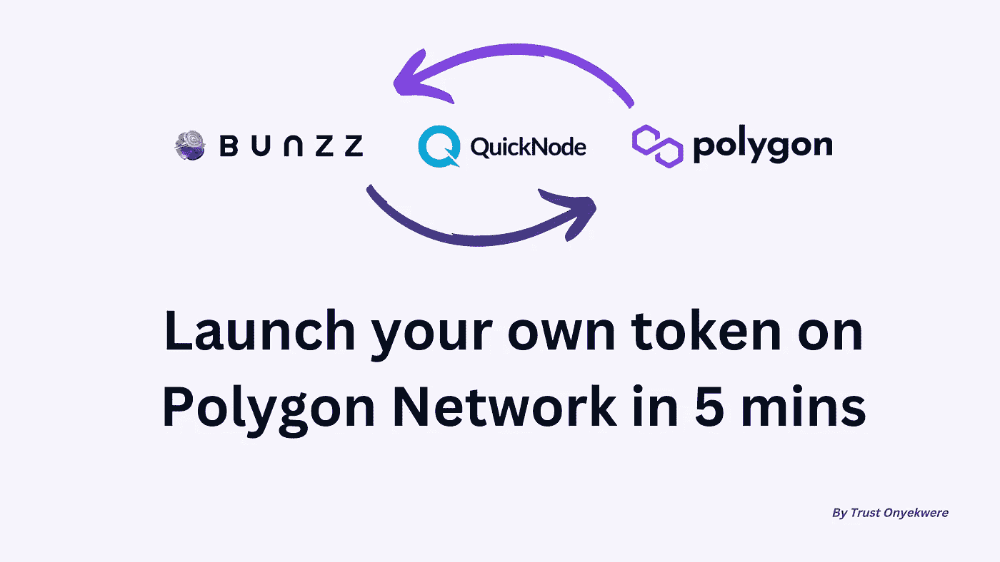

在本指南中，我们将学习使用 [Bunzz](https://www.bunzz.dev/) 在 10 分钟内创建自己的令牌，这将是一个循序渐进的过程。

在我们开始之前，我们需要了解一些事情，我保证这不会是一个漫长，无聊的历史课讲座！

# 什么是多边形网络？

[多边形](http://polygon.technology)网络是以太坊的第二层链，旨在提高速度、降低费用和提高生产率。

# 为什么是多边形？

建立在多边形上可以减少超过 99%的交易费用，因此你可以用比以太坊更低的成本部署你的令牌。

多边形也非常快，所以现在您的用户可以使用您的令牌更快更便宜地交易！

现在让我们准备好推出代币，谁知道你的代币会不会是下一个柴犬(SHIB)。…

# 使用 Bunzz 在多边形网络上创建令牌的先决条件

*   Bunzz 控制台——创建和部署我们的令牌和智能合约，而无需编写 solidity 代码
*   [元遮罩](https://metamask.io/)——与多边形网络交互
*   [快速节点](https://www.quicknode.com/?utm_source=partner&utm_campaign=metaschool&utm_content=metaschool-guides&utm_medium=partner)——与多边形测试网(也称为多边形孟买)交互
*   一些自动代币——我们可以从水龙头里拿到

让我们开始吧。

# 用多边形测试网节点设置 QuickNode

什么是 QuickNode？QuickNode 是一个平台，它可以帮助您访问区块链环境，而没有托管自己的节点的麻烦，从而节省时间和资源。

它让您只需点击几下鼠标即可访问区块链节点，并且您可以根据需要扩展节点性能，从而为您创建一个扩展 DApp 的环境。

*   登录/注册您的 [**QuickNode**](https://www.quicknode.com/?utm_source=partner&utm_campaign=metaschool&utm_content=metaschool-guides&utm_medium=partner) 账户
*   点击创建一个 **QuickNode** 端点

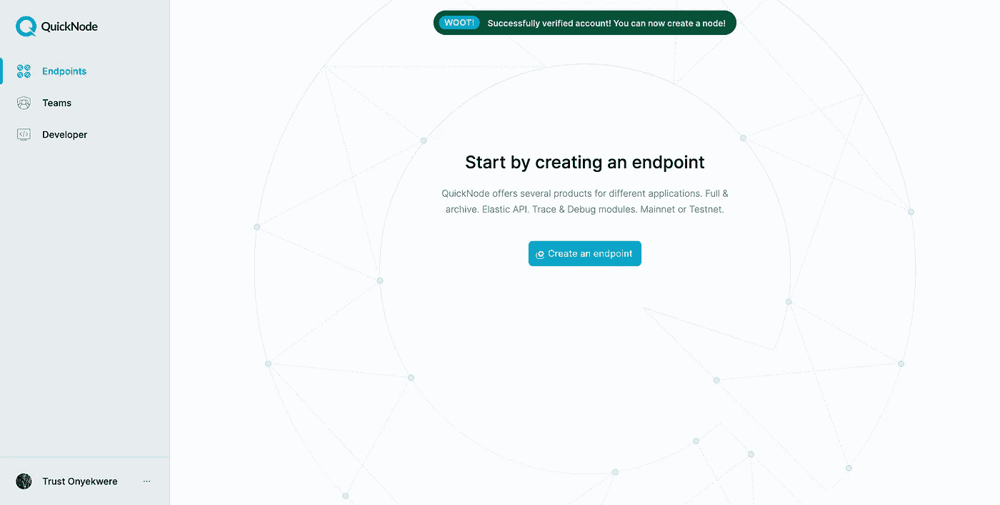

*   现在选择多边形作为网络，孟买测试网作为链，并继续
*   我们不需要任何附加组件，所以现在单击**创建端点**

一旦您创建了端点，您就可以开始使用 QuickNode 设置我们的元掩码钱包了。

*   进入元掩码钱包，点击网络列表
*   下拉列表将显示网络列表，但您需要点击列表底部的*添加网络*
*   现在，您需要填写一张表格，以便向您的元掩码帐户添加一个新网络

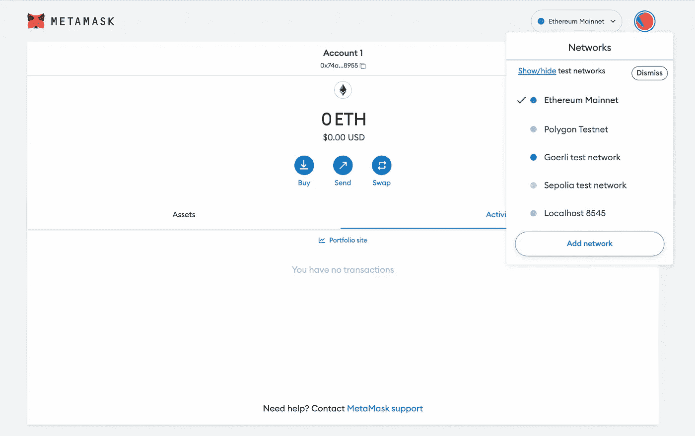

*   返回到 QuickNode 端点仪表板，并复制 HTTPS 提供者链接。

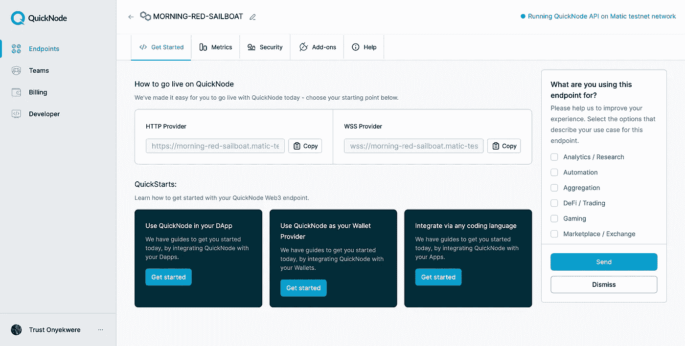

现在让我们回到元掩码添加网络表单，并粘贴:

*   HTTPS 在**新的 RPC URL** 字段中用 80001 作为**链 ID**
*   “MATIC”作为**的货币符号**
*   多边形 Testnet 作为**网络名(任何你喜欢的名字)**并且，
*   最后，[https://mumbai.polygonscan.com/](https://mumbai.polygonscan.com/)是**阻止浏览器的网址**
*   完成了吗？点击**保存**

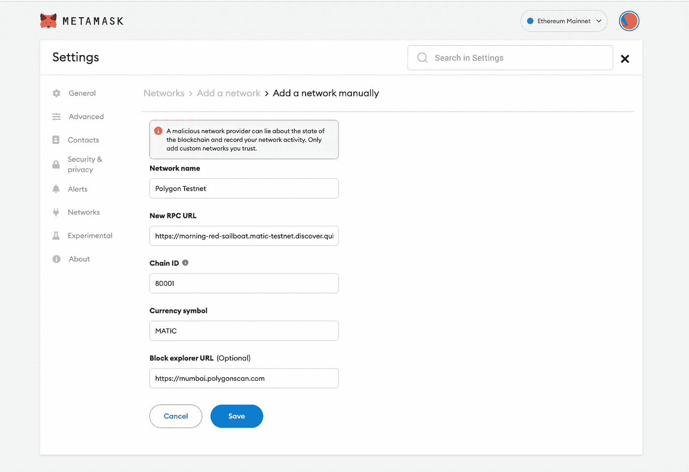

我们已经完成了令牌的元掩码设置，现在您已经创建了多边形元掩码地址。我们去买一个免费的自动代币来支付交易费吧。

# 让我们得到一些免费的 MATIC

既然我们在 Testnet 上，我们可以去水龙头那里得到免费的 MATIC。

*   转到[https://faucet.polygon.technology/](https://faucet.polygon.technology/)
*   选择 **Mumbai** 作为网络， **MATIC** 作为令牌，然后粘贴你的元掩码多边形地址。点击**提交**并确认交易

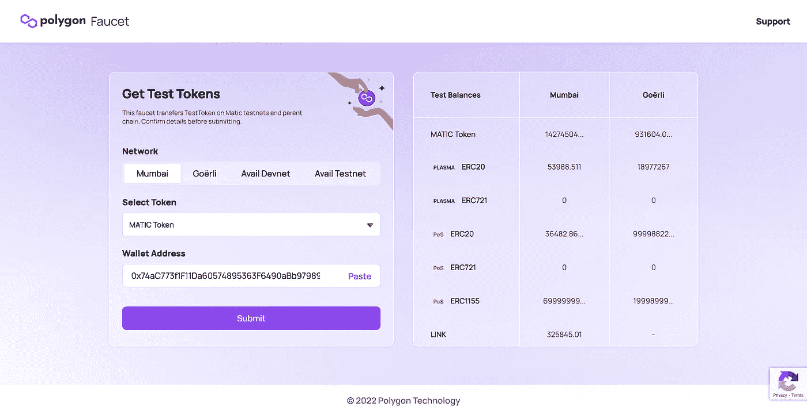

现在你的账户里会有一些自动代币来支付交易费用。

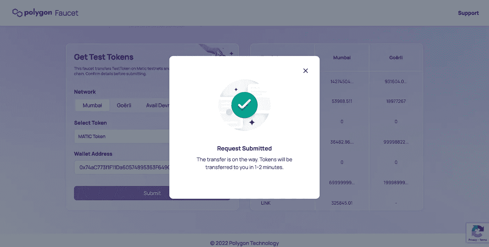

我们刚刚完成了部署所需的所有设置。

接下来，您将在 5 分钟内创建自己的 ERC-20 令牌合约，而无需编写 solidity 代码！不开玩笑。

# Polygon Testnet 上的部署和令牌启动

如果您是该平台的新用户，请访问 [Bunzz](https://www.bunzz.dev/) 并登录或注册。

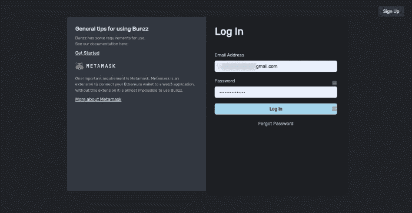

一旦您登录，您将可以访问 Bunzz 仪表板，在这里所有的神奇的事情都会发生。

*   连接您的 Metamask 钱包，然后
*   点击“创建 DApp”

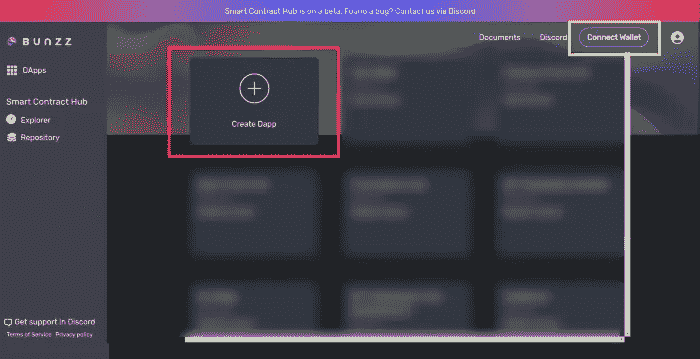

*   给你的 DApp 一个名字。

你可以用任何名字。我用*奶* *令牌*换我的。

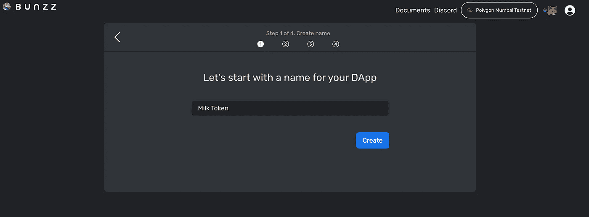

接下来，为 DApp 选择一个区块链网络。滚动下拉菜单中的选项，选择*多边形孟买测试网*。

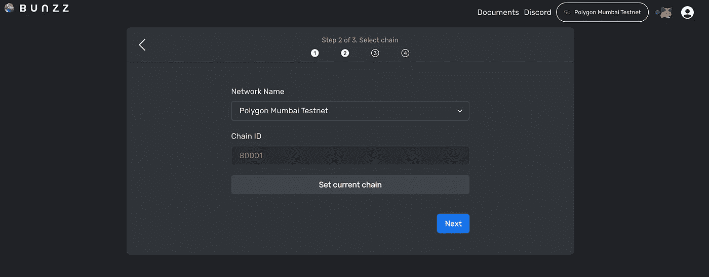

接下来是从许多可用的已经制作好的智能合同模板中选择一个模板。

*   选择简单的 ERC20 令牌。

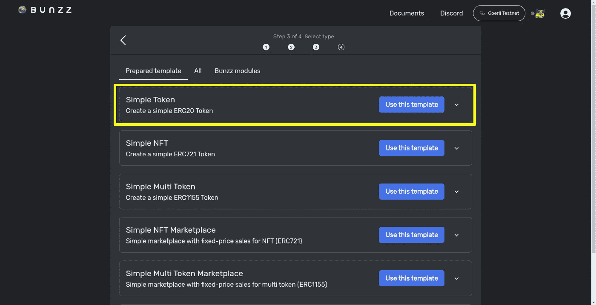

*   通过添加名称和符号来自定义令牌。

我将我的*牛奶令牌*和 *MTK* 命名为标志。

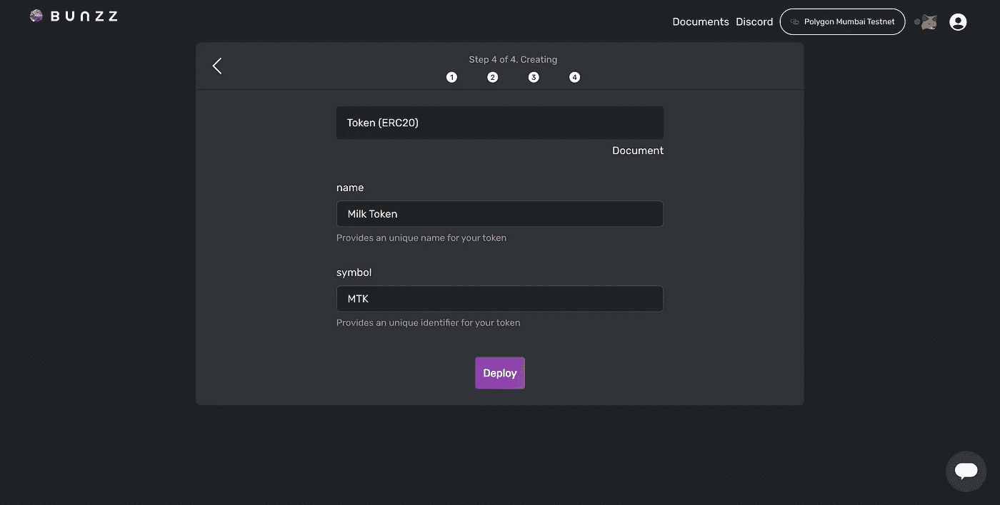

一旦您完成了定制，

*   单击 deploy 并等待它同步，方法是批准将通过 Metamask 弹出的三个事务。

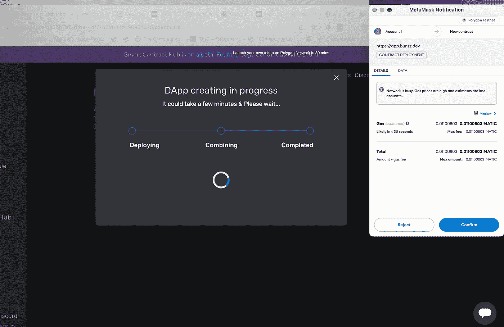

万岁！

你已经做到了。您已经为我们的新令牌成功部署了 ERC20 智能合约。

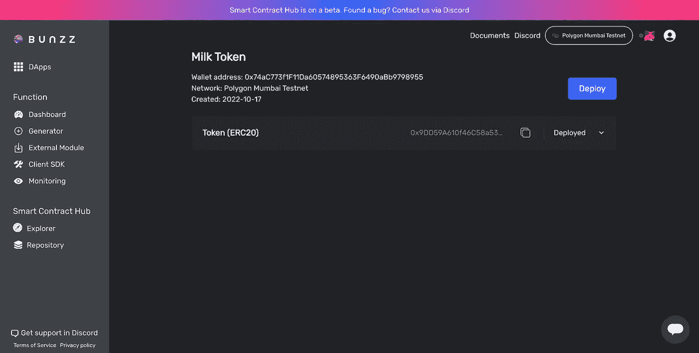

现在，继续检查[多边形令牌跟踪器](https://mumbai.polygonscan.com/tokens)并确认新令牌是否真的在多边形链上。

*   使用仪表板上的*复制*图标复制令牌地址。


*   将令牌地址粘贴在多边形扫描仪上，并点击*查找*按钮。

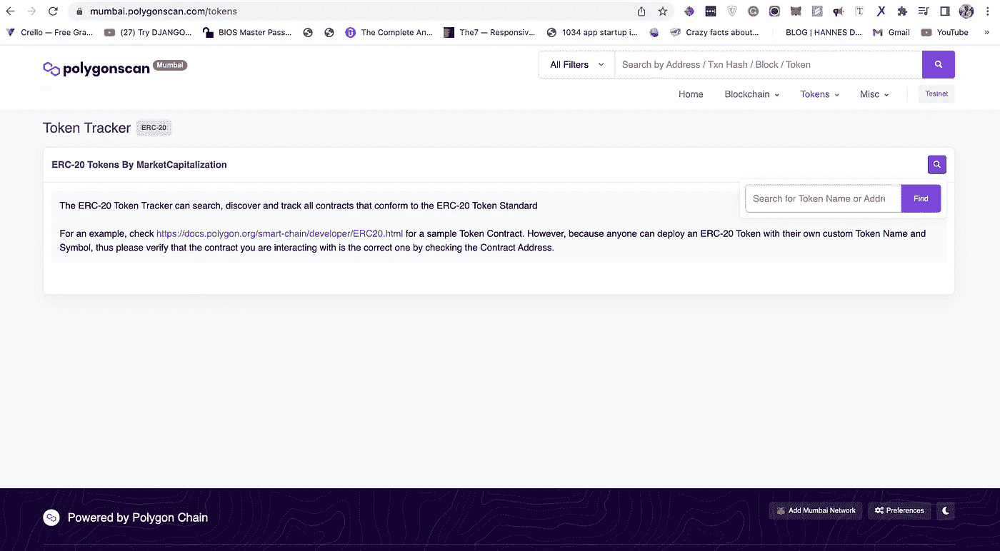

太好了！

您可以看到我们在多边形链上创建的令牌名称和符号。

恭喜您的令牌已创建！

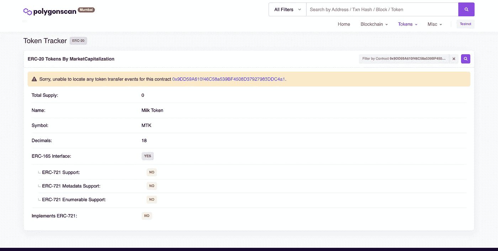

# 结论

如果您决定制作一个真正使用的令牌，请确保仅将本指南作为一个起点。这是一个需要很长时间才能完全理解的深刻话题。

除了创建令牌，您还需要考虑在发布后使其成功，并研究其他项目及其发布，以了解哪些项目运行良好，哪些项目运行不良，这有助于创建您自己的令牌。

```
**Want to Connect?**If you follow these steps and got stuck, or if you have any questions, feel free to reach out on [Discord](http://discord.gg/wCFUV6rNd7) or send a DM on [Twitter](https://twitter.com/iamtjah).
```