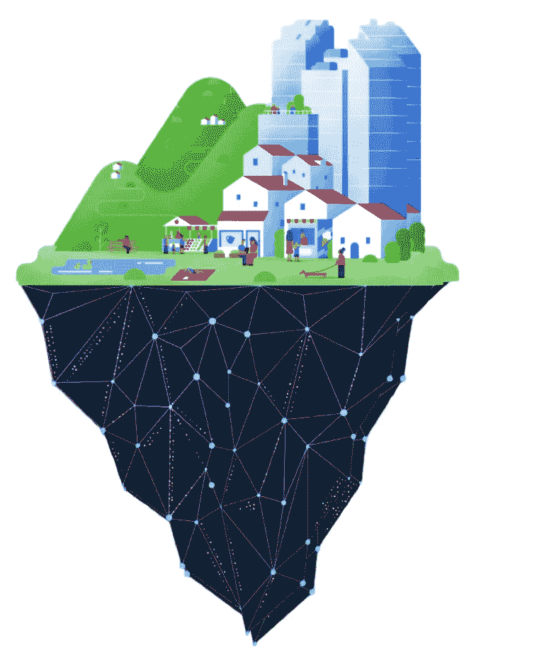

# 分层思维

> 原文：<https://medium.com/codex/layered-thinking-803d2a23cf48?source=collection_archive---------15----------------------->

## 科技如何帮助我们看到社会现实的新层面

流行说“政治是文化的下游”之类的话。但这到底意味着什么呢？

首先，这通常意味着我们所得到的政治制度的好坏取决于它们所产生的文化。想想即将到来的技术官僚体系: