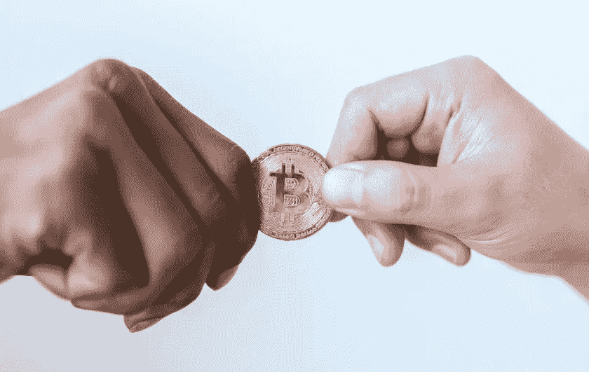

# 区块链和去中心化金融

> 原文：<https://medium.com/codex/laymans-cryptocurrencies-and-defi-staking-446c572bf4c4?source=collection_archive---------2----------------------->

## 金融和技术

## 区块链、加密货币、DeFi 和 DeFi Staking 前言

总的来说，随着加密货币、区块链、NFTs 和整个加密空间成为最新的炒作，人们认为了解其中一些意味着什么以及如何工作可能是有用的。

戴维·麦克比的照片

一般来说，区块链是你进行交易的 T2 网络。在你汇款的地方，你将会发送加密货币，而不是发送美元或任何其他*法定*货币。

在提到 DeFi 和 DeFi staking 之前，让我们先了解一些 *crypto* 。

# 加密货币

简单来说，它是一种在去中心化的系统上验证和维护交易的数字货币。

要称某种东西为加密货币，首先必须满足一些标准。

## **是什么让一种货币成为加密货币**

1.这是一个*数字资产*2。交易在*分散的* *系统*
3 上进行验证和维护。它决不能依靠一个*集权的* *权威的*
4。*密码学-* 担保交易
5。它有一个*限量供应*

*最后一种可能不是对所有人都通用的，因为有些货币并没有限量供应，但这些都是基于一些更高级的条款。*

关于有限供应本身——加密货币严重依赖数学，通过数学，有限供应成为可能。这实际上使得黄金变得稀缺，不像法定货币。

> 法定货币是由官方决定的货币。也不代表黄金等其他资产或金融工具。
> 
> 美元和欧元都是法定货币。

# 区块链

> 在对等网络上分散、存储和维护交易记录的系统。

区块链是一个网络，它由相互连接的对等体组成，管理所有交易。

其中最重要的部分是，区块链，网络和所有的同行，存储数字信息，交易，分发它们，不允许编辑这些信息。

这是通过让所有对等方跟踪所有交易来实现的。

如果你，一个单独的对等体，试图编辑一个旧的事务(即 Joe 给你发了 10 美元，但是你把它改成了 10.000 美元)，网络会拒绝这个编辑，因为网络不会信任你的*单对等信息*。

这就是为什么分散式网络也被称为*【无信任】*的原因，意思是没有一个单一的权威机构是可信的，而是整个网络。

# 分散金融

照片由[罗德尼制片公司](https://www.pexels.com/@rodnae-prod/)拍摄

DeFi 是去中心化金融的缩写，它只是金融，但在区块链上。它是一种基于分布式网络和加密货币**T3 的工具，最重要的部分是，它是一种不依赖于中央机构或中介的技术。**

> *有了 DeFi Finance，就不需要经纪公司、交易所和银行。*

如果说金融是管理货币和资金的科学，那么区块链的 DeFi 也是一样。

# 分散金融赌注

分散金融赌注，是 DeFi 的产物，连同加密货币和区块链。

在最纯粹的形式下，它锁定了一定数量的资金。特定时期的加密货币。这相当于把你的法定货币锁在你银行的储蓄账户里。

最大的区别在于，把钱存在银行的个人损失了很多利息。传统金融的其他选择是高收益储蓄账户、货币市场基金、债券等。但是传统的方法在很大程度上依赖于中央集权。

有了 DeFi staking，通过锁定你的密码，你就成了网络中的验证者——或者更好地说，你成了*证据*的一部分。

许多区块链都基于利益相关证明，简单来说，就是所有的交易都在对等网络中得到验证

照片由 [Pixabay](https://www.pexels.com/@pixabay/) 拍摄

## **这实际上是如何工作的**

股权证明网络过于复杂，无法用几段话来解释，但本质上，它是在赌你的加密货币*以验证其他交易*。

通过对您的加密进行赌注，您将生成一个事务，该事务又将与其他事务形成一个块。一旦一个事务块完成，它就会被验证。

这也是为什么你的赌注越大，你越感兴趣的原因。积木更容易完成。

通过标桩，个人可以帮助验证网络，并以这种方式改善网络。因此获得了更多的加密货币奖励。

除了网络本身，没有人会给予奖励，没有中央集权。

作为区块链实际实现的数学算法决定了这一点。

把钱锁在银行里，你可能会得到传统的利益，但这远远比不上赌博。

为了简单地说明区别——想象把钱放在一个集中的权威机构。银行。你赚的利息很少，而中央政府通过把它借给别人赚得更多。有了 DeFi staking，你现在就处于那个中央权威的角色中，和许多其他的同伴一起。

这个故事的目标是介绍加密货币、区块链和分散金融背后的基础知识，强调个人获得的好处。

感谢阅读！🎉