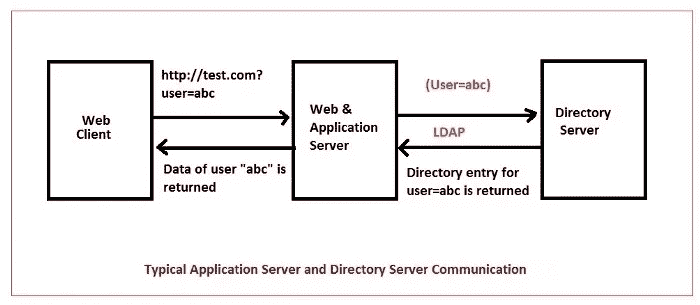
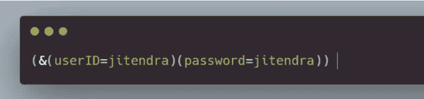
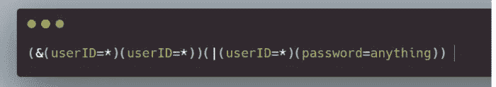
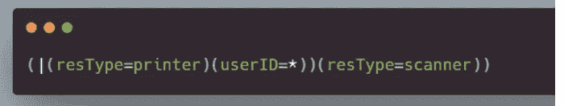
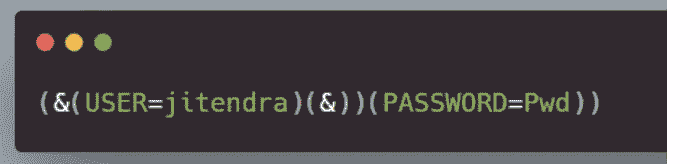
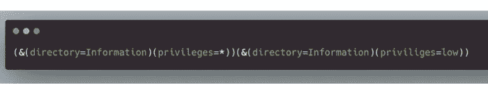

# LDAP 注入及其原因

> 原文：<https://medium.com/codex/ldap-injection-and-why-it-occurs-1cb4cd666781?source=collection_archive---------7----------------------->

[自由股票](https://unsplash.com/@freestocks?utm_source=unsplash&utm_medium=referral&utm_content=creditCopyText)上[下](https://unsplash.com/@freestocks?utm_source=unsplash&utm_medium=referral&utm_content=creditCopyText)

**什么是 LDAP 注射？**

LDAP 是一种开放的跨平台协议，它基于 TCP/IP 协议和其他服务。它存储数据和信息，如用户名、密码和许多不同类型的信息。它有助于存储和管理组织的信息，并提供应用程序从目录服务发送和接收信息所需的通信语言。这是一种使应用程序能够快速有效地查询用户信息的协议。让我们用一个例子来更好地理解我们正在谈论的内容。

想象一下给一个新雇员发一封电子邮件，然后在一台新打印机上打印一份通信的副本，LDAP 目录服务系统使这变得可行。因为它是一个相当轻量级的协议，所以不会消耗很多系统资源。

**为什么它被视为严重漏洞？**

攻击者可以在 LDAP 查询中注入恶意代码，以获得对信息的未授权访问，这可能导致信息泄露、数据操纵或盗窃。当 web 应用程序不清理用户提供的输入时，攻击者可以构造一个 LDAP 查询，并将其注入到输入字段中，如果执行命令，该输入字段将作为相同的组件运行。如果应用程序在管理员的许可下运行，LDAP 注入会导致严重的安全风险。如果应用程序一直以此权限运行，这些查询可以更改和删除 LDAP 树中的任何内容。许多企业的日常运营都依赖于 LDAP 服务，成功的 LDAP 注入攻击可以产生重要信息，并可用于对系统和应用程序发起更多攻击。

[来源](https://compsecurityconcepts.wordpress.com/tag/ldap-injection/)

基本上，LDAP 注入有两种方法。

可以通过 LDAP 利用的不同问题

**认证旁路**

用户认证和授权通常使用目录服务来执行；因此，最基本的 LDAP 注入攻击试图绕过身份验证和授权。例如，下面的查询使用提供的用户名和密码执行身份验证。

如果一个非恶意用户输入他们的用户名和密码，查询将如下所示。如果用户名和密码都有效，身份验证将会成功。

如果该查询的结果为真，则目录中存在所讨论的用户和密码组合，并且该用户已登录。以下是攻击者如何使用 LDAP 过滤器代码作为用户 ID 来创建始终为真的过滤器的示例:例如:

这可能允许攻击者访问系统，即使用户名或密码不是真实的。

**信息披露**

攻击者可以将 LDAP 过滤器代码注入到易受攻击的应用程序中，该应用程序使用 LDAP 过滤器来提供共享资源，如打印机、扫描仪或其他资源，如 IP 电话。在这种情况下，如果应用程序易受攻击，攻击者可以列出组织目录中的所有资源。考虑下面的筛选器，它应该列出打印机和扫描仪，但它是以一种危险的方式构建的:

或者，假设攻击者知道 userID 用于目录中的用户名，并且他们可以注入另一个值来代替打印机。在这种情况下，他们可能会注入以下代码:

这将列出所有打印机和用户对象，服务器将忽略扫描仪部分(仅处理第一个完整的过滤器)。

**门禁旁路**

每个登录页面上都有两个输入字段。其中有两个:一个用于用户名，一个用于密码。用户有两个输入:用户(Uname)和密码(Pwd)。用户/密码对由客户端提供。为了验证这一对是否存在，LDAP 创建搜索标准，并将它们发送到 LDAP 服务器进行验证。

攻击者可以输入有效的用户名(如 Jitendra ),同时在用户名后面插入适当的序列。在这种技术中，他们可以成功地绕过密码检查。如果您知道所指的用户名，任何字符串都可以用作 Pwd 值。发生这种情况时，以下查询将被发送到 LDAP 服务器:

LDAP 服务器只处理第一个过滤器。该查询只处理(&(USER=jitendra)(&)查询。因为这个查询总是正确的，所以攻击者在没有正确密码的情况下进入系统。

**特权提升**

一些查询返回启用了低安全级别的用户可见的所有文档的列表。例如,/Information/Reports、/Information/coming projects 等目录就包含这样的文件。“信息”部分包含用户为第一个参数输入的信息。所有这些文档都被归类为具有“低”安全级别。第二个参数的值由名称的“低”部分表示。这也使得黑客能够访问高安全级别的信息。黑客需要类似这样的注入来实现他的目标:

这种注入导致该过滤器:

如果您一直在关注，您可能知道 LDAP 服务器处理第一个过滤器。不考虑第二个过滤器。处理的查询是(&(directory = Information)(privileges = *))。所处理的查询不考虑(&(directory = Information)(privileges = low))指令。这就是黑客如何看到通常只有拥有最高安全权限的用户才能访问的文档列表。即使黑客无法访问这些信息，他或她也在试图获得这些信息。

**信息披露**

一些资源管理器让用户确切地知道系统中哪个资源是可用的。比如一个专门卖服装的网站。用户可以寻找特定的衬衫或裤子，并查看它们是否有售。在这种情况下，或者使用 LDAP 注入:

Resource1 和 Resource2 都显示系统中不同类型的可用资源的信息。系统中所有可供购买的裤子和运动服都通过资源 Resource1 =裤子和 Resource2 =运动服显示。黑客如何利用这一点？通过将(uid=*)插入 Resource1=Jeans，我们可以有所作为。然后，将以下查询提交给服务器:

然后，LDAP 服务器显示所有的牛仔裤和用户对象。

**结论:**

然而，尽管 LDAP 目录服务协议是一个开源协议，但是如果没有正确实现，它会导致各种问题，例如绕过身份验证、信息泄露和其他问题。因此，正确实现 LDAP 协议至关重要；否则，公司的重要信息可能会泄露。