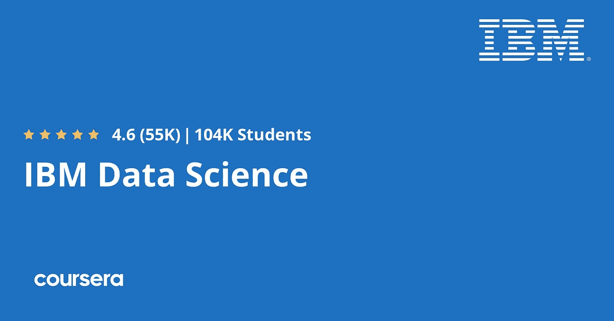

# 2022 年 Ace 领先的数据科学认证

> 原文：<https://medium.com/codex/leading-data-science-certifications-to-ace-in-2022-are-they-really-worth-your-efforts-9e12ee308927?source=collection_archive---------15----------------------->

## 他们真的值得你付出努力吗？

D 数据科学是关于数据集的检索和分析的研究，旨在识别隐藏在未处理数据(定义为原始数据)中的信息和对应关系。它是一门结合编程技巧、数学和统计知识，从数据中提取有意义信息的科学。它包括将**机器学习算法**应用于数字、文本数据、图像、视频和音频内容。

数据科学回答了关于客户行为对公司业务成果的影响的问题。随着数据成为公司决策的关键角色，以正确的方式推动业务发展，应用**数据科学技能**以充分利用当今公司拥有的海量数据变得势在必行。消费者转向在线门户网站以满足他们的日常购物和其他需求，由此产生的大量在线数据成为他们未来努力的决定性因素。

现在有许多**数据科学认证**，在线和现场都有。招聘人员对你的技能感兴趣，并会特别关注你在所需职位上获得了哪些认证。他们清楚地了解一名 [**认证数据科学专家**](https://www.usdsi.org/data-science-certifications) 给企业带来的价值。然而，你们中的许多人仍然进退两难，思考这些证书是否有价值？让我们了解这些数据科学认证如何影响您的求职。

[**数据科学认证**](https://www.usdsi.org/data-science-certifications) 的目的是为你提供超越业内其他专业人士的优势。你将学到复杂的技能，这些技能在你的市场上很难找到，你也将验证你目前拥有的技能。这些认证还表明您拥有管理和评估他们的数据以实现业务增长和繁荣所需的所有专业知识。

# 在考虑选择最佳数据科学认证时，您必须谨记以下几点:

👉*程序内容*

👉*项目成本*

👉*参加认证所需的先决条件或资格*

👉*往届学生的评论*

# **2022 年最佳数据科学认证:**

# ***1。*** ***IBM 数据科学认证(Coursera)***

本课程旨在帮助初学者了解数据科学的基本概念、数据科学家的角色和职责，以及您使用数据科学工具的流利程度，并提供构建、测试和培训数据模型的方法。这是一门负担得起的自定进度课程，没有先决条件，但需要 11 个月才能完成。

👉**网址:**[https://www . coursera . org/professional-certificates/IBM-data-science](https://www.coursera.org/professional-certificates/ibm-data-science)

# **2。** ***美国数据科学研究所**(USDSI):CDSP、CLDS、CSDS***

来自 USDSI 的全球知名 [**数据科学认证项目在认证的核心价值方面拥有更高的地位和深度，使其成为全球行业内**最佳数据科学认证**。他们提供三种不同的认证，可在线访问，并且只需很少的费用，就其为您的数据科学产品组合带来的质量而言，物有所值。**](https://www.usdsi.org/data-science-certifications)

这些项目在你所带来的专业水平上有所不同——从初学者(毕业生)到专业人士(提高技能)以及那些寻求职业转向数据科学的人。经过领先的行业专家和带有可共享数字徽章的自定进度计划的审查，是什么使得来自 **USDSI** 的认证与众不同。这些无疑是一种简单易行的方法，可以使梦想 [**数据科学专业**](https://www.usdsi.org/data-science-certifications/certified-data-science-professional) 的角色更接近现实。

👉**网址:**[https://www.usdsi.org/data-science-certifications](https://www.usdsi.org/data-science-certifications)

👉**立即注册并创建账户:**[https://www.usdsi.org/account/create-account](https://www.usdsi.org/account/create-account)

# **3。** ***数据科学课程:完整数据科学训练营(Udemy)***

Udemy 提供的数据科学计划是一个完整的工具箱，用于学习 Python 编码，解决现实生活中的业务案例，问答支持和社区可用性。

👉**网址:**[https://www . udemy . com/course/the-data-science-course-complete-data-science-boot camp/](https://www.udemy.com/course/the-data-science-course-complete-data-science-bootcamp/)

# ***4。*** ***数据科学家纳米学位由 Udacity***

考虑转行到数据科学的人可以查阅 Udacity 的这些纳米学位，它要求你熟悉一些数据科学概念和主题。它提供了全面的培训和实时案例研究，但成本较高，最终导致它被搁置。

👉**网址:**[https://www.udacity.com/course/data-scientist-nanodegree-nd 025](https://www.udacity.com/course/data-scientist-nanodegree--nd025)

*为了打造一个引人注目的产品组合，展示您开发强大数据科学项目的才能、经验和资质，投资一个有价值的数据科学认证是必不可少的。从长远来看，朝着可信的数据科学认证迈出正确的一步肯定会成为决定您数据科学职业生涯成败的决定。那么，为什么不从今天的* ***最佳数据科学认证*** *开始，让你的职业生涯飞黄腾达呢？*