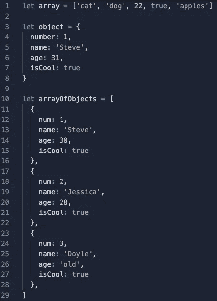

# 使用 for 循环了解 JavaScript 中 iterate 和 enumerate 之间的区别。

> 原文：<https://medium.com/codex/learn-about-the-difference-between-iterate-and-enumerate-in-javascript-using-for-loops-40a42dec576f?source=collection_archive---------1----------------------->


线圈的金属结构。图片来源:Unsplash

今天是我开始软件工程训练营的第三周。我遇到的第一个场景是使用数组和对象，并且在试图访问这些数据结构中的信息时感到沮丧。

一旦我完全理解了什么是*可迭代*和什么是*可枚举*之间的区别，我在处理复杂的数据结构时变得更加自信。我想写这篇博文来进一步巩固我对这个话题的理解，也希望有一天能帮助另一个软件工程学生理解其中的区别。

> 首先，这些术语的官方定义是什么？韦氏词典给出了这些定义:
> 
> **重复**:反复说或做
> 或反复**列举**:确定**或**的数量，依次指定

我从这些定义中得到的是，迭代不像枚举那样详细或具体。当我们迭代时，我们是在重复某件事，而不关心那件事到底是什么。当我们列举时，我们着眼于每一件事，并收集有关它的信息。想象一个装满狗玩具的玩具箱。如果我们打开盖子，试着在不接触的情况下数每一个玩具，我们就在迭代。如果我们把每个玩具拿出来数一数，我们就是在计数。枚举也给了我们一个机会来观察每个玩具，并确定每个玩具有什么属性，例如它有吱吱叫的玩具吗？


我的狗奥利维亚和她所有的玩具！#被宠坏了

这对 JavaScript 意味着什么？我们知道对象是一个键:数据的值对和数组是数据的集合。这些数据可以是字符串、数字、布尔值，我们甚至可以有一个对象数组！回到迭代和枚举的工作定义，我认为对象是比数组更具体的数据结构。对于一个对象，我们有一个可以引用的键:值对(这里我们给键一个变量名)。而数组是一种更简单的数据结构，我们通过它们的索引来访问。

> 虽然从技术上来说……数组实际上是一个对象，其中**键是索引，值是我们在数组中看到的内容。**您将在下面看到这一点。

让我们深入研究一些使用 JavaScript 循环 for…in 和 for…of 的例子。这些循环允许我们迭代或枚举数据集合。

> for…in 循环用于枚举。我们可以在对象和数组上使用它。
> 
> for…of 循环用于迭代。我们只能在数组上使用它。

想想我们的玩具盒类比。如果我想检查每个玩具，我需要进入玩具箱。如果我只是想看玩具，我就打开盒子，检查盒子里的玩具。

我们不能对一个对象进行迭代，因为我们需要更仔细地查看该对象以了解其属性，我们不能通过打开玩具箱并浏览玩具来做到这一点。让我们深入研究一些使用 JavaScript 的真实编码示例。



一个数组、一个对象和一个对象数组

这里我们有一个包含各种数据类型(字符串、布尔值和数字)集合的数组，一个包含一些键:值对的对象，以及一个对象数组。让我们看看这些数据结构在不同的 for 循环中会发生什么！

```
for (const item of array) { 
 console.log(item) 
} 
// LOGGED: ‘cat’ 
// LOGGED: ‘dog’ 
// LOGGED: 22 
// LOGGED: true 
// LOGGED: ‘applesfor (const item in array) { 
 console.log(item) 
} 
// LOGGED: 0 
// LOGGED: 1 
// LOGGED: 2 
// LOGGED: 3 
// LOGGED: 4
```

当我们迭代数组时，我们得到数组的值。当我们枚举数组时，我们得到每个值的索引。让我们看看我们的对象发生了什么！

```
for (const item of object) { 
 console.log(item) 
} 
// LOGGED: TypeError: object is not iterablefor (const item in object) { 
 console.log(item) 
} 
// LOGGED: number 
// LOGGED: name 
// LOGGED: age 
// LOGGED: isCool
```

当我们迭代对象时，我们得到一个错误，说“对象是不可迭代的”，这是有意义的！当我们枚举对象时，我们得到的是键，而不是值。有意思……所以我们花了足够长的时间来观察这个物品，看看它有什么属性，但是还没好到可以确定这些属性的价值。用我们的玩具箱类比，我们看到每个玩具都有一个吱吱叫的玩具，但不是它有多少个吱吱叫的玩具。

为了做到这一点，我们使用了一个名为 Object.values()的特殊方法，该方法将返回在()中传递的任何值的数组。我们还可以使用 Object.keys()获取键，使用 Object.entries()获取键和值。

```
Object.values(object) 
//=> [1, ‘Steve’, 31, true]Object.keys(object) 
//=> [‘number’, ‘name’, ‘age’, ‘isCool’]Object.entries(object) 
//=> [ 
      [‘number’, 1], 
      [‘name’, ‘Steve], 
      [‘age’, 31], 
      [‘isCool’, true] 
     ]
```

这允许我们获取一个对象，并把它转换成一个数组，然后我们可以迭代它。需要注意的是，Object.entries()返回一个嵌套数组，用逗号分隔 key: value 对，**不是**冒号。

我们的一系列目标呢？当我们在上面使用 for 循环时会发生什么？

```
for (const item of arrayOfObjects) { 
 console.log(item) 
} 
// LOGGED: { num: 1, name: ‘Steve’, age: 30, isCool: true } 
// LOGGED: { num: 2, name: ‘Jessica’, age: 28, isCool: true } 
// LOGGED: { num: 3, name: ‘Doyle’, age: ‘old’, isCool: true }for (const item in arrayOfObjects) { 
 console.log(item) 
} 
// LOGGED: 0 
// LOGGED: 1 
// LOGGED: 2
```

当我们有一个数组，其中每个数组的值是一个对象，我们实际上使用 for…of 来返回每个对象。当你分解它时，这是有意义的，但是当你看着它并问自己“我如何能得到那些对象…我必须需要枚举”时，你可能会感到困惑，因为你实际上需要迭代，因为对象是嵌套在一个数组中的。当我们使用 for…in 时，我们只是得到数组中每一项的索引。

希望现在你对如何以及何时使用*迭代*和*枚举*有了更深的理解，这将导致编程时更少的*挫折*！