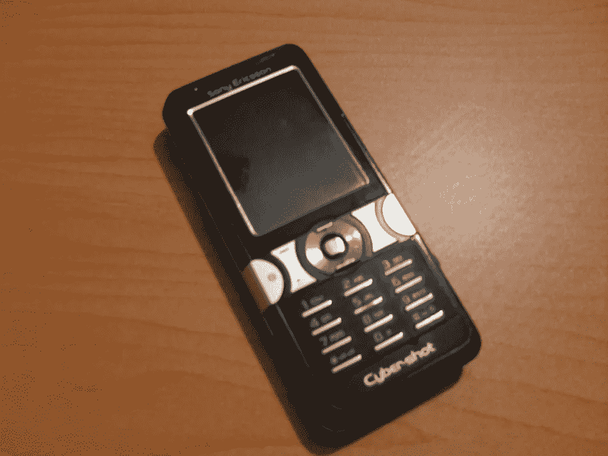
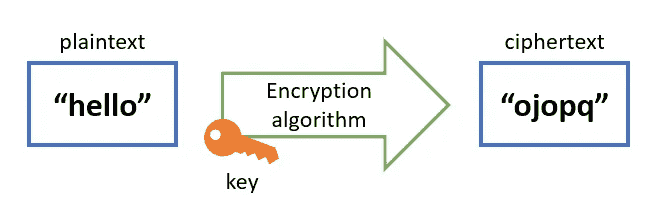
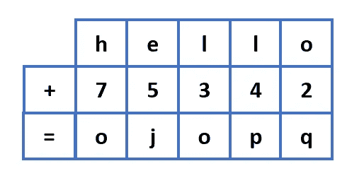
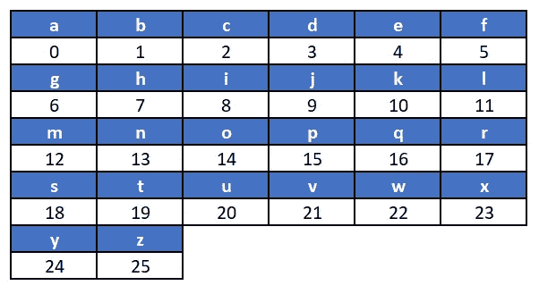
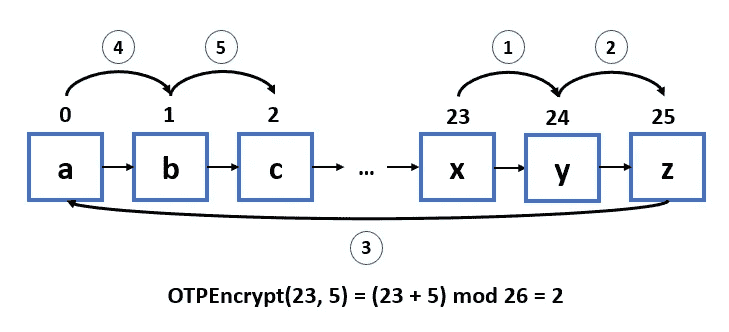
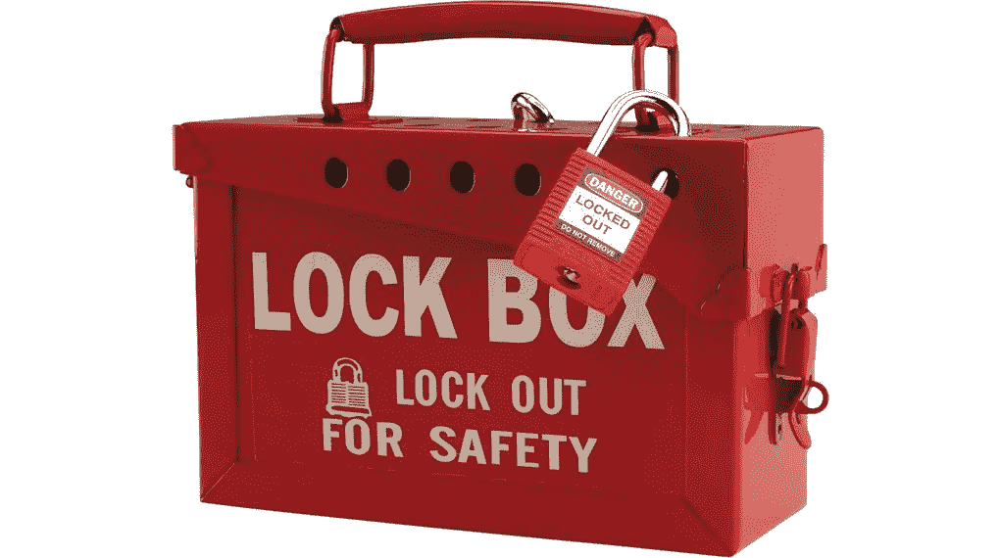
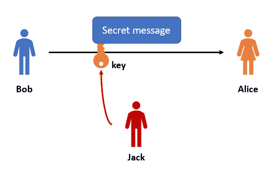
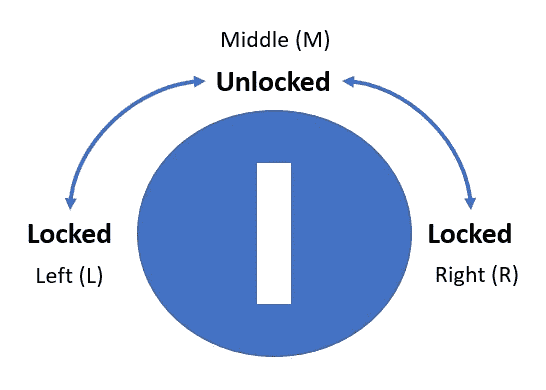
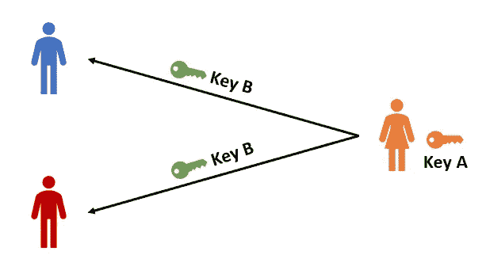
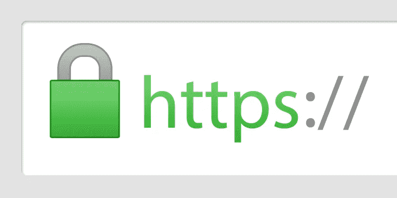

# 学习加密发送秘密情书

> 原文：<https://medium.com/codex/learn-encryption-to-send-secret-love-letters-b5b2c31fe703?source=collection_archive---------3----------------------->

## 一次一密加密、对称加密和公开密钥加密简介


王思然·哈德森在 Unsplash 上的照片

我不知道你，但我从小到大没有智能手机(天哪，我老了)。

我甚至没有电话。我不得不用我妈妈的旧索尼爱立信手机给我的暗恋对象发送秘密的爱情信息。这是所有的乐趣和游戏，直到我不得不通过删除 200 多条短信来销毁证据。



还是比 iPhone 好

短信很棒，但我更喜欢老式的方法，用 ***情书*** *。啊，写一封真诚的信来赢得一位年轻女士的芳心是多么浪漫啊。*

但是，情书有一个问题。你看，我是一个非常害羞的人。我没有勇气亲自给我喜欢的人写情书。我不得不依靠我的(不可靠的)朋友来这样做，但我不能相信他们不会破坏这封信！

可悲的是，我当时没有解决方案，但我现在有了，它叫做 ***加密*** 。

# 什么是加密？

简单来说，加密是一种将数据*打乱*成看似*随机表示*的方式，只有授权方才能理解。

从形式上来说，加密是将**明文**转化为**密文**。这种转换通过使用**密钥**的**加密算法**来完成。



明文+密钥=密文

加密算法是一个**数学公式**，它将数据转换成看起来随机的密文。通过*一系列明确的步骤*需要一个密钥来执行转换。

另一方面，密钥是一串字符，就像锁的**实际钥匙一样。谁拥有它，谁就有能力*锁定*(加密)*解锁*(解密)加密的数据。**

迷茫？我们用一个例子来演示一下。看上面的图像，你能猜出算法和密钥吗？

我上面使用的算法被称为**一次性密码**。这个密码*用另一个字母代替明文中的每个字母*，在字母表的某些位置。

例如，字母“h”向下移动 **7 个位置**到字母“o”，而字母“e”向下移动 **5 个位置**到“j”。用剩下的字母唱完经典的 ABCD 歌曲后，你会得到 ***75342*** ，这是这个特殊加密的关键。



OTP 密码

为了增加另一层安全性，OTP 密码的密钥可以被翻译成字母表中的字母。例如，使用下面所示的字母-字母表，键 75342 相当于***“HF dec”***。



字母到字母表

算法呢？我们知道 OTP 密码涉及移动和替换字母，但是我们可以使用*模加法*给它一个更正式的数学定义。

```
OTPEncrypt(x, n) = (x + n) mod 26 
```

其中`x`是 a → z 在 0 → 25 之间的整数表示，而`n`是任意正整数。模 26 用于将结果限制在 0 到 25 之间，这样任何超出范围的右移都将循环回到字母表的开始。



用密钥 5 加密“x”

现在，移动信件并称之为加密一点也不令人兴奋。实际上，加密算法远比 OTP 密码复杂，它的密钥更长，看起来也更随机。

好的加密必须生成一个人类无法识别的随机密文。同时，密文必须适当防范 [**蛮力攻击**](https://www.cloudflare.com/learning/bots/brute-force-attack/) ，这在足够的时间和计算资源下是可行的。

另一方面，我们如何解密密文呢？在 OTP 密码的情况下，我们可以简单地将加密算法改为*减去* `n` 。解密公式如下:

```
OTPDecrypt(x, n) = (x - n) mod 26
```

如果你知道密钥`n`，你可以很容易地将加密文本解密回明文！

在大多数情况下，加密算法是质量研究的产物，并且这种信息为公众所知。加密的真正秘密在于使用的密钥，因此你必须不惜一切代价保护你的密钥！

# 对称和非对称加密

在业界，广泛使用的加密有两种:**对称**和**非对称**加密。

## 对称加密

在对称加密中，*相同的密钥*用于加密和解密。上面我用 OTP 密码进行的演示是对称加密的一个例子。

打个比方，把对称加密想象成一个典型的盒子，可以一键上锁和解锁。发送者可以用钥匙锁住盒子里的秘密物品，接收者需要同样的钥匙才能打开盒子。



带锁的箱子

因为对称加密只依赖于一个密钥，所以您需要将您的密钥安全地传递给接收方进行解密。如果密钥在传递过程中被盗，加密的消息将会泄露！



对称加密的缺点

## 不对称加密

与对称加密不同，非对称加密使用两个密钥进行加密和解密:公钥**和私钥**分别为**和**。

用公钥加密的数据只能用私钥解密。同时，用私钥加密的数据只能用公钥解密。

对于第一次接触的人来说，这个概念似乎很陌生。为了简化它，让我给你提供一个改编自媒体作家 [Panayotis Vryonis](/@vrypan/explaining-public-key-cryptography-to-non-geeks-f0994b3c2d5) 的精彩解释的类比。

想象一个带有特殊锁的盒子，它有三种状态:**两种锁定状态**和**一种解锁状态**。两个锁定状态在左侧(L)和右侧(R)，而解锁状态在中间(M)。



有三种状态的特殊锁

这把锁需要两把不同的钥匙，我们将把它们命名为钥匙 A 和钥匙 b。

*   钥匙 A 从 R → M → L(逆时针)转动锁。
*   钥匙 B 从 L → M → R(顺时针)转动锁。

如果锁被钥匙 A 锁住(在 L 处)，只有钥匙 B 能打开它(向右转到 M)。

如果锁被钥匙 B 锁住(在 R 处)，只有钥匙 A 能打开它(左转到 M 处)。

现在，让我们想象一下，在电话出现之前，爱丽丝是学校里有名的女孩，她想与她的崇拜者建立一个可靠的沟通渠道。这个渠道需要满足两个标准:

1.  任何人都可以给她发送秘密消息，而**只有她**可以阅读消息内容。
2.  她可以向公众广播一条信息，她的崇拜者可以**绝对肯定地**确认这条信息是她发出的(而不是一个*爱丽丝冒充者*)。

她怎么能做到呢？*提示:它涉及带有特殊锁的盒子、钥匙 A 和钥匙 b*

首先，Alice 需要选择密钥 A 或密钥 B 作为她的*“私有”密钥*，即只有她有权访问该密钥。假设她选择了 a 调。

然后，她复制了许多钥匙 B，并把它们和盒子一起分发给她的崇拜者。这使得密钥 B 成为“公开的”，因为任何人都可以访问和复制它。



密钥 A 对 Alice 是私有的，而密钥 B 是公共的

任何希望与她私下交谈的人都可以将他们的消息放入盒子中，并用公钥 B 锁定它。记住，如果盒子被密钥 B 锁定，则只有密钥 A 可以打开它，即只有爱丽丝可以读取秘密消息！ ***满足第一条标准就这些！***

> 🔑只有私钥 A 可以打开由公钥 b 锁定的盒子。

第二个标准呢？她怎么防止有人冒充她？

嗯，爱丽丝可以把她的信息放在用她的私人钥匙 A 锁着的盒子里，然后分发它们。同样，回想一下，如果一个盒子被密钥 A 锁定，那么只有公钥 B 可以打开它。

因此，如果我想确保我收到的盒子来自 Alice 而不是冒名顶替者，我需要做的就是尝试用我的密钥 b 打开它。如果我能打开它，盒子必须用密钥 A 锁定，即它来自 Alice！如果我不能，这个盒子就是冒名顶替的。 ***第二个标准就这样定下来了！***

> 🔑只有公钥 B 可以打开由私钥 a 锁定的盒子。

这就结束了非对称加密的基本实现，也称为**公钥加密**。这种加密通常用于通过 HTTPS 在互联网上安全地传输数据。不对称加密的一个例子是 RSA 算法。



使用 HTTPS 安全浏览互联网

# 最后的想法

这涵盖了加密的基础知识！这篇文章的主要内容是，加密使用一种带有密钥的算法来扰乱数据，使它们变得无法识别。

对称加密只使用一个密钥来解密和加密数据，因此必须绝对保密。另一方面，非对称加密使用两个密钥，一个是私有的，而另一个可以与公众共享。

感谢您的阅读！和平✌️

# 参考

1.  [什么是加密？](https://www.cloudflare.com/learning/ssl/what-is-encryption/)乘云耀斑
2.  [什么是非对称加密？](https://www.cloudflare.com/learning/ssl/what-is-asymmetric-encryption/)乘云耀斑
3.  [维基百科上的一次性密码本](https://en.wikipedia.org/wiki/One-time_pad)