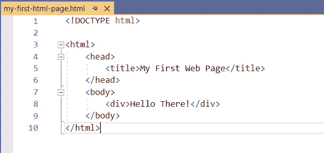
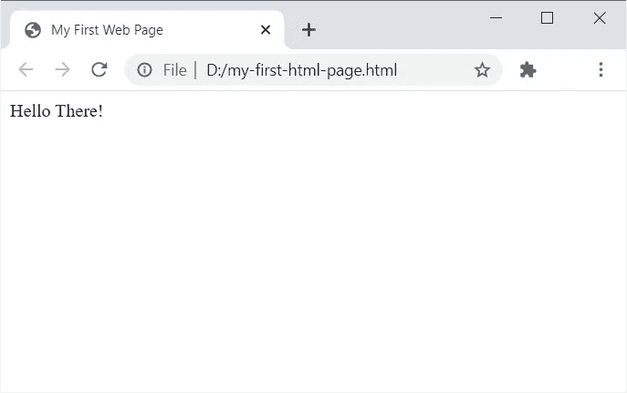
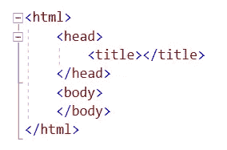
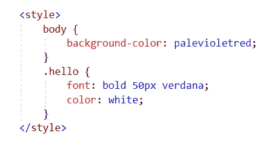
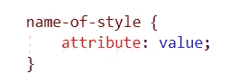
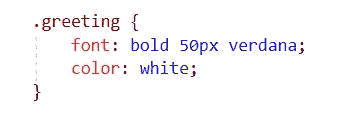
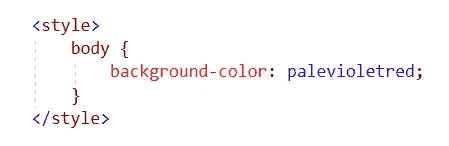
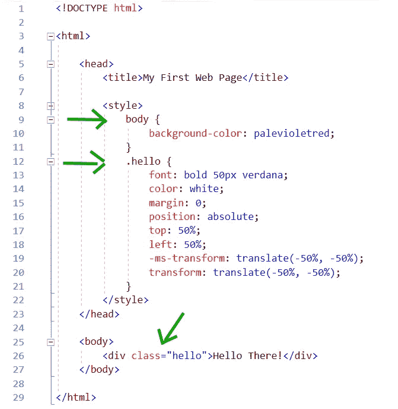
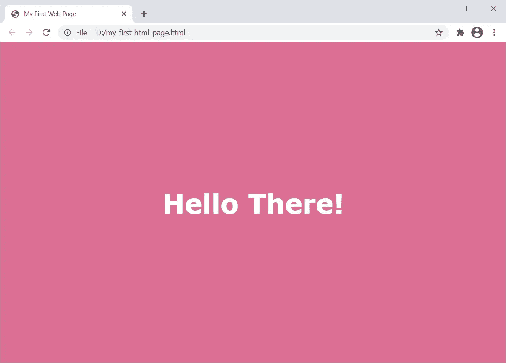

# 了解如何在 10 分钟内创建一个网页

> 原文：<https://medium.com/codex/learn-how-to-create-a-webpage-in-10-minutes-a5c595175f69?source=collection_archive---------11----------------------->

## 你想学习如何创建自己的网页吗？如果你的答案是肯定的，请继续读下去！

在 [Unsplash](https://unsplash.com?utm_source=medium&utm_medium=referral) 上由[米米·蒂安](https://unsplash.com/@mimithian?utm_source=medium&utm_medium=referral)拍摄的照片

现在，网上有很多服务，即使你没有编程技能，也可以创建自己的网站。不过，如果你有一些编程知识，能对你的网站进行编码/编程就更好了。说了这么多，请允许我跟大家分享一些 web 编程的基础知识。希望这篇教程能有所帮助，尤其是对那些想学习网站编码/编程的人。

在本教程中，你可以使用任何文本编辑器来尝试我们将要讨论的例子。若要测试您的代码，请用“.”保存您的文件。html”扩展名，并使用 web 浏览器打开该文件。

我们开始吧！

# 超文本标记语言

创建网页时，你需要学习的首要技能是 HTML(超文本标记语言)。HTML 是一种代码结构，它允许你格式化你的网页内容。为了给你一个概述，这里有一个 HTML 代码的基本例子。

一个 HTML 代码的基本例子。

这是它的输出。

上面示例代码的网页输出。

看起来很简单，对吧？确实是。随着你的代码变得越来越长，加上其他的编程库，HTML 看起来只会越来越复杂。但是这个概念就像我们的示例代码一样简单。

我们继续。

HTML 由标签和数据内容组成。标签是那些用左()尖括号括起来的字符。例如，、、<title>和</title>是标签。数据内容是用标签括起来的数据。例如，“我的第一个网页”和“你好！”是数据内容。我将在下一节讨论更多的标签。

在 HTML 代码中，是一个重要的行。因此，我们把它放在第一行。它告诉浏览器它将解析什么类型的代码。在上面的例子中，文档类型是 HTML5。不过，我们不要太担心这个。现在，我们将使用由标识的 HTML5 文档类型。

# 那么什么是标签呢？

标签是我们用来构成网页内容的元素。标签告诉浏览器如何处理数据。例如， *< title >* 标签(我们示例中的第 5 行)告诉浏览器将数据内容(“我的第一个 Web 页面”)放在页面的标题栏上。正如您在上面的示例网页上看到的，文本*我的第一个网页*在页面的标题栏上。

每个标签对浏览器都有特定的含义/指示。在练习 HTML 编程时，您可以了解不同标签的用途。

为了识别标签的内容，我们有称为开始标签和结束标签的标签元素。例如，在我们的例子中，第 5 行告诉我们“我的第一个网页”是<title>标签的内容。它包括开始标签<title>和结束标签</title>。请注意，前缀“/”表示结束标记。

在 HTML 中，标签可以有层次结构。这意味着一个标签可以包含多个标签。因此，有父标签和子标签。在我们的例子中，标签是和的父标签。和标签分别是<title>和
标签的父标签。
</title>

# 必需的 HTML 标签

HTML 中有 4 个必需的标签。它们如下所示，并按要求的顺序排列。

HTML 基本结构

一个 HTML 页面必须包含所有这些标签。

现在让我们了解一下这些必需标签的含义。

# 

*< html >* 是 html 网页的根。它是网页所有元素的主要容器。 *< html >* 分为 2 个主标签。这些是 *<头部>* 和 *<身体>* 。

# 

*< head >* 包含了那些在渲染页面时有用但并不显示在网页本身上的信息。例如，编程脚本和样式可以放在 *< head >* 标签中。随着学习的推进，一定会用到脚本和样式。脚本用于自动化，而样式用于对网页的不同元素进行样式化(例如，设置字体、颜色、背景图像等)。)

# <title></h1>
<em class="lq"> <标题> </em>包含网页的标题，显示在页面的标题栏上。
<h1 id="5e28" class="kr ks hi bd kt ku ls kw kx ky lt la lb io lu ip ld ir lv is lf iu lw iv lh li bi translated"/>
<em class="lq"> < body > </em>包含网页上显示的所有元素。正是在<em class="lq"> < body > </em>标签中，我们构建了网页的内容和布局。例如，在我们的例子中，“你好！”是一个内容为<em class="lq"> <正文> </em>的标签并显示在网页上。

就是这样。这是 HTML 的基本概念。您可以通过使用标签添加更多的 HTML 内容来改进我们的示例网页。

现在让我来教你如何设计你的网页。

<h1 id="8a21" class="kr ks hi bd kt ku kv kw kx ky kz la lb io lc ip ld ir le is lf iu lg iv lh li bi translated">设计网页样式的基础</h1>
之前，我们创建了一个非常简单的网页，上面写着“你好！”。现在让我们创建一些样式来使我们的网页看起来更好。让我们把白色背景换成紫红色，文本“你好！”，并将字体更改为不同的字体系列和大小。为此，我们将使用<strong class="jq hj"> CSS </strong>。

你准备好了吗？

<h1 id="1975" class="kr ks hi bd kt ku kv kw kx ky kz la lb io lc ip ld ir le is lf iu lg iv lh li bi translated">什么是 CSS？</h1>
CSS(层叠样式表)是用来设计网页元素的语言。使用 CSS，你可以设计你的网页的外观和感觉。这里有一个 CSS 是如何编写的例子。
<figure class="iy iz ja jb fd jc er es paragraph-image">

<figcaption class="jj jk et er es jl jm bd b be z dx translated">一个 CSS 的例子。</figcaption></figure>

<h1 id="bf85" class="kr ks hi bd kt ku kv kw kx ky kz la lb io lc ip ld ir le is lf iu lg iv lh li bi translated">如何写一个 CSS 样式</h1>
CSS 应该包含在<em class="lq"> <样式> </em>标签中(如我们上面的例子所示)。下面是 CSS 样式的格式。
<figure class="iy iz ja jb fd jc er es paragraph-image">

<figcaption class="jj jk et er es jl jm bd b be z dx translated">样式格式</figcaption></figure>
<em class="lq">风格名称，</em>从术语本身来看，指的是您正在创建的风格的名称。例如，您可以将一种样式命名为“问候”、“你好”等。

属性是您希望在 web 元素中更改的特定质量，属性值是该属性的新值。当你练习 HTML 编程时，你会学到 HTML 识别的不同属性。

现在让我们创建一个名为“greeting”的样式，我们将定义一个粗体字体，大小为 50px，字体系列为 Verdana，字体颜色为白色。我们必须使用的改变字体样式的属性是<strong class="jq hj"> <em class="lq">字体</em> </strong>，改变字体颜色的属性是<strong class="jq hj"> <em class="lq">颜色</em> </strong>。我们的 CSS 样式将编写如下。
<figure class="iy iz ja jb fd jc er es paragraph-image">

<figcaption class="jj jk et er es jl jm bd b be z dx translated">CSS 示例</figcaption></figure>
顺便说一下，自定义命名的样式前面应该有一个点“.”。因此，在我们的例子中，样式名是"<strong class="jq hj">。问候</strong>”。

好的。这就是我们创造风格的方式。很简单，对吧？有其他方法来定义一种风格，但现在让我们先学习基本的。

在接下来的部分，我会教你更多关于写作风格以及如何使用它们。

<h1 id="a246" class="kr ks hi bd kt ku kv kw kx ky kz la lb io lc ip ld ir le is lf iu lg iv lh li bi translated">如何为标签创建样式</h1>
在我们的 HTML 示例页面中，假设我们想要将白色背景更改为<em class="lq">浅紫色</em>颜色。因为我们要改变的背景是针对整个网页的，所以我们要设计 body 标签的样式。你还记得主体是网页上显示的所有元素的容器吗？

我们的 CSS 会是这样的。
<figure class="iy iz ja jb fd jc er es paragraph-image">

<figcaption class="jj jk et er es jl jm bd b be z dx translated">CSS 示例</figcaption></figure>
要设置标签的样式，标签的名称将用作样式名称。因此，我们使用“body”作为样式名。

<h1 id="7b7c" class="kr ks hi bd kt ku kv kw kx ky kz la lb io lc ip ld ir le is lf iu lg iv lh li bi translated">如何在 HTML 上实现 CSS</h1>
既然我们知道了如何编写 CSS，现在让我们在 HTML 示例页面上应用一些样式。

下面是我们的示例 HTML 代码使用 CSS 后的样子。
<figure class="iy iz ja jb fd jc er es paragraph-image">

<figcaption class="jj jk et er es jl jm bd b be z dx translated">HTML 示例代码</figcaption></figure>
正如我前面提到的，样式被放置在<em class="lq"> <头> </em>标签中。

在上面的 HTML 代码中，我们为<em class="lq"> < body > </em>标签创建了一个样式，另一个样式我们命名为“<em class="lq">”。你好</em>”。不要被我们在 style <em class="lq">中使用的属性所淹没。你好”。</em>它们仅仅是属性和价值。我让你“谷歌”一下，找出每个属性的用途和对应的值:)

为了实现一个自定义命名的样式，<strong class="jq hj"> <em class="lq">类</em> </strong>属性被添加到我们想要实现样式的标签中，后面跟着“=”和不带点号的样式名(例如 class="hello ")。

这是我们的 CSS 样本 HTML 的网页输出。
<figure class="iy iz ja jb fd jc er es paragraph-image">

<figcaption class="jj jk et er es jl jm bd b be z dx translated">HTML 页面输出</figcaption></figure>

就是这样！我希望你能够从这篇教程中学到 HTML 的基础知识。

感谢阅读！

干杯！

 </body> </html></title>