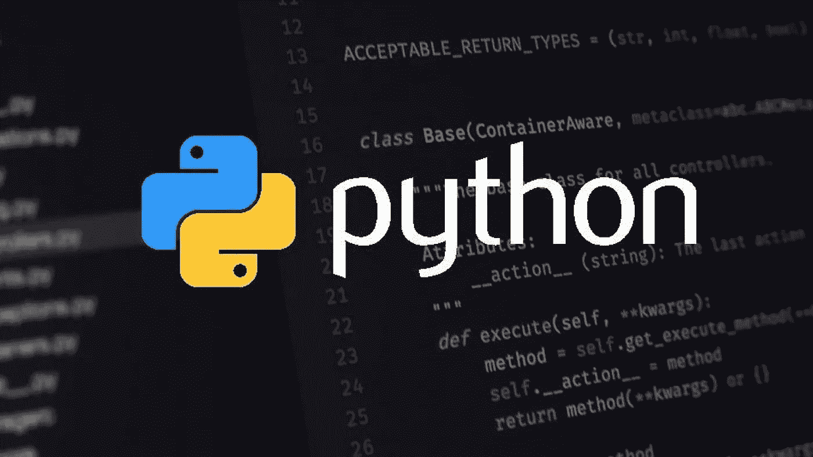

# 通过示例学习 Python:如何在 Python 中使用 If 语句

> 原文：<https://medium.com/codex/learn-python-by-example-how-to-use-an-if-statement-in-python-d280848892bb?source=collection_archive---------14----------------------->

## 在本文中，我们将向您展示如何在 Python 中使用 if 语句。

If 语句是 Python 中的一个通用工具，可用于条件逻辑。在本文中，我们将向您展示如何在 Python 中使用 if 语句。我们将首先介绍 if 语句的语法，然后是几个例子。