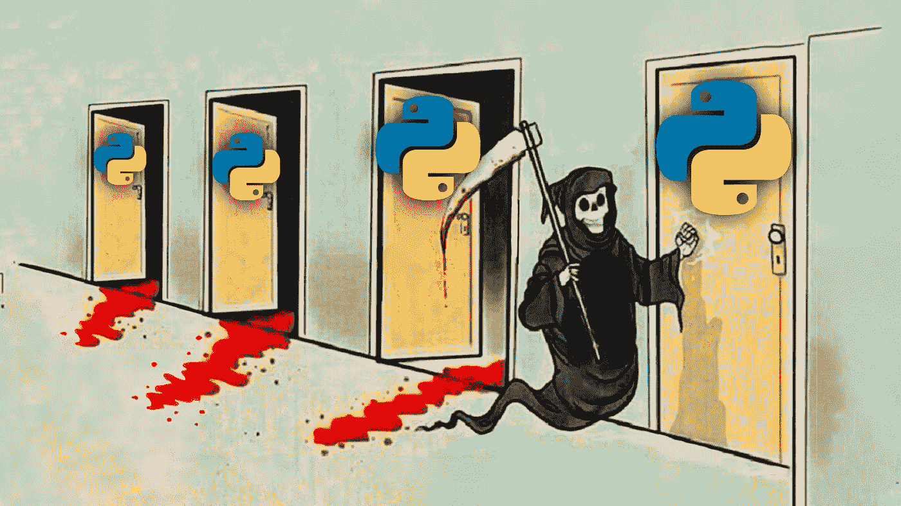

# 学习 Python 是一个糟糕的选择

> 原文：<https://medium.com/codex/learn-python-is-a-bad-choice-5c8af5cb45a8?source=collection_archive---------0----------------------->

## 我会详细解释为什么

Python 是当今最流行的编程语言之一，但这并不意味着它是 2022 年最好的编程语言。最重要的是，每种语言都有不同的优缺点，这使得在你决定学习一门特定的语言之前了解它们变得比以往任何时候都重要。**那么为什么不是 Python 呢？**让我们来看看……