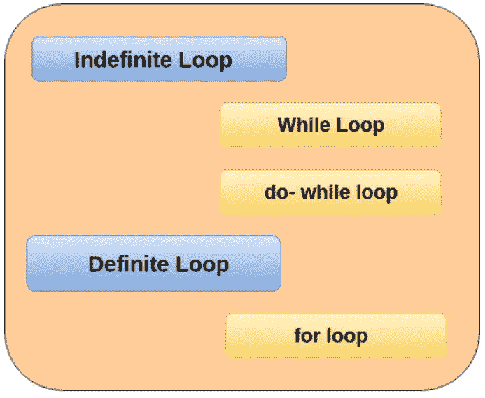
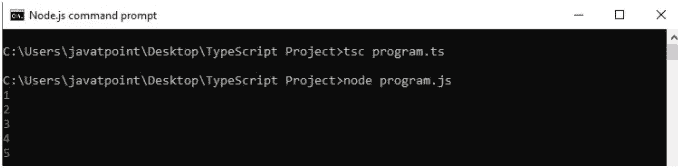
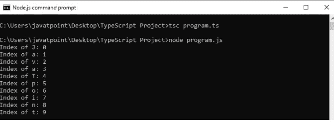
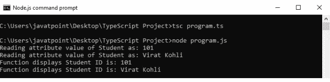
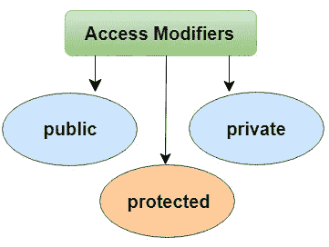

# 学习打字稿—高级水平

> 原文：<https://medium.com/codex/learn-typescript-advanced-level-75675db35825?source=collection_archive---------10----------------------->


(来源:[unsplash.com](https://unsplash.com/photos/nKEARsgmrqc))

在这篇文章中，我将讨论几个话题，比如函数、循环、OOP 等等。

# 类型脚本函数

函数是 JavaScript 中任何应用程序的基本构件。

它使得代码可读、可维护和可重用。我们可以用它来建立抽象层，模仿类、信息隐藏和模块。

然而，在 TypeScript 中，我们有了类、命名空间和模块的概念，但是函数仍然是描述如何做事的一个不可或缺的部分。

**一个函数有三个方面:**

**1】函数声明:**

函数声明告诉编译器函数名、函数参数和返回类型。

函数声明的语法是-

```
function functionName( [arg1, arg2, ...argN] );
```

**2】功能定义:**

它包含将要执行的实际语句。它规定了具体任务的内容和完成方式。

函数定义的语法是-

```
function functionName( [arg1, arg2, ...argN] ){
//code to be executed
}
```

**3】函数调用:**

我们可以在程序的任何地方调用一个函数。函数调用和函数声明中的参数/实参不能不同。我们必须传递与函数声明中声明的相同数量的函数。

函数调用的语法是-

```
FunctionName();
```

**功能创建**

我们可以用两种方法创建一个函数。这些是:

*   命名函数
*   匿名函数

**命名函数**

当我们通过给定的名字来声明和调用一个函数时，那么这种类型的函数被称为名为的**函数。**

句法

```
functionName( [arguments] ) { }
```

例子

```
//Function Definition  
function display() {  
    console.log("Hello JavaTpoint!");  
}  
//Function Call  
display();
```

**匿名功能**

没有名字的函数称为匿名函数。这些类型的函数是在运行时动态声明的。

它被定义为一个表达式。我们可以把它存储在一个变量中，所以它不需要函数名。

像标准函数一样，它也接受输入并返回输出。我们可以通过使用包含 function 的变量名来调用它。

句法

```
let res = function( [arguments] ) { }
```

例子

```
// Anonymous function  
let myAdd = function (x: number, y: number) : number {  
    return x + y;  
};  
// Anonymous function call  
console.log(myAdd(5,3));
```

**功能参数**

参数是传递给函数的值或变量。

在 TypeScript 中，编译器接受函数签名中定义的相同数量和类型的参数。

如果编译器与函数签名中的参数不匹配，那么它会给出编译错误。

**功能参数可分为以下几类:**

*   任选参数
*   默认参数
*   休息参数

**可选参数**

在 JavaScript 中，我们可以调用一个函数而不传递任何参数。

因此，在 JavaScript 函数中，参数是可选的，当我们这样做时，每个参数值都是未定义的。

与 JavaScript 不同，如果我们试图调用一个函数而不提供函数签名中声明的参数的确切数量和类型，TypeScript 编译器将抛出错误。

我们可以通过使用问号('？'来使用可选参数来克服这个问题**)**。

这意味着可以在可能接收值也可能不接收值的参数后面附加一个“？”签名以将它们标记为可选。

句法

```
function function_name(parameter1[:type], parameter2[:type], parameter3 ? [:type]) { }
```

例子

```
function showDetails(id:number,name:string,e_mail_id?:string) {   
   console.log("ID:", id, " Name:",name);   
   if(e_mail_id!=undefined)    
   console.log("Email-Id:",e_mail_id);   
}  
showDetails(101,"Virat Kohli");  
showDetails(105,"Sachin","sachin@javatpoint.com");
```

在上面的例子中，**电子邮件 id** 被标记为可选参数。

**默认参数**

TypeScript 提供了为函数参数设置默认值的选项。

如果用户没有向参数传递值，TypeScript 将初始化该参数的默认值。

默认参数的行为与可选参数相同。

对于默认参数，如果在函数调用中没有传递值，那么默认参数必须跟在函数签名中所需的参数后面。

**我们不能同时将参数设为可选和默认。**

句法

```
function function_name(parameter1[:type], parameter2[:type] = default_value) { }
```

例子

```
function displayName(name: string, greeting: string = "Hello") : string {  
    return greeting + ' ' + name + '!';  
}  
console.log(displayName('JavaTpoint'));   //Returns "Hello JavaTpoint!"  
console.log(displayName('JavaTpoint', 'Hi'));   //Returns "Hi JavaTpoint!".  
console.log(displayName('Sachin'));    //Returns "Hello Sachin!"
```

**剩余参数**

rest 参数用于将零个或多个值传递给函数。

我们可以通过在参数前加上三个“点”字符('…')来声明它。

它允许函数在不使用 arguments 对象的情况下拥有不同数量的参数。

TypeScript 编译器将使用 rest 参数创建一个参数数组，以便所有数组方法都可以使用 rest 参数。

**rest 参数很有用，这里我们有一个未确定数量的参数。**

**rest 参数遵循的规则:**

*   一个函数中只允许一个 rest 参数。
*   它必须是数组类型。
*   它必须是参数列表中的最后一个参数。

句法

```
function function_name(parameter1[:type], parameter2[:type], ...parameter[:type]) { }
```

例子

```
function sum(a: number, ...b: number[]): number {  
  let result = a;  
  for (var i = 0; i < b.length; i++) {  
  result += b[i];  
  }  
  return result;  
}  
let result1 = sum(3, 5);  
let result2 = sum(3, 5, 7, 9);  
console.log(result1 +"\\n" + result2);
```

# 键入箭头函数

ES6 版的 TypeScript 提供了一个 arrow 函数，它是定义匿名函数的**简写**语法。

它省略了 function 关键字。我们可以称之为粗箭(因为->是细箭而= >是"**粗**箭)。

它也被称为**λ函数**。

arrow 函数具有" **this** "关键字的词法作用域。

**语法**

我们可以将箭头函数的语法分成三个部分:

*   **参数:**一个函数可以有也可以没有参数。
*   **箭头符号/λ符号** (= >)
*   **语句:**表示函数的指令集。

```
(parameter1, parameter2, ..., parameterN) =**>** expression;
```

如果我们使用**胖箭头(= > )** 符号，就没有必要使用**函数**关键字。

参数在括号()中传递，函数表达式包含在大括号{}中。

```
// ES5: Without arrow function  
var getResult = function(username, points) {  
  return username + ' scored ' + points + ' points!';  
};  

// ES6: With arrow function  
var getResult = (username: string, points: number): string => {  
  return `${ username } scored ${ points } points!`;  
}
```

**带参数**的箭头功能

```
let sum = (a: number, b: number): number => {  
            return a + b;  
}  
console.log(sum(20, 30)); //returns 50
```

在上面的例子中，

**sum** 是箭头函数，

**“a:number，b: number** ”是一个参数类型，

**":数字**"是(函数的)返回类型，

并且**箭头符号= >** 将函数参数和函数体分开。

**无参数箭头功能**

```
let Print = () => console.log("Hello JavaTpoint!");  
Print();
```

在箭头函数中，**如果函数体只包含一条语句，那么就不需要花括号和 return 关键字。**

我们可以从下面的例子中理解它-

```
let sum = (a: number, b: number) =**>** a + b;
console.log("SUM: " +sum(5, 15));
```

# TypeScript 循环



**确定循环**

在这个循环中，**我们知道在执行语句块之前的迭代次数。**

一个“ **for 循环**”就是这个循环的最好例子。

**在这里，我们要讨论三种类型的循环:**

1.  for 循环
2.  为..循环的
3.  为..在回路中

**为循环**

它用于将代码块执行特定的次数。

一个 **for** 语句在一行中包含了初始化、条件和增量/减量，这提供了一个更短且易于调试的循环结构。

for 循环的语法如下所示。

句法

```
for (first expression; second expression; third expression ) {  
    // statements to be executed repeatedly  
}
```

例子

```
let n=5;
let i;for (i=0;i<n;i++){
    console.log(i)
}
```

输出-

```
0
1
2
3
4
```

**对于..循环的**

森林..of 循环用于迭代和访问数组、字符串、集合、映射、列表或元组集合的元素。

的语法..下面给出了循环的:

句法

```
for (var val of list) {
//statements to be executed
}
```

例子

```
let arr = [1, 2, 3, 4, 5];  

for (var val of arr) {  
  console.log(val);  
}
```

输出-



**对于..在循环中**

森林..in 循环与数组、列表或元组一起使用。

该循环遍历列表或集合，并在每次迭代中返回一个索引。

在这里，“ **val** 的数据类型应该是字符串或者任意。

的语法..回路中给出如下:

句法

```
for (var val in list) {
//statements
}
```

例子

```
let str:any = "JavaTpoint";  

for (let index in str) {  
  console.log('Index of ${str[index]}: ${index}');  
}
```

输出-



**区别为..的和为的..在**中

两个循环都遍历列表，但是它们的迭代类型不同。**为..in** 循环返回被迭代对象的索引列表，而..循环返回被迭代对象的**值列表**。

以下示例展示了这些差异:

例子

```
let myArray = [10, 20, 30, 40, 50,]; console.log("Output of for..in loop ");  
for (let index in myArray) {  
   console.log(index);  
} console.log("Output of for..of loop ");  
for (let val of myArray) {  
   console.log(val);  
}
```

**不定循环**

在无限循环中，在开始执行语句块之前，迭代次数是未知的。

有两个无限循环:

1.  while 循环
2.  do-while 循环

**While 循环**

TypeScript while 循环无限次迭代元素。它重复执行指令，直到指定的条件评估为真。当迭代次数未知时，我们可以使用它。

while 循环语法如下所示:

句法

```
while (condition)    
{    
    //code to be executed    
}
```

while 循环语法的解释是-

While 循环通过检查条件开始执行。如果条件评估为真，则执行循环体语句。如果条件为假，循环将被终止，从而结束循环的生命周期。

例子

```
let num = 4;  
let factorial = 1;  

while(num >=1) {  
   factorial = factorial * num;  
   num--;  
}  
console.log("The factorial of the given number is: "+factorial);
```

**Do-while 循环**

类似于 while 循环，TypeScript do-while 循环无限次迭代元素。

但是与 while 循环有一个不同之处，即无论条件是真还是假，它都至少执行一次。

当迭代次数不固定，且至少要执行一次循环时，建议使用 do-while。

do-while 循环语法如下所示:

句法

```
do{    
    //code to be executed    
}while (condition);
```

do-while 循环语法的解释是-

do-while 循环第一次开始执行语句时不检查任何条件。在执行语句和更新变量值之后，它开始评估条件。如果条件为真，则循环的下一次迭代开始执行。如果条件为假，循环将被终止，从而结束循环的生命周期。

例子

```
let n = 10;  

do {   
    console.log(n);   
    n++;   
 } while(n<=15);
```

# **打字班**

在像 Java 和 C#这样的面向对象编程语言中，类是用来创建可重用组件的基本实体。

功能传递给类，对象从类中创建。

在 ECMAScript 6 中，引入了面向对象的基于类的方法。

TypeScript 引入了类来利用封装和抽象等面向对象技术的优势。

TypeScript 编译器将 TypeScript 中的类编译成普通的 JavaScript 函数，以便跨平台和浏览器工作。

用哎呀的话说，一个类是一个用于创建对象的**模板**或**蓝图**。

一个类可以包括以下内容:

*   构造器
*   属性(属性/变量/字段)
*   方法(功能)

句法

```
class <class_name>{    
    field;    
    method;    
}
```

例子

```
class Student {  
    studCode: number;  
    studName: string;  

    constructor(code: number, name: string) {  
            this.studName = name;  
            this.studCode = code;  
    }  

    getGrade() : string {  
        return "A+" ;  
    }  
}
```

TypeScript 编译器在下面的 JavaScript 代码中转换上述类。

```
var Student = /** @class */ (function () {  
    function Student(code, name) {  
        this.studName = name;  
        this.studCode = code;  
    }  
    Student.prototype.getGrade = function () {  
        return "A+";  
    };  
    return Student;  
}());
```

**创建一个**类的对象

类通过使用 **new** 关键字后跟**类名**来创建对象。

句法

```
let object_name = new class_name(parameter)
```

**new 关键字:**用于实例化(创建)内存中的对象。

表达式的右边调用构造函数，它可以传递值

例子

```
//Creating an object or instance     
let obj = new Student();
```

**对象初始化**

**对象初始化是指在对象中存储数据。**有三种方法可以初始化对象。这些是:

*   通过引用变量

```
//Creating an object or instance     
let obj = new Student();  

//Initializing an object by reference variable  
obj.id = 101;  
obj.name = "Virat Kohli";
```

*   通过方法

```
class Student {   
    //defining fields    
    id: number;  
    name:string;  

    //creating method or function   
    display():void {   
        console.log("Student ID is: "+this.id)   
        console.log("Student ID is: "+this.name)   
    }   
}   

//Creating an object or instance     
let obj = new Student();  
obj.id = 101;  
obj.name = "Virat Kohli";  
obj.display();
```

*   由构造者

构造函数用于**初始化**一个对象。

在 TypeScript 中，构造函数方法总是用名称“**构造函数**”来定义

在构造函数中，我们可以通过使用**这个**关键字来访问一个类的成员。

```
//defining constructor   
constructor(id: number, name:string) {   
    this.id = id;  
    this.name = name;  
}
```

没有必要总是在类中有一个构造函数。

构造函数、方法和对象示例-

```
//Defining a Student class.  
class Student {   
    //defining fields    
    id: number;  
    name:string;  

    //defining constructor   
   constructor(id: number, name:string) {   
       this.id = id;  
       this.name = name;  
   }    

   //creating method or function   
   display():void {   
      console.log("Function displays Student ID is: "+this.id)   
      console.log("Function displays Student ID is: "+this.name)   
   }   
}   

//Creating an object or instance     
let obj = new Student(101, "Virat Kohli")  

//access the field   
console.log("Reading attribute value of Student as: " +obj.id,)  
console.log("Reading attribute value of Student as: " +obj.name)  

//access the method or function  
obj.display()
```

输出-



# 类型脚本访问修饰符

**数据隐藏**是一种用于隐藏内部对象细节的技术。

一个类可以控制其数据成员对其他类成员的可见性。

这种能力被称为**封装或数据隐藏**。

**OOPs 使用访问修饰符**的概念来实现**封装**。

访问修饰符定义了类数据成员在其定义类之外的可见性。

**TypeScript 支持三种访问修饰符。他们是:**



**1]公开**

默认情况下，在 TypeScript 中，类的所有成员(属性和方法)都是公共的。

因此，没有必要在成员前面加上这个关键字。

我们可以在任何地方不受任何限制地访问这个数据成员。

```
class Student {  
    public studCode: number;  
    studName: string;  
}  

let stud = new Student();  
stud.studCode = 101;  
stud.studName = "Joe Root";  

console.log(stud.studCode+ " "+stud.studName);
```

在上面的例子中， **studCode** 是 public， **studName** 是不带修饰符声明的，因此 TypeScript 默认将它们视为 **public** 。

由于数据成员是公共的，因此可以使用类的对象在类外部访问它们。

**2】私人**

私有访问修饰符不能在其包含类之外访问。

它确保类成员仅对它包含的类可见。

```
class Student {  
 studCode: number;  
 private studName: string;  
 constructor(code: number, name: string){  
  this.studCode = code;  
  this.studName = name;  
 }  
public display() {  
return (`My unique code: ${this.studCode}, my name: ${this.studName}.`);  
}  
}  

let student: Student = new Student(1, "JoeRoot");  
console.log(student.display());
```

在上面的例子中， **studName** 是 private，而 **studCode** 是在没有修饰符的情况下声明的，因此 TypeScript 默认将其视为 public。

如果我们在类之外访问私有成员，它会给出一个编译错误。

```
//This will give an error
console.log(student.studName); 
//We can't access private members from class object
```

**3】受保护的**

受保护的访问修饰符只能在类及其子类中访问。

我们不能从包含它的类的外部访问它。

例子

```
class Student {  
    public studCode: number;  
    protected studName: string;  
    constructor(code: number, name: string){  
        this.studCode = code;  
        this.studName = name;  
        }  
}  
class Person extends Student {  
    private department: string;  

    constructor(code: number, name: string, department: string) {  
        super(code, name);  
        this.department = department;  
    }  
    public getElevatorPitch() {  
        return (`My unique code: ${this.studCode}, my name: ${this.studName} and I am in ${this.department} Branch.`);  
    }  
}  
let joeRoot = new Person(1, "JoeRoot", "CS");  
console.log(joeRoot.getElevatorPitch());
```

在上面的例子中，我们不能使用**学生**类之外的名字。我们仍然可以在 Person 类的实例方法中使用它，因为 **Person** 类是从 Student 类派生的。(例如，Person 类继承了 Student 类)

**总结**

*   `private`修饰符允许在同一个类中访问。
*   `protected`修饰符允许在同一个类和子类中访问。
*   `public`修饰符允许从任何位置访问。

# TypeScript 访问器

在 TypeScript 中，访问器属性提供了访问和设置类成员的方法。

它有下面给出的两种方法。

1.  吸气剂
2.  作曲者

**吸气剂**

getter 访问器属性是用于检索变量值的常规方法。

在 object literal 中，getter 属性由关键字“ **get** 表示。它可以是公共的、私有的和受保护的。

句法

```
get propName() {  
    // getter, the code executed on getting obj.propName  
  },
```

例子

```
class MyDrawing {    
    length: number = 20;    
    breadth: number = 15;    

    get rectangle() {    
        return this.length * this.breadth;    
    }    
}    
let obj=new MyDrawing();
console.log(obj.rectangle);
```

**设定器**

setter 访问器属性是用于更新变量值的常规方法。

在 object literal 中，setter 属性由关键字“ **set** 表示。

句法

```
set propName(value) {  
    // setter, the code executed on setting obj.propName = value  
  }
```

例子

```
class Student {
    studentName:string;
    studentRollno:number; constructor(name:string,rollno:number){
        this.studentName=name;
        this.studentRollno=rollno;
    } get getname(){
        return this.studentName;
    } set setname(value:string){
     this.studentName=value;

    }}let obj1 = new Student("ninad",65);//getter call
console.log(obj1.getname)//setter call
obj1.studentName="walanj";console.log(obj1.getname)
```

**注:**

*   **getter** 和 **setter** 为我们提供了一种更好地控制如何在每个对象上访问成员的方法。
*   TypeScript 访问器要求我们将编译器设置为输出 ECMAScript 5 或更高版本。它不支持 ECMAScript 5。
*   具有 get 属性但没有任何 set 属性的访问器被自动假定为只读的。当我们从代码中生成一个 **.d.ts** 文件时，这很有帮助。

# 类型脚本继承

继承是 OOPs 语言的一个方面，它提供了程序从现有类创建新类的能力。

**它是一种从另一个类获取一个类的属性和行为的机制。**

其成员被继承的类被称为**基类/超类，**而继承这些成员的类被称为**派生/子/子类**。

在子类中，我们可以覆盖或修改其父类的行为。

TypeScript 通过 extends 关键字使用类继承。

TypeScript 只支持**单一继承和多级继承。**

**不支持多重和混合继承。**

句法

```
class sub_class_name extends super_class_name  
{  
        // methods and fields  
}
```

**继承的类型**

我们可以把传承分为**五种**。这些是:

*   单一遗传
*   多级遗传
*   多重遗传
*   分层继承
*   混合遗传

**TypeScript 仅支持单级和多级继承。它不支持多重、层次和混合继承。**

**单一继承**

单一继承最多可以从一个父类继承属性和行为。

例子

```
class Shape {   
   Area:number   
   constructor(area:number) {   
      this.Area = area  
   }   
}   
class Circle extends Shape {   
   display():void {   
      console.log("Area of the circle: "+this.Area)   
   }   
}  
var obj = new Circle(320);   
obj.display()
```

**多级继承**

当一个派生类是从另一个派生类派生出来的时候，那么这种类型的继承被称为**多级继承**。

因此，多级继承有**多个父类。**

这类似于祖父、父亲和孩子之间的**关系**。

例子

```
class Animal {   
    eat() {   
        console.log("Eating")   
     }   
}   
class Dog extends Animal {   
   bark() {   
      console.log("Barking")   
   }   
}  
class BabyDog extends Dog{   
    weep() {   
        console.log("Weeping")   
     }  
}  
let obj = new BabyDog();   
obj.eat();  
obj.bark();  
obj.weep()
```

*感谢你阅读这篇文章！如果你有任何问题，请在下面留言。请务必关注*[*Ninad Walanj*](https://medium.com/u/7368122f55cb?source=post_page-----75675db35825--------------------------------)*以获得关于 TypeScript 的最新文章的通知。*

> *可以通过*[***LinkedIn***](https://www.linkedin.com/in/ninad-walanj-0040031b6/)*[***GitHub***](https://github.com/NinadWalanj)*与我联系，或者通过访问*[***【Medium.com***](/@ninadwalanj)***。*** *访问我的网站—* [***尼纳德·瓦兰吉***](https://ninadwalanj.netlify.app/) ***。****