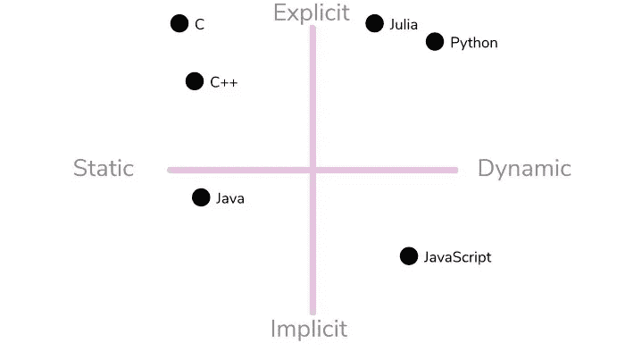

# 学习打字稿—初级水平

> 原文：<https://medium.com/codex/learn-typescript-beginner-level-95411aad693c?source=collection_archive---------15----------------------->


(来源:[unsplash.com](https://unsplash.com/photos/nKEARsgmrqc))

ypescript 是 JavaScript 的超集。这意味着您编写的任何 JavaScript 仍然是有效的类型脚本。

那么打字稿有什么不同呢？

Typescript 通过添加类型、JavaScript 中还没有的特性和一些其他实用程序来扩展 JavaScript。最终 typescript 编译成 JavaScript。简单地说，即使你编写了类型脚本，JavaScript 也是浏览器自带的。

***为什么我们甚至需要 typescript，JavaScript 还不够？***

我通过一个例子来解释一下:

你写了一个求和函数:`const sum = (a, b) => a + b;`

每当你用两个数字参数调用 sum 函数时，它都会工作得很好。但是，如果你传递一个字符串和一个数字，或者两个字符串都传递，或者甚至数字和一个对象呢？如果你的项目只有几行代码，并且只有一两个人在做，这不是问题。但是如果你的产品只有几千行代码，甚至几百行代码，那该怎么办呢？添加几个参与项目并使用 sum 函数的人。他们可能都不知道函数的内部。现在他们中的一个可以用错误类型的参数调用函数。这将导致意想不到的结果。如果将其推向生产，可能会导致可怕的体验。

上面场景中的问题可以通过 typescript 更早地发现。如果你试图将一个字符串传递给一个 number 类型的声明，Typescript 会报错。

让我们看看在 typescript 中 sum 函数的等价 typescript 声明:

```
const sum = (a: number, b: number) => a + b;
// Now if you try to pass a non-number value to a or b typescript will complain
const s1 = sum(3, 5);
// works
const s2 = sum(2, '33');
// Error
// Argument of type '"33"' is not assignable to parameter of type 'number'
```

# **打字稿 Hello World**

```
var message:string = "Hello World!";
console.log(message);
```

TypeScript 代码将被转换成 JavaScript 代码。编译完上述类型脚本代码后，将生成以下 JavaScript 代码。

翻译代码-

```
var message:string = "Hello World!" ;
console.log(message);
```

**编译并执行打字稿程序-**

在终端窗口使用下面的命令进行编译。

```
tsc typeScriptFileName.ts
```

可以一次编译多个文件-

```
tsc typeScriptFileName1.ts, typeScriptFileName2.ts, typeScriptFileName3.ts
```

在终端窗口使用下面的命令来执行。

```
node typeScriptFileName.js
```

# TypeScript 数据类型

类型系统表示语言支持的不同类型的值。在程序存储或操作所提供的值之前，类型系统会检查它们的有效性。这确保了代码的行为符合预期。

TypeScript 提供数据类型作为其可选类型系统的一部分。


**任意类型**

**any** 数据类型是 TypeScript 中所有类型的超类型。它表示动态类型。

让我们假设我们有一个`**let**`语句，我们会说变量标识符是`**coupon**`，并且不给它任何类型:

```
let coupon;
```

如果我们将鼠标悬停在你的 IDE 上，我们会看到它会显示`**let coupon: any**`，这就是我们所说的*推断类型*。我们让 TypeScript 为我们推断类型，而不是声明它。这种做法叫做*隐式*类型化。如果我们自己添加一个类型，比如`**let coupon: any;**`，那就是*显式*类型化。

当我们使用`**let**`关键字时，我们可以用任何类型覆盖任何值。

如果我们给`**coupon**`分配一个数字，它确实会工作。然而，如果我们将鼠标悬停在 IDE 中的`**coupon**`上，我们仍然会得到一个`**any**`类型，即使该值是一个数字！

即使它保存一个数字的值，TypeScript 也不会将`**any**`类型更改为其他类型(比如`**number**`)。如果我们不提供类型，默认情况下它将是类型`**any**`。

**内置类型**


**用户自定义类型**

包括枚举(Enums)、类、接口、数组和元组。

**空数据类型和未定义数据类型的区别**

值' undefined '表示一个变量已经被声明，但还没有被赋值。因此，变量的值是“未定义的”。

另一方面，‘null’指的是不存在的对象，基本意思是‘空’或者‘什么都没有’。

# 类型脚本变量

根据定义，变量是存储值的“内存中的命名空间”。

**换句话说，它充当程序中值的容器。**

TypeScript 变量必须遵循 JavaScript 命名规则

*   变量名可以包含字母和数字。
*   它们不能包含空格和特殊字符，下划线(_)和美元($)符号除外。
*   变量名不能以数字开头。

变量必须在使用前声明。 **使用 var 关键字来声明变量。**

在 TypeScript 中声明变量的类型语法是在变量名后包含一个**冒号(:)，后跟变量的类型。**

当你声明一个变量时，你有四个选项

*   在一条语句中声明其类型和值。
*   声明其类型，但不声明值。在这种情况下，变量将被设置为未定义。
*   声明它的值，但不声明类型。变量类型将被设置为赋值的数据类型。
*   既不声明值也不声明类型。在这种情况下，变量的数据类型将是 any，并将被初始化为 undefined。

示例:

*   **var name:string = "mary"**

该变量存储字符串类型的值

*   **var 名称:string**

该变量是一个字符串变量。默认情况下，变量值设置为未定义

*   **var name = "玛丽"**

变量的类型是从值的数据类型推断出来的。这里，变量是字符串类型

*   **var 名称；**

变量的数据类型是 any。默认情况下，其值设置为未定义。

示例:

```
var name:string = "John";
var score1:number = 50;
var score2:number = 42.50
var sum = score1 + score2
console.log("name"+name)
console.log("first score: "+score1)
console.log("second score: "+score2)
console.log("sum of the scores: "+sum)
```

在编译时，它将生成以下 JavaScript 代码-

```
//Generated by typescript 1.8.10
var name = "John";
var score1 = 50;
var score2 = 42.50;
var sum = score1 + score2;
console.log("name" + name);
console.log("first score: " + score1);
console.log("second score : " + score2);
console.log("sum of the scores: " + sum);
```

上述程序的输出如下所示

```
name:John
first score:50
second score:42.50
sum of the scores:92.50
```

# **类型脚本变量范围**

变量的作用域指定了变量的定义位置。程序中变量的可用性是由其作用域决定的。TypeScript 变量可以具有以下范围

*   **全局范围**—在任何函数/类或代码块之外定义全局变量，它们成为全局范围的一部分。我们可以在程序中的任何地方使用它们。
*   **函数范围或类范围**——这些变量也被称为**字段**。函数/类中定义的函数或类变量是函数范围的。它们可以在函数中的任何地方使用。您不能在函数之外使用它们。可以使用类的对象来访问这些变量。字段也可以是静态的。可以使用类名访问静态字段
*   **局部范围或块范围**——局部变量在代码块内声明，如方法、循环等。局部变量只能在声明它们的构造中访问。

**变量汇总**

声明变量-

有三个关键字，可以用来在 Typescript 中声明变量。它们是`let`、`var`或`const`关键词。

它们之间的作用域规则不同-

`var`支持功能&全局范围。`let` & `const`支持所有三种范围。

# 类型脚本类型注释

在 TypeScript 中，我们可以指定变量、函数参数和对象属性的类型，因为 TypeScript 是一种类型化语言。

类型注释是当我们使用一个类型时可以放在任何地方的注释。在 TypeScript 中，类型注释的使用不是强制性的。它帮助编译器检查变量的类型，避免在处理数据类型时出错。

我们可以通过在变量名、参数或属性后使用**冒号(:Type)** 来指定类型。冒号和变量名、参数或属性之间可以有一个空格。TypeScript 包括 JavaScript 的所有原始数据类型，如数字、字符串、布尔值等。

语法-

```
var variableName: TypeAnnotation = value;
```

示例-

```
var age: number = 44; // number variable
var name: string = "Rahul"; // string variable
var isUpdated: boolean = true; // Boolean variable
```

# 关于打字的一切



**静态与动态打字**

许多编程语言的一个显著区别是它们的编译器处理类型的方式。很可能大多数程序员都熟悉“静态”和“动态”这两个术语，但是这两个术语暗示了什么类型呢？

**静态类型**指的是在执行时创建的类型。这意味着，在这种语言运行它的代码之前，它就已经知道它将使用什么类型，以及它们将如何彼此交互。静态类型具有使类型不可变的优势，这意味着您的数据可以安全地驻留在所述类型中，并且通常需要完成从所述类型中检索数据的工作。这对于需要这种类型应用的代码来说非常好。然而，每当您需要在不同场景中不断改变和使用的类型时，寻找动态类型语言作为解决方案可能是明智的。

静态类型是指编译器强制值使用相同的类型。这里有一个例子。这在 JavaScript 中是有效的:

`let value = 5; value = "hello";`

这里，`value`的类型从数字变成了字符串。在 TypeScript 中，这是禁止的。

`let value = 5; value = "hello"; // error: Type '"hello"' is not assignable to type 'number'.`

**动态类型**指的是编译器在运行时处理更多的类型，而不是在编译程序时。像静态类型一样，这当然有应用，但也会产生问题——特别是如果程序员不知道类型在语言中是如何使用的。说静态类型语言或动态类型语言更好可能有点愚蠢，但是对于数据科学中的大多数应用程序来说，动态类型可能是最好的选择。也就是说，在数据科学中使用静态类型语言当然也有好处。

**隐式与显式类型**

隐式和显式类型，也称为强类型或弱类型，是一种编程语言将应用于类型断言的假设量。

*   *隐含的*——就是我们从上下文中读到的，隐藏在字里行间的东西。代码更简洁，但有时需要更多的时间来思考
*   *明确的*——被明明白白地写下来。代码更加冗长，但留下的疑问更少

**隐式类型化**

**隐式类型化**免除了我们编写类型的责任，让 TypeScript 推理变量和表达式的类型:

```
const number = 3 // inferred as number (implicit)
const numbers = [1,2,3] // inferred as number[] (implicit)
```

**显式打字**

在 TypeScript 中，**显式类型化**只是声明变量的类型，比如:

```
const number: number = 3 // explicit number
const numbers: number[] = [1,2,3] // explicit number[]
```

*感谢您阅读本文！如果你有任何问题，请在下面留言。请务必关注*[*Ninad Walanj*](https://medium.com/u/7368122f55cb?source=post_page-----95411aad693c--------------------------------)*以获得关于 TypeScript 的最新文章的通知。*

> *您可以通过*[***LinkedIn***](https://www.linkedin.com/in/ninad-walanj-0040031b6/)*[***GitHub***](https://github.com/NinadWalanj)*与我联系，或者通过访问*[***【Medium.com***](/@ninadwalanj)***。*** *访问我的网站-* [***尼纳德·瓦兰吉***](https://ninadwalanj.netlify.app/) ***。****