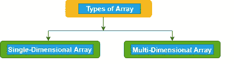
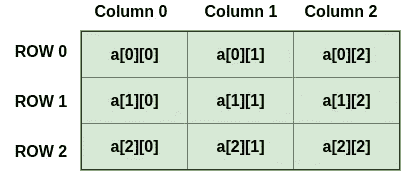
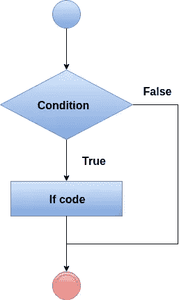
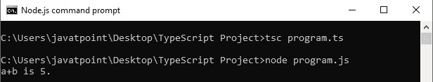

# 学习打字稿—中级水平

> 原文：<https://medium.com/codex/learn-typescript-intermediate-level-90490e98d8e8?source=collection_archive---------2----------------------->


(来源:【unsplash.com )

在我的上一篇文章中，我讨论了打字稿的基础。本文主要关注中间概念，如数组、元组、联合、字符串、决策等。

# **类型脚本数组**

数组是具有连续内存位置的相似类型元素的同质集合。

数组是用户定义的数据类型。

数组是一种数据结构，我们在其中存储相似数据类型的元素。在一个数组中，我们只能存储一组固定的元素。我们也可以把它作为一个对象。

该数组是基于索引的存储，其中第一个元素存储在索引 0 处。

## **数组声明**

有两种方法可以声明数组:

**1。使用方括号。**

```
let array_name[:datatype] = [val1,val2,valn..]
```

例- let fruits: string[] = ['Apple '，' Orange '，' Banana ']；

**2。使用泛型数组类型。**

```
let array_name: Array**<elementType>** = [val1,val2,valn..]
```

例-**let fruits:Array * *<string>* * =['苹果'，'橘子'，'香蕉']；**

****数组有两种类型:****

1.  **一维数组**
2.  **多维数组**

****

## ****一维数组****

**一维数组是一种线性数组，它只包含一行用于存储数据。它有一组方括号(“[]”)。我们可以使用行索引或列索引来访问它的元素。**

**句法**

```
let array_name[:datatype];
```

**初始化**

```
array_name = [val1,val2,valn..]
```

**例子**

```
let arr:number[];
arr = [1, 2, 3, 4]
console.log("Array[0]: " + arr[0]);
console.log("Array[1]: " + arr[1]);
```

**输出-**

**`Array[0]: 1 Array[1]: 2`**

## ****多维阵列****

**多维数组是包含一个或多个数组的数组。在多维数组中，数据存储在基于行和列的索引中(也称为矩阵形式)。二维数组是多维数组的最简单形式。**

****

**句法**

```
let arr_name:datatype[][] = [ [a1,a2,a3], [b1,b2,b3] ];
```

**初始化**

```
let arr_name:datatype[initial_array_index][referenced_array_index] = [ [val1,val2,val 3], [v1,v2,v3]];
```

**例子**

```
var mArray:number[][] = [[1,2,3],[5,6,7]] ;
console.log(mArray[0][0]);
console.log(mArray[0][1]);
console.log(mArray[0][2]);
console.log();
console.log(mArray[1][0]);
console.log(mArray[1][1]);
console.log(mArray[1][2]);
```

**输出-**

```
1
2
35
6
7
```

## ****数组对象****

**也可以使用 array 对象创建数组。可以传递数组构造函数。**

## ****数组构造器— Array()****

*   **一个表示数组大小的数值，或者**
*   **逗号分隔值的列表。**

**句法**

```
let arr_name:datatype[] = new Array(values);
```

**例子**

```
//array by using the Array object.
let arr:string[] = new Array("JavaTpoint","2200","Java","Abhishek");
for(var i = 0;i**<arr.length**;i++) {
console.log(arr[i]);
}
```

**输出-**

```
JavaTpoint
2200
Java
Abhishek
```

# **类型脚本元组**

**我们知道一个数组保存多个相同数据类型的值。**

**但有时，我们可能需要在单个变量中存储不同数据类型的值的集合。**

**数组不会提供这个特性，但是 TypeScript 有一个叫做 Tuple 的数据类型来实现这个目的。**

****元组是存储属于不同数据类型的多个字段的数组。****

**句法**

```
let tuple_name = [val1,val2,val3, ...val n];
```

**例子**

```
let arrTuple = [101, "JavaTpoint", 105, "Abhishek"];
console.log(arrTuple);
```

**输出-**

**`[101, 'JavaTpoint', 105, 'Abhishek']`**

## ****访问元组元素****

**我们可以通过使用索引来读取或访问元组的字段，这与数组相同。在 Tuple 中，索引从零开始。**

**例子**

```
let empTuple = ["Rohit Sharma", 25, "JavaTpoint"];
console.log("Name of the Employee is : "+ empTuple [0]);
console.log("Age of the Employee is : "+ empTuple [1]);
console.log(empTuple [0]+" is working in "+ empTuple [2]);
```

**输出-**

**`Name of the Employee is: Rohit Sharma Age of the Employee is: 25 Rohit Sharma is working in JavaTpoint`**

## ****元组上的操作****

**一个元组有两个操作:**

1.  **推送()**
2.  **流行()**

****Push()****

**推送操作用于将元素添加到元组中。**

**例子**

```
let empTuple = ["Rohit Sharma", 25, "JavaTpoint"];console.log("Items: "+empTuple);
console.log("Length of Tuple Items before push: "+empTuple.length); // returns the tuple size
empTuple.push(10001); // append value to the tupleconsole.log("Length of Tuple Items after push: "+empTuple.length);
console.log("Items: "+empTuple);
```

**输出-**

**`Items: Rohit Sharma, 25, JavaTpoint Length of Tuple Items before push: 3 Length of Tuple Items after push: 4 Items: Rohit Sharma, 25, JavaTpoint, 10001`**

****Pop()****

**pop 操作用于从元组中移除元素。**

**例子**

```
let empTuple = ["Rohit Sharma", 25, "JavaTpoint", 10001];console.log("Items: "+ empTuple);
console.log("Length of Tuple Items before pop: "+ empTuple.length); // returns the tuple size
empTuple.pop(); // removed value to the tupleconsole.log("Length of Tuple Items after pop: "+ empTuple.length);
console.log("Items: "+empTuple);
```

**输出-**

**`Items: Rohit Sharma,25, JavaTpoint, 10001 Length of Tuple Items before pop: 4 Length of Tuple Items after pop: 3 Items: Rohit Sharma, 25, JavaTpoint`**

## ****更新或修改元组元素****

**元组是可变的，这意味着我们可以更新或更改元组元素的值。**

**要修改一个元组的字段，我们需要使用字段的索引和赋值操作符。**

**我们可以用下面的例子来理解:**

**例子**

```
let empTuple = ["Rohit Sharma", 25, "JavaTpoint"];
empTuple[1] = 30;
console.log("Name of the Employee is: "+empTuple [0]);
console.log("Age of the Employee is: "+empTuple [1]);
console.log(empTuple [0]+" is working in "+empTuple [2]);
```

**输出-**

**`Name of the Employee is: Rohit Sharma Age of the Employee is: 30 Rohit Sharma is working in JavaTpoint`**

# **打字稿工会**

**在 TypeScript 中，我们可以定义一个可以有多种类型值的变量。**

**换句话说， **TypeScript 可以组合一种或两种不同类型的数据(即数字、字符串等。)在单个类型中，这称为联合类型。****

**联合类型是用多种类型表达变量的一种强有力的方式。**

****两个或多个数据类型可以通过在类型之间使用管道(' | ')符号来组合。****

**句法**

```
(type1 | type2 | type3 | ........ | type-n)
```

**例子**

```
let value: number|string;
value = 120;
console.log("The Numeric value of a value is: " + value);
value = "Welcome to JavaTpoint";
console.log("The String value of a value is: " + value);
```

**输出-**

**`The Numeric value of the value is: 120 The String value of the value is: Welcome to JavaTpoint`**

## ****将联合类型传递给数组****

**TypeScript 允许将联合类型传递给数组。我们可以从下面的例子中理解它。**

**例子**

```
let arrType:number[]|string[];   
let i:number;   
arrType = [1,2,3,4];  
console.log("Numeric type array:")    

for(i = 0;i<arrType.length;i++){  
   console.log(arrType[i]);  
}  
arrType = ["India","America","England"];  
console.log("String type array:")    

for(i = 0;i<arrType.length;i++){   
   console.log(arrType[i]);  
}
```

**输出-**

**`Numeric type array: 1 2 3 4 String type array: India America England`**

## ****在函数参数**中传递联合类型**

**在函数中，我们可以将联合类型作为参数传递。我们可以从下面的例子中理解它。**

**例子**

```
function display(value: (number | string))  
{  
    if(typeof(value) === "number")  
        console.log('The given value is of type number.');  
    else if(typeof(value) === "string")  
        console.log('The given value is of type string.');  
}  
display(123);  
display("ABC");
```

**输出-**

**`The given value is of type number. The given value is of type of string.`**

# **类型脚本字符串**

**在 TypeScript 中，字符串是表示字符值序列的对象。**

**它是一种用于存储文本数据的原始数据类型。**

****字符串值用单引号或双引号括起来。****

**句法**

```
let var_name = new String(string);
```

**例子**

```
let uname = new String("Hello JavaTpoint");  
console.log("Message: " + uname);  
console.log("Length: "+ uname.length);
```

**输出-**

**`Message: Hello JavaTpoint Length: 16`**

****我们有三种方法可以创建一个字符串:****

## **1.单引号字符串**

**它用单引号将字符串括起来，如下所示。**

**例子**

```
var studentName: String = 'Peter';
```

## **2.双引号字符串**

**它用双引号将字符串括起来，如下所示。**

**例子**

```
var studentName: String = "Peter";
```

## **3.反勾号字符串**

**它是用来写表达式的。我们可以用它将表达式嵌入到字符串中。它也被称为模板字符串。TypeScript 支持 ES6 版本的模板字符串。**

**例子**

```
let empName:string = "Rohit Sharma";   
let compName:string = "JavaTpoint";   
// Pre-ES6  
let empDetail1: string = empName + " works in the " + compName + " company.";   
// Post-ES6  
let empDetail2: string = `${empName} works in the ${compName} company.`;   
console.log("Before ES6: " + empDetail1);  
console.log("After ES6: " + empDetail2);
```

**输出-**

**`Before ES6: Rohit Sharma works in the JavaTpoint company. After ES6: Rohit Sharma works in the JavaTpoint company.`**

# **决策**

**在 TypeScript 中有各种类型的决策:**

*   **如果语句**
*   **if-else 语句**
*   **if-else-if 阶梯**
*   **嵌套 if 语句**

## ****If 语句****

**这是一种简单的决策形式。它决定是否执行这些语句，也就是说，它检查条件，如果满足给定的条件，则返回 true。**

**句法**

```
if(condition) {
// code to be executed
}
```

****

**例子**

```
let a = 10, b = 20;if (a < b)
{
console.log('a is less than b.');
}
```

**输出-**

**`a is less than b.`**

> **参见[https://www.javatpoint.com/typescript-decision-making](https://www.javatpoint.com/typescript-decision-making)了解更多关于 **if-else、if-else-if 和嵌套 if 语句的信息。****

# **TypeScript Switch 语句**

**TypeScript switch 语句从多个条件中执行一个语句**。****

**它根据表达式的值来计算表达式，值可以是布尔值、数字、字节、短整型、长整型、枚举类型、字符串等。**

****switch 语句有一个对应于每个值的代码块。当找到匹配时，将执行相应的块。****

****在 switch 语句中必须记住以下几点:****

*   **switch 语句中可以有 N 种情况。**
*   **案例值必须是唯一的。**
*   **大小写值必须是常量。**
*   **每个 case 语句在代码末尾都有一个 break 语句。break 语句是可选的。**
*   **switch 语句有一个默认块，写在末尾。default 语句是可选的。**

**句法**

```
switch(expression){  

case expression1:  
    //code to be executed;  
    break;  //optional  

case expression2:  
    //code to be executed;  
    break;  //optional  
    ........  

default:  
    //when no case is matched, this block will be executed;  
    break;  //optional  
}
```

****Case:**Case 后面应该只跟一个常量，然后再跟一个分号。它不能接受另一个变量或表达式。**

****Break:**Break 应该写在执行完一个 case 块后从 switch 语句出来的块的末尾。如果我们不写 break，那么执行将继续使用与后续 case 块相匹配的值。**

****默认:**默认块应该写在 switch 语句的末尾。它在没有匹配的案例时执行。**

**例子**

```
let a = 3;  
let b = 2;  

switch (a+b){  
    case 1: {  
        console.log("a+b is 1.");  
        break;  
    }  
    case 2: {  
        console.log("a+b is 5.");  
        break;  
    }  
    case 3: {  
        console.log("a+b is 6.");  
        break;  
    }  

    default: {  
        console.log("a+b is 5.");  
        break;  
    }  
}
```

**输出-**

****

***感谢您阅读这篇文章！如果你有任何问题，请在下面留言。请务必关注* [*尼纳德·瓦兰杰*](https://medium.com/u/7368122f55cb?source=post_page-----90490e98d8e8--------------------------------) *以获得关于 TypeScript 最新文章的通知。***

> **你可以在 [**LinkedIn**](https://www.linkedin.com/in/ninad-walanj-0040031b6/) ， [**GitHub**](https://github.com/NinadWalanj) 上与我联系，或者访问[**Medium.com**](/@ninadwalanj)**。**访问我的网站— [**尼纳德·瓦兰杰**](https://ninadwalanj.netlify.app/) **。****