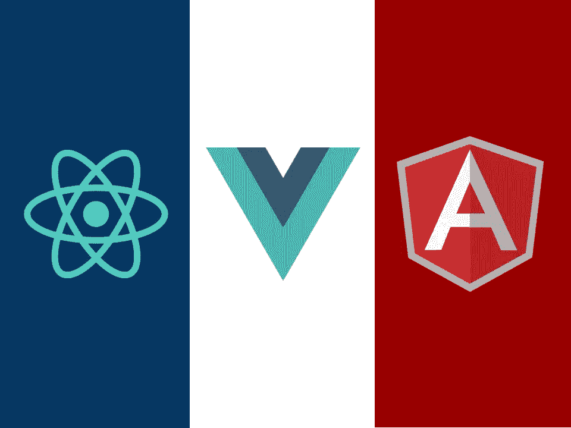

# 先学 Vue 再反应。原因如下

> 原文：<https://medium.com/codex/learn-vue-before-react-heres-why-f22351926b7e?source=collection_archive---------0----------------------->

今天的 web 是不同语言、库和框架的一团乱麻，有抱负的 web 开发人员经常纠结于先学什么。

你是选择需求很大的可靠的框架，还是选择在行业中迅速流行的框架？有一个温和的学习曲线，可以让你快速构建一些东西，或者一个更具挑战性的库，怎么样